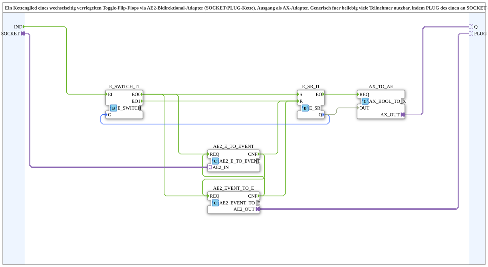

# AE2_ILOCK_T_FF_TO_AX

* * * * * * * * * *

## Einleitung

Der Funktionsblock `AE2_ILOCK_T_FF_TO_AX` realisiert ein wechselseitig verriegeltes Toggle-Flip-Flop, das über bidirektionale AE2-Adapter (SOCKET und PLUG) mit weiteren gleichartigen Bausteinen zu einer Kette verbunden werden kann. Nur ein Glied der Kette kann gleichzeitig aktiv sein, d.h. nur ein Ausgang `Q` liefert einen logischen `TRUE`-Zustand. Der aktive Zustand wird über einen unidirektionalen AX-Adapter nach außen geführt.

Der Baustein ist generisch für beliebig viele Teilnehmer einsetzbar: Durch Verbinden des PLUG-Ausgangs eines Gliedes mit dem SOCKET-Eingang des nächsten entsteht eine verriegelte Kette, bei der ein Ereignisimpuls am Eingang `IND` eines beliebigen Gliedes dessen Zustand toggelt und dabei alle anderen Glieder in den inaktiven Zustand versetzt.

## Schnittstellenstruktur

### **Ereignis-Eingänge**

| Name | Typ  | Beschreibung |
|------|------|--------------|
| `IND` | Event | Externer Trigger, der das Toggle-Verhalten des Bausteins anstößt. |

### **Ereignis-Ausgänge**

Keine.

### **Daten-Eingänge**

Keine.

### **Daten-Ausgänge**

Keine.

### **Adapter**

| Name | Richtung | Typ   | Beschreibung |
|------|----------|-------|--------------|
| `SOCKET` | Eingang (bidirektional) | `adapter::types::bidirectional::AE2` | Bidirektionale Schnittstelle zum Vorgängerglied der Kette. Empfängt Verriegelungssignale und gibt das aktive Zustandssignal weiter. |
| `PLUG` | Ausgang (bidirektional) | `adapter::types::bidirectional::AE2` | Bidirektionale Schnittstelle zum Nachfolgeglied. Sendet Verriegelungssignale und empfängt Rückmeldungen. |
| `Q` | Ausgang (unidirektional) | `adapter::types::unidirectional::AX` | Ausgabe des aktuellen Toggle-Zustands (TRUE = aktiv, FALSE = inaktiv) für die externe Anwendung. |

## Funktionsweise

Intern verwendet der Baustein folgende Funktionsblöcke:

- `E_SR_I1` (Typ `iec61499::events::E_SR`): Ein SR-Flip-Flop, das den Toggle-Zustand speichert (Q-Ausgang).
- `E_SWITCH_I1` (Typ `iec61499::events::E_SWITCH`): Verteilt ein eingehendes Ereignis abhängig vom Wert des Daten-Eingangs `G` auf zwei Ausgänge (EO0, EO1).
- `AE2_EVENT_TO_E` und `AE2_E_TO_EVENT` (adapter::conversion::bidirectional): Konvertieren Ereignisse in Signale über den AE2-Adapter und umgekehrt.
- `AX_TO_AE` (adapter::conversion::unidirectional::AX_BOOL_TO_X): Wandelt den Q-Zustand in ein AX-Signal für den Ausgangsadapter.

**Signalfluss bei einem Ereignis am Eingang `IND`:**

1. Das Ereignis `IND` erreicht den Eingang `EI` von `E_SWITCH_I1`.
2. `E_SWITCH_I1` prüft den Wert seines Daten-Eingangs `G`, der mit `E_SR_I1.Q` verbunden ist.
   - Ist `Q` = `FALSE`, wird das Ereignis an `EO0` ausgegeben.
   - Ist `Q` = `TRUE`, wird das Ereignis an `EO1` ausgegeben.
3. Die Ausgänge `EO0` und `EO1` steuern das SR-Flip-Flop:
   - `EO0` → `S` (Set) setzt `Q` auf `TRUE`.
   - `EO1` → `R` (Reset) setzt `Q` auf `FALSE`.
4. Parallel dazu werden die Ereignisse von `EO0` auch an die Konvertierungsblöcke `AE2_EVENT_TO_E` und `AE2_E_TO_EVENT` gesendet. Diese erzeugen über den AE2-Adapter Verriegelungssignale an die benachbarten Glieder der Kette.
5. Die von den Nachbarn empfangenen Ereignisse (über `SOCKET` oder `PLUG`) werden durch `AE2_EVENT_TO_E` bzw. `AE2_E_TO_EVENT` in Ereignisse zurückgewandelt und führen über `CNF`-Rückmeldungen zu einem Reset des eigenen SR-Flip-Flops, falls das eigene Glied nicht das aktive sein soll.
6. Nach dem Toggle wird `E_SR_I1.EO` (das Ausgangsereignis des SR-Flip-Flops) verwendet, um über `AX_TO_AE` den Ausgangsadapter `Q` zu aktualisieren.

Die gegenseitige Verriegelung wird durch die bidirektionale Kommunikation über den AE2-Adapter erreicht: Jedes Glied sendet seinen Zustand (aktiv/inaktiv) an seine Nachbarn. Ein aktives Glied verriegelt alle anderen, sodass diese bei einem internen Toggle-Versuch in den inaktiven Zustand zurückgesetzt werden.

## Technische Besonderheiten

- **Bidirektionale Kette:** Der Baustein verwendet zwei bidirektionale AE2-Schnittstellen (`SOCKET` und `PLUG`), die eine Verkettung in einer Linie ermöglichen. Jedes Glied kann sowohl mit seinem Vorgänger als auch mit seinem Nachfolger kommunizieren.
- **Verriegelung durch Ereignisrückkopplung:** Die Konvertierungsblöcke `AE2_EVENT_TO_E` und `AE2_E_TO_EVENT` sind in einer Schleife verschaltet, sodass eingehende Ereignisse von Nachbarn ein Reset des eigenen Flip-Flops auslösen. Dadurch wird sichergestellt, dass immer nur ein Glied aktiv ist.
- **Ausgang als AX-Adapter:** Der Zustand `Q` wird über einen unidirektionalen AX-Adapter bereitgestellt, sodass er ohne weitere Konvertierung direkt von Applikationsbausteinen gelesen werden kann.
- **Generische Erweiterbarkeit:** Durch Aneinanderreihung mehrerer dieser Bausteine lässt sich eine Verriegelung mit beliebig vielen Teilnehmern aufbauen, ohne zusätzliche Logik außerhalb der Bausteine.

## Zustandsübersicht

Der interne Zustand wird durch das SR-Flip-Flop `E_SR_I1` repräsentiert:

| Zustand `Q` | Bedeutung | Verhalten bei `IND` |
|-------------|-----------|---------------------|
| `FALSE` (inaktiv) | Das Glied ist nicht aktiv. | Ein Ereignis setzt `Q` auf `TRUE`; das Glied wird aktiv. |
| `TRUE` (aktiv)   | Das Glied ist aktiv, alle anderen sind verriegelt. | Ein Ereignis setzt `Q` zurück auf `FALSE`; das Glied wird inaktiv. |

Nach außen wird `Q` über den `AX_TO_AE`-Block an den Ausgangsadapter `Q` weitergegeben.

## Anwendungsszenarien

- **Mehrere Verbraucher mit exklusiver Freigabe:** Z.B. mehrere Motoren oder Lichter, bei denen immer nur einer eingeschaltet sein darf. Jedes Gerät erhält ein eigenes Kettenglied; ein Taster an einem Glied schaltet es ein und alle anderen aus.
- **Wechselseitige Verriegelung in Steuerungssystemen:** Einsatz in sicherheitsrelevanten Anlagen, bei denen zwei Zustände sich gegenseitig ausschließen müssen.
- **Daisy-Chain-Konfiguration:** Einfache Verdrahtung über die AE2-Adapter, ohne zusätzliche Bus- oder Matrix-Logik.

## Vergleich mit ähnlichen Bausteinen

Im Vergleich zu einem einfachen Toggle-Flip-Flop (z.B. `E_Toggle`) bietet dieser Baustein zusätzlich die Verriegelung über eine bidirektionale Kommunikation. Ein einfacher Toggle hat keine Kenntnis über andere Bausteine und kann nicht gewährleisten, dass nur ein Ausgang aktiv ist. Der hier beschriebene Baustein integriert die Verriegelung direkt in die Kette, sodass eine exklusive Zustandsverteilung ohne übergeordnete Steuerung möglich ist.

## Fazit

`AE2_ILOCK_T_FF_TO_AX` ist ein flexibler, generisch einsetzbarer Baustein für die Realisierung exklusiver Zustände in einer vernetzten Steuerung. Durch die Kombination eines Toggle-Flip-Flops mit bidirektionalen AE2-Adaptern entsteht eine robuste Lösung für Kettenverriegelungen, die sich mit minimalem Verdrahtungsaufwand zu beliebig großen Systemen erweitern lässt.