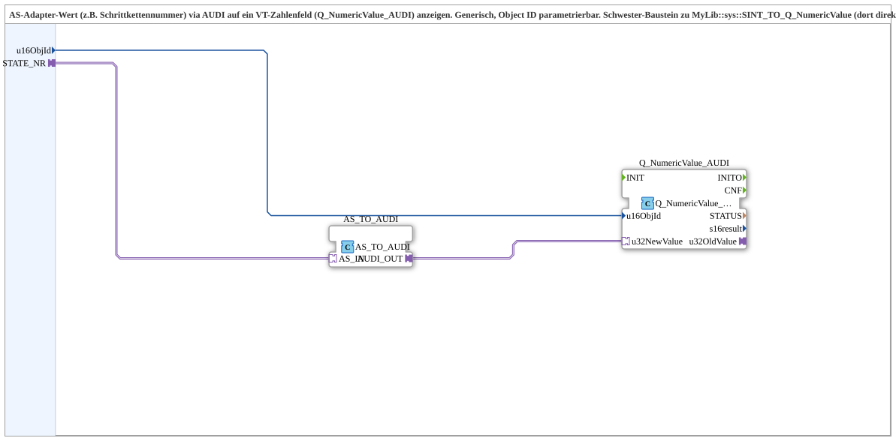

# AS_TO_Q_NumericValue

* * * * * * * * * *

## Einleitung

Der Subapp-Baustein **AS_TO_Q_NumericValue** dient zur Anzeige eines AS-Adapter-Werts (beispielsweise einer Schrittkettennummer) über einen AUDI-Konverter auf einem Visualisierungs-Zahlenfeld (VT-Zahlenfeld) vom Typ `Q_NumericValue_AUDI`. Er ist generisch aufgebaut und die Ziel-Object-ID ist über den Eingang `u16ObjId` parametrierbar. Dieser Baustein ist die Schwester-Variante zu `MyLib::sys::SINT_TO_Q_NumericValue`, bei dem anstelle des AS-Adapters eine direkte SINT-Verdrahtung verwendet wird.

## Schnittstellenstruktur

### **Ereignis-Eingänge**

Keine – der Baustein arbeitet rein über Daten- und Adapterverbindungen ohne explizite Ereignissteuerung.

### **Ereignis-Ausgänge**

Keine.

### **Daten-Eingänge**

| Name      | Datentyp | Initialwert | Beschreibung |
|-----------|----------|-------------|--------------|
| `u16ObjId` | `UINT`   | `ID_NULL`   | Object-ID für das anzuzeigende Zahlenfeld. Über diese ID wird das Zielgerät bzw. die Zielvariable in der Visualisierung adressiert. |

### **Daten-Ausgänge**

Keine.

### **Adapter**

| Name        | Typ                                        | Richtung    | Beschreibung |
|-------------|--------------------------------------------|-------------|--------------|
| `STATE_NR`  | `adapter::types::unidirectional::AS`       | Eingang (Socket) | Adapter für den AS-Wert (z.B. aktuelle Schrittkettennummer). |

## Funktionsweise

Der Subapp-Baustein nimmt über den Adapter `STATE_NR` einen AS-Wert entgegen. Dieser wird durch den internen FB `AS_TO_AUDI` (Typ `adapter::conversion::unidirectional::AS_TO_AUDI`) in ein AUDI-Signal umgewandelt. Das konvertierte Signal (`AUDI_OUT`) wird an den FB `Q_NumericValue_AUDI` (Typ `isobus::UT::Q::Q_NumericValue_AUDI`) übergeben, welcher den Wert in ein VT-Zahlenfeld schreibt. Die Ziel-Object-ID wird dabei über den Eingang `u16ObjId` gesetzt und direkt mit dem FB `Q_NumericValue_AUDI` verbunden.

Die Verdrahtung erfolgt rein über Daten- und Adapterverbindungen, ohne Ereignisse. Somit liegt eine kontinuierliche, datengetriebene Übertragung vor.

## Technische Besonderheiten

- **Generische Parametrierung**: Durch den Eingang `u16ObjId` kann der Baustein für beliebige VT-Zahlenfelder verwendet werden, ohne dass eine feste Object-ID hartkodiert ist.
- **Adapter-Konvertierung**: Die Kombination aus `AS_TO_AUDI` und `Q_NumericValue_AUDI` ermöglicht die Anbindung von AS-Adapter-Daten an das AUDI-Protokoll der Visualisierung.
- **Wiederverwendbarkeit**: Der Baustein wurde aus der Übung `Uebung_039_sub_NumbAnzeig_AS` ausgelagert, um in mehreren Projekten unabhängig einsetzbar zu sein.
- **Keine Ereignissteuerung**: Die Datenübertragung erfolgt rein über Datenverbindungen, was eine einfache und robuste Integration in bestehende Netzwerke erlaubt.
- **Import**: Enthält einen Import für `isobus::UT::Q::const::IDs::ID_NULL` zur Initialisierung der Object-ID.

## Zustandsübersicht

Da der Baustein keine Zustandsautomaten oder Ereignisverarbeitung besitzt, gibt es keine expliziten Zustände. Die Funktionalität ist rein kombinatorisch und abhängig von den aktuellen Eingangswerten. Änderungen am Adapterwert oder an `u16ObjId` wirken sich unmittelbar auf die Ausgabe im Zahlenfeld aus.

## Anwendungsszenarien

- **Visualisierung von Schrittkettennummern**: Anzeige der aktuellen Schrittnummer einer SPS-Steuerung über einen AS-Adapter auf einem HMI-Bildschirm.
- **Generische Werteanzeige**: Der Baustein kann verwendet werden, um beliebige numerische Werte (z.B. Messwerte, Zählerstände) über AS-Schnittstellen auf VT-Zahlenfelder zu projizieren, sofern eine AUDI-Konvertierung verfügbar ist.
- **Modulare HMI-Anbindung**: Durch die Parametrierbarkeit der Object-ID eignet sich der Baustein für den Einsatz in wiederverwendbaren Funktionsbaustein-Bibliotheken für Maschinen- oder Anlagenvisualisierungen.

## Vergleich mit ähnlichen Bausteinen

| Merkmal                  | `AS_TO_Q_NumericValue`                     | `SINT_TO_Q_NumericValue` (Schwester)      |
|--------------------------|--------------------------------------------|-------------------------------------------|
| Eingangsquelle           | AS-Adapter                                  | Direkter SINT-Wert                        |
| Konvertierung            | `AS_TO_AUDI` → `Q_NumericValue_AUDI`       | Keine (SINT wird direkt an `Q_NumericValue_AUDI` übergeben) |
| Parametrierung `u16ObjId` | Ja                                         | Ja                                        |
| Verwendung               | AS-basierte Systeme                        | Direkte SINT-Verdrahtung                  |
| Komplexität              | Höher (Adapterlogik)                        | Geringer                                   |

Beide Bausteine verfolgen das gleiche Ziel – die Anzeige eines Werts auf einem VT-Zahlenfeld – unterscheiden sich aber in der Art der Wertquelle. `AS_TO_Q_NumericValue` ist für Systeme gedacht, die über AS-Adapter kommunizieren, während die Schwester-Variante für einfache SINT-Signale optimiert ist.

## Fazit

Der Subapp-Baustein `AS_TO_Q_NumericValue` bietet eine flexible und wiederverwendbare Lösung zur Anzeige von AS-Adapter-Werten auf VT-Zahlenfeldern. Durch die generische Object-ID-Ansteuerung und die klare Trennung von Adapterkonvertierung und Visualisierung eignet er sich hervorragend für modulare Automatisierungsprojekte. Die Einbettung in die Bibliothek `MyLib::sys` gewährleistet eine konsistente Integration und Reduzierung von Redundanz in zukünftigen Anwendungen.
