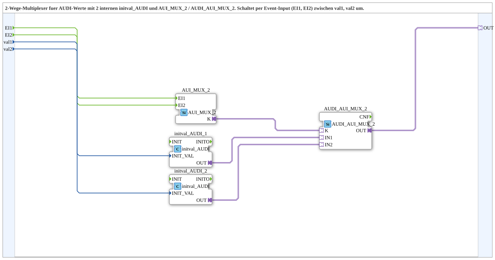

# AUDI_AUI_MUX_2_VAL

* * * * * * * * * *
## Einleitung

Der Funktionsblock **AUDI_AUI_MUX_2_VAL** ist ein 2-Wege-Multiplexer für AUDI-Werte. Er wählt in Abhängigkeit von den beiden Ereigniseingängen `EI1` und `EI2` zwischen zwei unterschiedlichen Werten (`val1`, `val2`) aus und stellt den ausgewählten Wert über einen AUDI-Adapter (`OUT`) bereit. Die Umschaltung erfolgt ereignisgesteuert, wobei die beiden passenden Eingangswerte zuvor intern über spezielle Initialisierungsbausteine in AUDI-Adapter umgewandelt werden.

## Schnittstellenstruktur

### **Ereignis-Eingänge**

| Bezeichnung | Datentyp | Beschreibung                 |
|-------------|----------|-------------------------------|
| `EI1`       | `Event`  | Event zur Auswahl von `val1`  |
| `EI2`       | `Event`  | Event zur Auswahl von `val2`  |

### **Ereignis-Ausgänge**

Keine vorhanden.

### **Daten-Eingänge**

| Bezeichnung | Datentyp | Beschreibung                         |
|-------------|----------|--------------------------------------|
| `val1`      | `UDINT`  | Initialer Ausgabewert bei `EI1`      |
| `val2`      | `UDINT`  | Initialer Ausgabewert bei `EI2`      |

### **Daten-Ausgänge**

Keine vorhanden.

### **Adapter**

| Bezeichnung | Typ                                      | Beschreibung                           |
|-------------|------------------------------------------|-----------------------------------------|
| `OUT`       | `adapter::types::unidirectional::AUDI`   | Ausgewählter AUDI-Adapter als Ausgang  |

## Funktionsweise

Der Baustein besitzt ein internes Netzwerk, das aus mehreren Funktionsbausteinen besteht:

- **`AUI_MUX_2`** – Ein Ereignis-Multiplexer, der die eingehenden Events `EI1` und `EI2` verarbeitet und über einen Steuerkanal `K` den ausgewählten Kanal signalisiert.
- **`AUDI_AUI_MUX_2`** – Ein Selektionsbaustein, der anhand des Steuerkanals `K` einen der beiden Eingänge `IN1` oder `IN2` auswählt und diesen auf den Ausgang `OUT` durchschaltet.
- **`initval_AUDI_1`** und **`initval_AUDI_2`** – Zwei Initialisierungsbausteine, die die Werte `val1` bzw. `val2` als `INIT_VAL` übernehmen und daraus jeweils einen AUDI-Adapter mit diesem Initialwert erzeugen.

Die Ereignisse `EI1` und `EI2` werden direkt an den internen Baustein `AUI_MUX_2` weitergeleitet. Dieser generiert ein Steuersignal auf seinem Ausgang `K`, welches den Selektionsbaustein `AUDI_AUI_MUX_2` veranlasst, entweder den von `initval_AUDI_1` erzeugten AUDI-Wert (Kanal 1) oder den von `initval_AUDI_2` erzeugten Wert (Kanal 2) auf den externen Ausgangs-Adapter `OUT` zu legen.

Durch diese interne Verschaltung ist eine zuverlässige und ereignisgesteuerte Umschaltung zwischen zwei AUDI-Werten gewährleistet, ohne dass auf externe Multiplexer-Bausteine zurückgegriffen werden muss.

## Technische Besonderheiten

- **SubApp-basiert:** Der Baustein ist als Subapplikation (SubApp) modelliert und stellt seine Funktionalität über ein internes Netzwerk bereit.
- **Verwendung spezieller Bausteintypen:**  
  - `adapter::events::unidirectional::AUI_MUX_2`  
  - `adapter::selection::unidirectional::AUDI_AUI_MUX_2`  
  - `adapter::types::unidirectional::AUDI::initval::initval_AUDI`
- **Keine eigene Algorithmuslogik:** Die Funktion ist vollständig durch die Verbindung der internen Bausteine realisiert.
- **Initialwertaufbereitung:** Die Eingänge `val1` und `val2` werden intern zu AUDI-Adapter-Objekten umgewandelt, sodass der Ausgang stets einen vollwertigen AUDI-Adapter liefert.
- **Skalierbarkeit:** Durch die modulare Netzwerkstruktur kann der Baustein leicht auf weitere Kanäle erweitert werden (beispielsweise zur 3-fach Variante).

## Zustandsübersicht

Der Baustein selbst besitzt keine expliziten Zustände, da die Umschaltung rein ereignisgesteuert erfolgt. Es lassen sich jedoch zwei logische Zustände unterscheiden:

1. **Kanal 1 aktiv:** Nach Eintreffen von `EI1` wird der Wert `val1` über den AUDI-Adapter ausgegeben.
2. **Kanal 2 aktiv:** Nach Eintreffen von `EI2` wird der Wert `val2` über den AUDI-Adapter ausgegeben.

Beide Zustände sind stabil, bis das jeweils andere Ereignis eintrifft. Es gibt keine internen Speicherzustände oder zyklische Verarbeitung; die Umschaltung erfolgt unmittelbar bei Ereigniseintritt.

## Anwendungsszenarien

- **Umschaltung zwischen zwei festen Konfigurationswerten** in einer Automatisierungsumgebung.
- **Auswahl eines von zwei Initialwerten** für einen nachgeschalteten AUDI-Kommunikationskanal.
- **Ereignisgesteuertes Multiplexing** von AUDI-Adaptern in modularen Steuerungssystemen.
- **Einfache Redundanzlösung:** Wenn ein Wert fehlerhaft ist, kann auf einen zweiten Wert umgeschaltet werden.

## Vergleich mit ähnlichen Bausteinen

Der Baustein ist eine **2-fach-Variante** des `AUDI_AUI_MUX_3_VAL`, der drei Eingänge unterstützt. Im Gegensatz zu einem einfachen `AUI_MUX_2` (rein ereignisbasierte Umschaltung) kombiniert `AUDI_AUI_MUX_2_VAL` die Ereignisumschaltung mit der automatischen Bereitstellung von AUDI-Initialwerten über interne `initval_AUDI`-Bausteine. Dadurch ist er besonders für Anwendungen geeignet, bei denen die AUDI-Werte direkt aus einfachen Ganzzahlen (UDINT) erzeugt werden sollen, ohne dass externe Initialisierungsbausteine benötigt werden.

Weitere Unterschiede zu einem generischen Multiplexer:

- **Keine Datenausgänge:** Die Auswahl wird ausschließlich über den AUDI-Adapter ausgegeben, nicht als physischer Datentyp.
- **Eingangsdaten sind UDINT:** Die Werte werden erst intern in AUDI-Adapter umgewandelt, was eine einfache Konfiguration mit Ganzzahlen ermöglicht.

## Fazit

Der **AUDI_AUI_MUX_2_VAL** ist ein kompakter und flexibel einsetzbarer 2-Wege-Multiplexer für AUDI-Adapter. Durch die interne Aufbereitung der Eingangswerte und die ereignisgesteuerte Umschaltung eignet er sich ideal für Anwendungen, in denen zwei verschiedene AUDI-Werte ohne großen Aufwand ausgewählt werden müssen. Die modulare SubApp-Struktur erlaubt zudem eine einfache Wartung und Erweiterung, ohne die äußere Schnittstelle zu verändern.