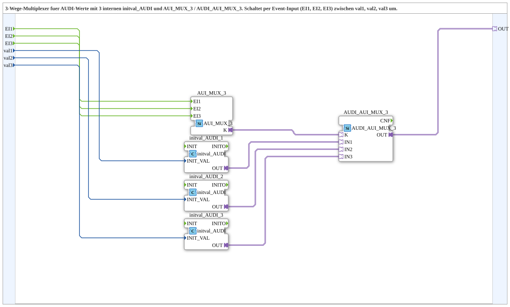

# AUDI_AUI_MUX_3_VAL

* * * * * * * * * *
## Einleitung
Der Funktionsblock **AUDI_AUI_MUX_3_VAL** ist eine Subapplikation (SubApp), die als 3‑Wege‑Multiplexer für AUDI‑Werte dient. Über drei Ereignis‑Eingänge (EI1, EI2, EI3) wird jeweils einer von drei Eingangswerten (val1, val2, val3) ausgewählt und über den Adapter‑Ausgang **OUT** bereitgestellt. Die SubApp kapselt dabei die benötigte Logik aus Ereignis‑Multiplexing, Wertinitialisierung und Adapter‑Umschaltung in einer wiederverwendbaren Einheit.

## Schnittstellenstruktur
Die SubApp besitzt drei Ereignis‑Eingänge, drei Daten‑Eingänge und einen Adapter‑Ausgang. Ereignis‑Ausgänge und Daten‑Ausgänge sind nicht vorhanden.

### **Ereignis-Eingänge**
| Name | Typ    | Kommentar                        |
|------|--------|----------------------------------|
| EI1  | Event  | Event zur Auswahl von val1       |
| EI2  | Event  | Event zur Auswahl von val2       |
| EI3  | Event  | Event zur Auswahl von val3       |

### **Ereignis-Ausgänge**
Keine.

### **Daten-Eingänge**
| Name | Typ   | Kommentar                       |
|------|-------|---------------------------------|
| val1 | UDINT | Initialer Ausgabewert bei EI1   |
| val2 | UDINT | Initialer Ausgabewert bei EI2   |
| val3 | UDINT | Initialer Ausgabewert bei EI3   |

### **Daten-Ausgänge**
Keine.

### **Adapter**
| Name | Typ                                   | Kommentar                        |
|------|---------------------------------------|----------------------------------|
| OUT  | adapter::types::unidirectional::AUDI  | Ausgewählter AUDI‑Adapter‑Output |

## Funktionsweise
Die SubApp realisiert einen Multiplexer für AUDI‑Adapterwerte. Intern werden die drei Eingangswerte (val1…val3) zunächst in jeweils einen **initval_AUDI**‑Baustein geladen, der diese Werte als Initialwerte für einen AUDI‑Adapter bereitstellt. Über den Baustein **AUI_MUX_3** (Ereignis‑Multiplexer) wird das an EI1, EI2 oder EI3 anliegende Ereignis an den entsprechenden Kanal des Bausteins **AUDI_AUI_MUX_3** weitergeleitet. Dieser wählt abhängig vom empfangenen Ereignis den passenden Adapter‑Eingang (IN1, IN2, IN3) aus und verbindet ihn mit dem Ausgang OUT. Dadurch erscheint am Ausgang der Wert, der mit dem auslösenden Ereignis assoziiert ist.

## Technische Besonderheiten
- **Typisierung:** Die Eingangswerte sind als UDINT (32‑Bit‑Unsigned Integer) definiert, was eine klare Datenbreite und Bereichsdefinition ermöglicht.
- **Adapter‑Architektur:** Die Verwendung unidirektionaler Adapter (`adapter::types::unidirectional::AUDI`) sorgt für eine saubere Schnittstellen‑Kapselung und Wiederverwendbarkeit.
- **Drei unabhängige Initialwerte:** Durch die drei getrennten `initval_AUDI`‑Instanzen können die Werte unabhängig voneinander initialisiert und später über die Ereignisse geschaltet werden.
- **Ereignis‑gesteuert:** Kein zyklisches Polling, sondern ereignisbasierte Auswahl – geeignet für zeitkritische Anwendungen.

## Zustandsübersicht
Die SubApp selbst besitzt keinen expliziten Zustandsautomaten. Ihr Verhalten wird durch die intern verschalteten Funktionsblöcke bestimmt. Der aktive Ausgang wird ausschließlich durch das zuletzt eingetroffene Ereignis (EI1, EI2 oder EI3) festgelegt. Es gibt keine internen Zustandsregister, die über die Auswahl hinausgehen – die Logik ist rein ereignis‑ und datengetrieben.

## Anwendungsszenarien
- **Messwertumschaltung:** Auswahl zwischen mehreren Sensoren oder Messkanälen über Steuersignale.
- **Parameterauswahl:** Dynamisches Umschalten zwischen verschiedenen Konfigurationswerten (z. B. Sollwerten oder Grenzwerten) in einer Steuerung.
- **Redundante Systeme:** Umschalten zwischen redundanten Signalquellen, wobei die Initialwerte im Fehlerfall auf definierte Alternativen gesetzt werden.
- **Testumgebungen:** Simulierte Wertebereitstellung mit Ereignissteuerung in Automatisierungstests.

## Vergleich mit ähnlichen Bausteinen
Ein einfacher Multiplexer ohne Adapter‑Schnittstelle würde lediglich die Datenwerte direkt durchschalten und hätte keine Kapselung in einem AUDI‑Adapter. Der **AUDI_AUI_MUX_3_VAL** bietet gegenüber einem solchen Baustein:
- Die Möglichkeit, vordefinierte Initialwerte über Adapter zu nutzen, was die Integration in bestehende Adapter‑Netzwerke erleichtert.
- Eine klare Trennung zwischen Wertquelle (Eingänge) und Wertsenke (Adapter‑Ausgang).
- Eine ereignisbasierte Steuerung, die parallele Datenleitungen ersetzt und so die Verbindungsanzahl reduziert.

Im Vergleich zu einer Variante ohne integrierte Initialwert‑Bausteine müsste der Anwender die Wertzuweisung selbst übernehmen; hier wird die Initialisierung durch `initval_AUDI` explizit vorgenommen und vereinfacht die Verwendung.

## Fazit
Der **AUDI_AUI_MUX_3_VAL** ist ein kompakter, ereignisgesteuerter 3‑Kanal‑Multiplexer für AUDI‑Adapterwerte. Durch die Kombination aus Ereignis‑Multiplexing, Initialwert‑Bausteinen und Adapter‑Ausgang bietet er eine flexible und klar strukturierte Lösung für die Auswahl unterschiedlicher Werte in Automatisierungsanwendungen. Die saubere Kapselung macht ihn wiederverwendbar und erleichtert die Einbindung in komplexe Adapter‑Netzwerke. Dank der reinen Ereignissteuerung eignet er sich besonders für Echtzeitsysteme, in denen deterministische Reaktionen erforderlich sind.