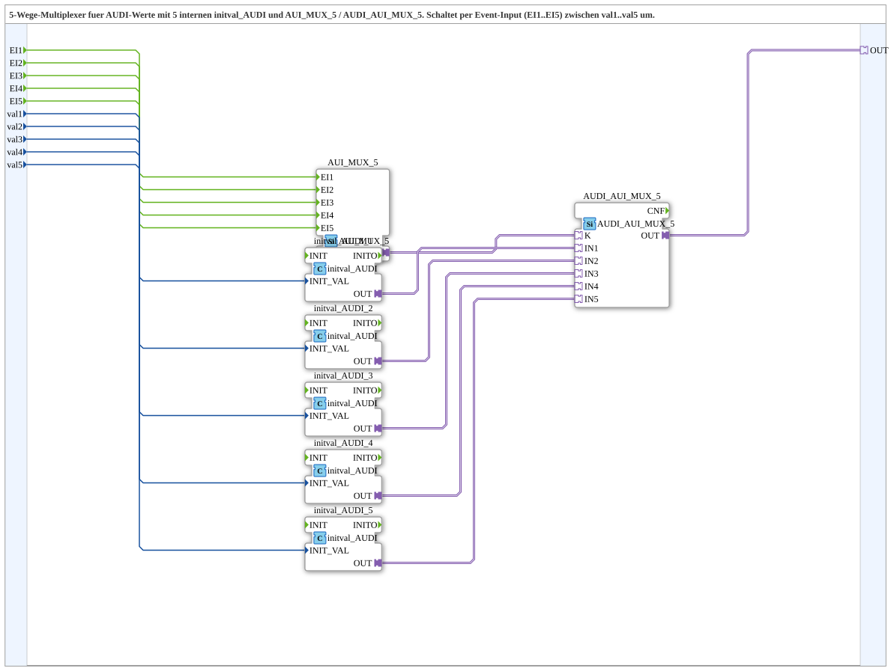

# AUDI_AUI_MUX_5_VAL

* * * * * * * * * *
## Einleitung

Der Funktionsblock **AUDI_AUI_MUX_5_VAL** ist ein 5‑Wege‑Multiplexer für AUDI‑Werte. Er wählt über fünf Ereignis‑Eingänge (EI1…EI5) einen von fünf Datenwerten (val1…val5) aus und stellt diesen am Adapter‑Ausgang OUT bereit. Die SubApp kapselt die notwendige Konvertierung der numerischen Eingänge in den AUDI‑Datentyp sowie die eigentliche Multiplex‑Logik.

## Schnittstellenstruktur

### **Ereignis-Eingänge**

| Bezeichnung | Typ   | Kommentar                           |
|-------------|-------|-------------------------------------|
| EI1         | Event | Event zur Auswahl von val1          |
| EI2         | Event | Event zur Auswahl von val2          |
| EI3         | Event | Event zur Auswahl von val3          |
| EI4         | Event | Event zur Auswahl von val4          |
| EI5         | Event | Event zur Auswahl von val5          |

### **Ereignis-Ausgänge**

Keine.

### **Daten-Eingänge**

| Bezeichnung | Typ   | Kommentar                           |
|-------------|-------|-------------------------------------|
| val1        | UDINT | Initialer Ausgabewert bei EI1       |
| val2        | UDINT | Initialer Ausgabewert bei EI2       |
| val3        | UDINT | Initialer Ausgabewert bei EI3       |
| val4        | UDINT | Initialer Ausgabewert bei EI4       |
| val5        | UDINT | Initialer Ausgabewert bei EI5       |

### **Daten-Ausgänge**

Keine.

### **Adapter**

| Bezeichnung | Typ                                 | Kommentar                         |
|-------------|-------------------------------------|-----------------------------------|
| OUT         | adapter::types::unidirectional::AUDI | Ausgewählter AUDI‑Adapter‑Output |

## Funktionsweise

Die SubApp verbindet die Eingangsereignisse direkt mit dem internen Baustein **AUI_MUX_5**, der die Ereignisse über seinen Ausgang **K** dem Auswahlbaustein **AUDI_AUI_MUX_5** mitteilt. Die numerischen Datenwerte val1…val5 werden jeweils über einen eigenen **initval_AUDI**‑Baustein in den AUDI‑Datentyp umgewandelt. Diese fünf konvertierten Werte werden als IN1…IN5 an **AUDI_AUI_MUX_5** geführt. Der Auswahlbaustein wählt anhand des über **K** empfangenen Ereignisses den passenden Eingang aus und stellt das Ergebnis über seinen Ausgang **OUT** dem SubApp‑Adapter zur Verfügung. Dadurch wird bei einem Ereignis auf EI1 der Wert val1 ausgegeben, bei EI2 der Wert val2 usw.

## Technische Besonderheiten

- Die SubApp verwendet fünf Instanzen des FB **initval_AUDI**, um die UDINT‑Eingänge in den komplexen AUDI‑Typ zu überführen.
- Die eigentliche Multiplex‑Logik ist in zwei getrennten Bausteinen realisiert: **AUI_MUX_5** für die Ereignisverarbeitung und **AUDI_AUI_MUX_5** für die Datenauswahl.
- Durch die Kapselung wird die Verwendung von vier verschiedenen FB‑Typen im Anwenderprogramm auf eine einzige SubApp reduziert.
- Die SubApp ist als 5‑fach Variante des vorhandenen **AUDI_AUI_MUX_3_VAL** ausgelegt und erweitert dessen Funktionsumfang entsprechend.

## Zustandsübersicht

Die SubApp besitzt keine eigenen Zustände. Sie besteht ausschließlich aus einer kaskadierten Verdrahtung von Funktionsbausteinen, die ereignisgesteuert arbeiten – eine explizite Zustandsverwaltung ist daher nicht erforderlich.

## Anwendungsszenarien

- Auswahl eines von fünf Sollwerten oder Konfigurationswerten in Automatisierungssystemen, die auf dem AUDI‑Datentyp basieren.
- Umschaltung zwischen verschiedenen Betriebsmodi oder Profilen zur Laufzeit.
- Einsatz in Anlagen, in denen mehrere alternative Parameter eines Prozesses über ein einheitliches Protokoll bereitgestellt werden.

## Vergleich mit ähnlichen Bausteinen

Die SubApp **AUDI_AUI_MUX_5_VAL** ist die erweiterte Version des Bausteins **AUDI_AUI_MUX_3_VAL** (3‑Wege‑Multiplexer). Sie bietet fünf statt drei Eingangskanäle und dieselbe interne Struktur, bestehend aus initval_AUDI, AUI_MUX und AUDI_AUI_MUX. Gegenüber einem direkten Einsatz der Einzelbausteine vereinfacht sie die Einbindung in Entwicklungsumgebungen, da nur noch die SubApp mit ihren Ereignissen und Datenwerten konfiguriert werden muss.

## Fazit

**AUDI_AUI_MUX_5_VAL** ist ein komfortabler und kompakter Multiplexer für bis zu fünf AUDI‑Werte. Er kombiniert Ereignissteuerung, Datenkonvertierung und Auswahllogik in einer wiederverwendbaren SubApp und ermöglicht eine saubere, wenig fehleranfällige Programmierung von Auswahlfunktionen. Die klare Schnittstelle und die einfache Integration machen den Baustein zu einem nützlichen Werkzeug in IEC 61499‑basierten Steuerungsanwendungen.