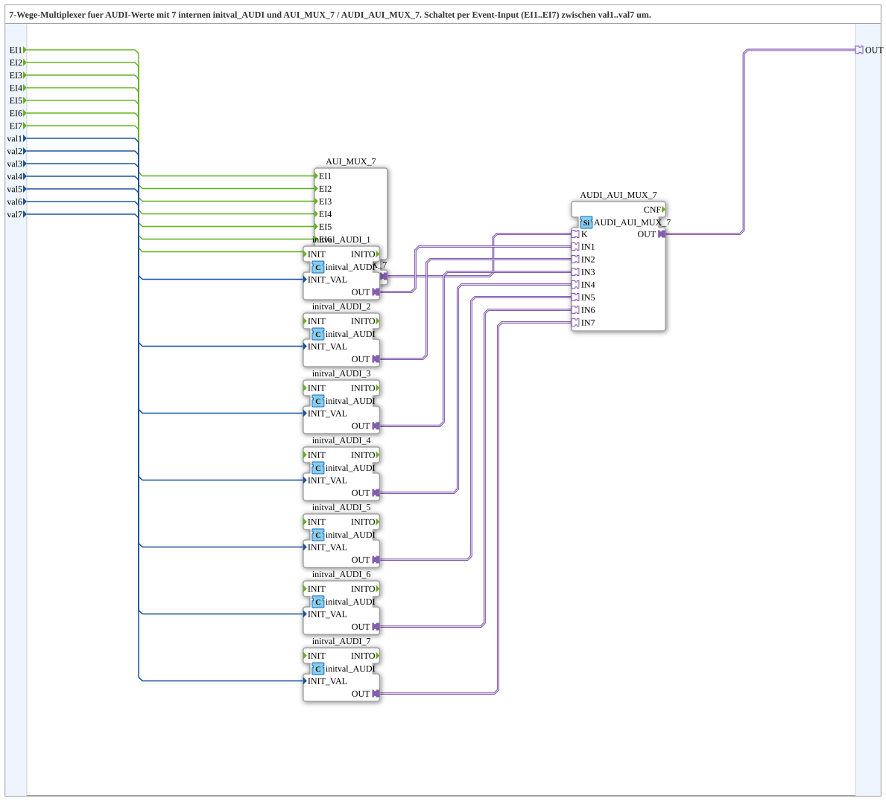

# AUDI_AUI_MUX_7_VAL

* * * * * * * * * *

## Einleitung
Der Funktionsbaustein **AUDI_AUI_MUX_7_VAL** ist ein 7-wege-Multiplexer für AUDI-Werte. Er wählt anhand eines Ereigniseingangs (EI1..EI7) einen von sieben Eingangswerten (val1..val7) aus und stellt diesen über den AUDI-Adapterausgang (OUT) bereit. Intern kombiniert der Baustein einen AUI_MUX_7-Index-Selektor, einen AUDI_AUI_MUX_7-Auswahlbaustein und sieben initval_AUDI-Initialisierungsbausteine, um die Rohwerte in den AUDI-Datentyp zu überführen.

## Schnittstellenstruktur

### **Ereignis-Eingänge**
| Name | Typ | Kommentar |
|------|-----|-----------|
| EI1  | Event | Event zur Auswahl von val1 |
| EI2  | Event | Event zur Auswahl von val2 |
| EI3  | Event | Event zur Auswahl von val3 |
| EI4  | Event | Event zur Auswahl von val4 |
| EI5  | Event | Event zur Auswahl von val5 |
| EI6  | Event | Event zur Auswahl von val6 |
| EI7  | Event | Event zur Auswahl von val7 |

### **Ereignis-Ausgänge**
Keine definiert.

### **Daten-Eingänge**
| Name | Typ   | Kommentar                       |
|------|-------|---------------------------------|
| val1 | UDINT | Initialer Ausgabewert bei EI1  |
| val2 | UDINT | Initialer Ausgabewert bei EI2  |
| val3 | UDINT | Initialer Ausgabewert bei EI3  |
| val4 | UDINT | Initialer Ausgabewert bei EI4  |
| val5 | UDINT | Initialer Ausgabewert bei EI5  |
| val6 | UDINT | Initialer Ausgabewert bei EI6  |
| val7 | UDINT | Initialer Ausgabewert bei EI7  |

### **Daten-Ausgänge**
Keine definiert.

### **Adapter**
| Name | Typ                                     | Kommentar                        |
|------|-----------------------------------------|----------------------------------|
| OUT  | adapter::types::unidirectional::AUDI  | Ausgewählter AUDI-Adapter Output |

## Funktionsweise
Der Baustein arbeitet ereignisgesteuert. Wird ein Ereignis an einem der Eingänge EI1 bis EI7 empfangen, so wird der zugehörige Datenwert (val1..val7) als Initialisierungswert an den entsprechenden internen initval_AUDI-Baustein übergeben. Diese Bausteine konvertieren den rohen `UDINT`-Wert in einen AUDI-Adapterdatensatz.

Parallel dazu erzeugt der Ereigniseingang über den internen AUI_MUX_7-Baustein ein Indexsignal (K), das den gewünschten Kanal (1..7) selektiert. Der anschließende AUDI_AUI_MUX_7-Baustein greift auf die sieben von den initval_AUDI-Bausteinen erzeugten AUDI-Werte zu und gibt den über den Index ausgewählten Wert über den Adapterausgang OUT zurück.

Die Umschaltung ist synchron: Ein einzelnes Ereignis reicht aus, um den Datenwert am Ausgang zu ändern, wobei der gewählte Wert unmittelbar nach Verarbeitung des Ereignisses zur Verfügung steht.

## Technische Besonderheiten
- **SubApp-Struktur**: Der Baustein ist als SubApp (SubAppType) realisiert und besteht aus mehreren internen Bausteinen (`AUI_MUX_7`, `AUDI_AUI_MUX_7`, `initval_AUDI_1`..`initval_AUDI_7`).
- **Adapterbasierte Kommunikation**: Die Verbindung zum Ausgang erfolgt über einen unidirektionalen AUDI-Adapter, der eine standardisierte Schnittstelle für AUDI-Daten bietet.
- **Typumwandlung**: Die rohen UDINT-Werte werden über die `initval_AUDI`-Bausteine in den AUDI-Datentyp konvertiert, sodass der Baustein mit unterschiedlichen Datenformaten umgehen kann.
- **Keine Ereignisausgänge**: Die SubApp erzeugt selbst keine Ereignisse; die gesamte Steuerung läuft über die Ereigniseingänge und den Datenfluss.

## Zustandsübersicht
Der Baustein besitzt keinen internen Zustandsspeicher. Es handelt sich um eine rein kombinatorische Auswahlschaltung, deren Ergebnis ausschließlich von den aktuellen Eingangswerten und dem zuletzt empfangenen Ereignis abhängt. Eine separate Zustandsmaschine ist nicht erforderlich.

## Anwendungsszenarien
- **Konfigurationsumschaltung**: Auswahl eines von sieben vorgegebenen AUDI-Werten (z.B. Parameter, Profile, Betriebsmodi) durch gezielte Ereignissignale.
- **Redundante Wertbereitstellung**: Bereitstellung mehrerer möglicher Ausgabewerte, die je nach Ereignis aktiviert werden.
- **Test- und Simulationsumgebungen**: Einsatz bei Testständen, um unterschiedliche AUDI-Datensätze schnell durchschalten zu können.
- **Multiplexing in Automatisierungssystemen**: Wenn mehrere Datenquellen vorliegen und nur eine davon gleichzeitig ausgegeben werden soll.

## Vergleich mit ähnlichen Bausteinen
Es existieren bereits Varianten wie `AUDI_AUI_MUX_3_VAL` (3-Wege-Multiplexer). Der vorliegende Baustein ist die 7-fach Variante und erweitert die Auswahlmöglichkeiten entsprechend. Gemeinsam ist ihnen die prinzipielle Arbeitsweise: Ereignisgesteuerte Auswahl über AUI_MUX-Komponenten und initval_AUDI-Initialisierung. Der 7-Wege-Multiplexer bietet eine höhere Anzahl an Eingängen und ist für umfangreichere Auswahlszenarien geeignet, benötigt jedoch auch mehr interne Ressourcen.

## Fazit
Der Funktionsbaustein **AUDI_AUI_MUX_7_VAL** stellt eine robuste und flexible Lösung zur Auswahl eines von sieben AUDI-Werten dar. Durch die Einbettung als SubApp mit standardisierten Adaptern ist er leicht in übergeordnete Systeme integrierbar. Die klare ereignisbasierte Schnittstelle ermöglicht eine unkomplizierte Ansteuerung und erfüllt die Anforderungen an einen vielseitigen Multiplexer in Automatisierungs- und Steuerungsumgebungen.