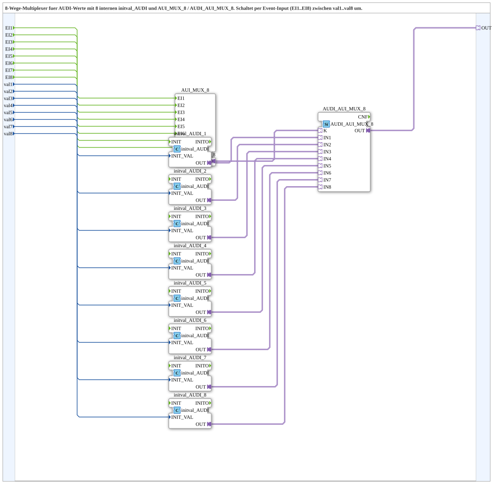

# AUDI_AUI_MUX_8_VAL

* * * * * * * * * *

## Einleitung
Der Funktionsbaustein **AUDI_AUI_MUX_8_VAL** ist ein 8-Wege-Multiplexer für Werte vom Typ **AUDI** (Adapter). Über acht separate Ereignis-Eingänge kann jeweils einer von acht Datenwerten (val1 … val8) ausgewählt und als einziger Adapter-Ausgang **OUT** bereitgestellt werden. Der Baustein kombiniert einen Ereignis-Multiplexer mit einer Adapter-Selektionslogik und eignet sich besonders für die dynamische Umschaltung zwischen unterschiedlichen Konfigurations- oder Steuerwerten in IEC 61499-Applikationen.

## Schnittstellenstruktur

### **Ereignis-Eingänge**
| Ereignis | Datentyp | Kommentar |
|----------|----------|-----------|
| EI1      | Event    | Event zur Auswahl von val1 |
| EI2      | Event    | Event zur Auswahl von val2 |
| EI3      | Event    | Event zur Auswahl von val3 |
| EI4      | Event    | Event zur Auswahl von val4 |
| EI5      | Event    | Event zur Auswahl von val5 |
| EI6      | Event    | Event zur Auswahl von val6 |
| EI7      | Event    | Event zur Auswahl von val7 |
| EI8      | Event    | Event zur Auswahl von val8 |

### **Ereignis-Ausgänge**
Keine vorhanden.

### **Daten-Eingänge**
| Name | Datentyp | Kommentar |
|------|----------|-----------|
| val1 | UDINT    | Initialer Ausgabewert bei EI1 |
| val2 | UDINT    | Initialer Ausgabewert bei EI2 |
| val3 | UDINT    | Initialer Ausgabewert bei EI3 |
| val4 | UDINT    | Initialer Ausgabewert bei EI4 |
| val5 | UDINT    | Initialer Ausgabewert bei EI5 |
| val6 | UDINT    | Initialer Ausgabewert bei EI6 |
| val7 | UDINT    | Initialer Ausgabewert bei EI7 |
| val8 | UDINT    | Initialer Ausgabewert bei EI8 |

### **Daten-Ausgänge**
Keine direkten Datenausgänge vorhanden.

### **Adapter**
| Name | Typ                        | Kommentar |
|------|----------------------------|-----------|
| OUT  | adapter::types::unidirectional::AUDI | Ausgewählter AUDI-Adapter-Ausgang |

## Funktionsweise
Der Baustein ist intern in drei Funktionsblöcke gegliedert:
- **AUI_MUX_8** (Ereignis-Multiplexer): nimmt die Ereignisse EI1…EI8 entgegen und erzeugt ein entsprechendes Ereignis an seinem Ausgang.
- **AUDI_AUI_MUX_8** (Adapter-Multiplexer): wählt anhand des zugehörigen Ereignisses einen der acht internen AUDI-Adapter-Eingänge aus und verbindet ihn mit dem Ausgangs-Adapter.
- **8× initval_AUDI** (Initialisierungswerte): wandelt den jeweiligen UDINT-Eingangswert in einen AUDI-Adapter um. Jede Instanz ist fest mit einem der Daten-Eingänge (val1…val8) verbunden.

Der Ablauf: Wenn ein Ereignis an einem der **EI**-Eingänge auftritt, wird dieses über den Ereignis-Multiplexer an den Adapter-Multiplexer weitergeleitet. Dieser wählt den entsprechenden vorbereiteten **initval_AUDI**-Ausgang aus und stellt ihn am **OUT**-Adapter bereit. Somit liegt am Ausgang unmittelbar der zuvor über das Dateneingangsfeld konfigurierte AUDI-Wert an.

## Technische Besonderheiten
- **Zweistufige Multiplexlogik**: Ereignis- und Adapterpfad sind getrennt, wodurch eine klare Trennung von Steuerung und Datenfluss erreicht wird.
- **8 parallele initval_AUDI-Instanzen**: Jeder Datenwert wird bereits beim Systemstart in einen AUDI-Adapter konvertiert und steht damit ohne Latenz zur Verfügung.
- **Keine Ereignisausgänge**: Die SubApp gibt kein Quittungs- oder Folgeereignis aus; die Auswahl ist rein ereignisgesteuert.
- **Adapterbasierte Ausgabe**: Der Ausgang ist ein unidirektionaler AUDI-Adapter, der direkt mit anderen Bausteinen desselben Typs verbunden werden kann.

## Zustandsübersicht
Der Baustein besitzt keinen expliziten internen Zustandsautomaten. Er arbeitet ereignisgesteuert; es gibt keine dauerhaft gespeicherten Zustände. Nach einem Ereignis wird der entsprechende Datenwert unmittelbar am Ausgang ausgegeben. Eine parallele Verarbeitung mehrerer Ereignisse ist nicht vorgesehen – das zuletzt eingetroffene Ereignis bestimmt den Ausgang.

## Anwendungsszenarien
- **Konfigurationsumschaltung**: Auswahl verschiedener Betriebsmodi oder Parameter zur Laufzeit (z. B. Geschwindigkeitsprofile, PIDs).  
- **Test- und Simulationssysteme**: Umschalten zwischen mehreren simulierten Sensorwerten.  
- **Redundante Datenquellen**: Auswahl einer aktiven Datenquelle aus mehreren parallelen Eingängen.  
- **Audiotechnik**: Steuerung von Audioparametern (z. B. Lautstärke, Klangregelung) über ereignisgesteuerte Umschaltung.

## Vergleich mit ähnlichen Bausteinen
Gegenüber einem einfachen Daten-Multiplexer (z. B. mit direkten UDINT-Ausgaben) bietet dieser Baustein den Vorteil der **Adapter-Kompatibilität**: Die Ausgabe kann direkt an andere AUDI-fähige Bausteine angeschlossen werden, ohne zusätzliche Konvertierungslogik. Im Vergleich zu fest verdrahteten Auswahllogiken ermöglicht er eine flexible, ereignisgetriebene Steuerung. Nachteilig ist, dass keine Ereignis-Rückmeldung erfolgt und der Baustein ausschließlich für den AUDI-Typ ausgelegt ist.

## Fazit
**AUDI_AUI_MUX_8_VAL** stellt eine robuste und einfach einsetzbare Lösung zur ereignisgesteuerten Auswahl eines von acht AUDI-Werten dar. Die Kombination aus Ereignis-Multiplexer und Adapter-Selektion reduziert den Verdrahtungsaufwand und erhöht die Wiederverwendbarkeit in komplexen IEC 61499-Systemen. Durch die Initialisierung der Eingangswerte beim Start ist die Ausgabe sofort verfügbar, ohne auf Datenkonvertierung warten zu müssen.