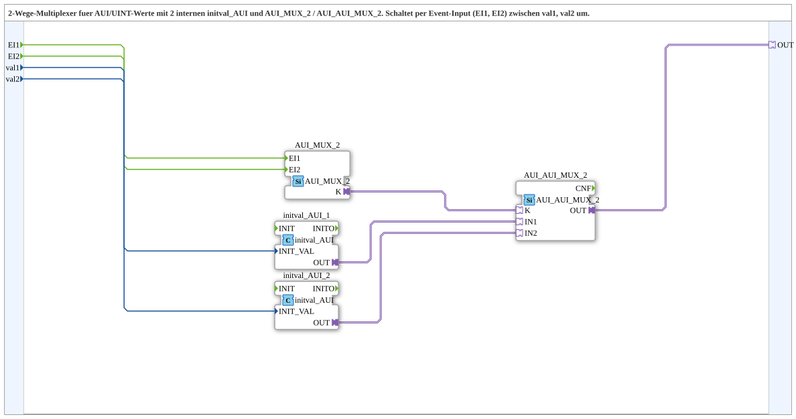

# AUI_AUI_MUX_2_VAL

* * * * * * * * * *

## Einleitung

Der Funktionsblock `AUI_AUI_MUX_2_VAL` ist eine Subapplikation (SubApp), die einen 2-Wege-Multiplexer für AUI/UINT-Werte realisiert. Er nimmt zwei UINT-Eingangswerte entgegen und stellt je nach ausgelöstem Event den entsprechenden Wert über einen AUI-Adapterausgang bereit. Die Umschaltung erfolgt über die Ereigniseingänge `EI1` und `EI2`.

## Schnittstellenstruktur

### **Ereignis-Eingänge**

- **EI1** (Event): Wählt den Wert von `val1` als aktiven Ausgangswert aus.
- **EI2** (Event): Wählt den Wert von `val2` als aktiven Ausgangswert aus.

### **Ereignis-Ausgänge**

Keine.

### **Daten-Eingänge**

- **val1** (UINT): Erster Auswahlwert. Er wird beim Eintreffen von `EI1` auf den Ausgang gelegt.
- **val2** (UINT): Zweiter Auswahlwert. Er wird beim Eintreffen von `EI2` auf den Ausgang gelegt.

### **Daten-Ausgänge**

Keine direkten Datenausgänge. Der ausgewählte Wert wird ausschließlich über den Adapterausgang `OUT` bereitgestellt.

### **Adapter**

- **OUT** (AUI-Adapter, unidirektional): Ausgewählter AUI-Adapterausgang. Liefert den über `EI1` bzw. `EI2` ausgewählten Wert als AUI-Datenstrom.

## Funktionsweise

Die SubApp enthält intern die Funktionsbausteine `initval_AUI_1`, `initval_AUI_2`, `AUI_MUX_2` und `AUI_AUI_MUX_2`. Die an `val1` und `val2` anliegenden UINT-Werte werden über die beiden `initval_AUI`-Bausteine in AUI-Adapterwerte umgewandelt und den Eingängen `IN1` bzw. `IN2` des Bausteins `AUI_AUI_MUX_2` zugeführt.

Wird das Ereignis `EI1` ausgelöst, erzeugt der Baustein `AUI_MUX_2` über den Ausgang `K` ein Auswahlsignal für den Multiplexer `AUI_AUI_MUX_2`. Dadurch wird der am Eingang `IN1` anliegende AUI-Wert ausgewählt und zum Ausgang `OUT` durchgeschaltet. Analog dazu wählt `EI2` den Wert am Eingang `IN2` aus.

## Technische Besonderheiten

- Die SubApp kombiniert einen eventgesteuerten Auswahlbaustein (`AUI_MUX_2`) mit einem adapterbasierten Multiplexer (`AUI_AUI_MUX_2`).
- Die Umwandlung von UINT nach AUI erfolgt über zwei interne Instanzen des Bausteins `initval_AUI`.
- Die SubApp besitzt keinen direkten Datenausgang; der Ergebniswert wird ausschließlich über den Adapter `OUT` übertragen.
- Die Auswahl-Events beeinflussen nicht den Datenfluss, sondern steuern nur die Umschaltung des Multiplexers.

## Zustandsübersicht

Da es sich um eine SubApp handelt, gibt es keinen expliziten Zustandsautomaten auf oberster Ebene. Logisch lassen sich folgende Zustände unterscheiden:

- **Bereit**: Die SubApp wartet auf ein Ereignis an `EI1` oder `EI2`.
- **Auswahl val1**: Nach `EI1` wird der Wert von `IN1` (aus `val1`) über `OUT` ausgegeben.
- **Auswahl val2**: Nach `EI2` wird der Wert von `IN2` (aus `val2`) über `OUT` ausgegeben.

## Anwendungsszenarien

- Umschaltung zwischen zwei Sollwerten oder Parametern in einer Steuerung.
- Auswahl unterschiedlicher Konfigurationswerte zur Laufzeit.
- Wechsel zwischen zwei AUI-basierten Signalquellen in einer Automatisierungsanwendung.
- Bereitstellung von Initialwerten für nachgeschaltete AUI-basierte Funktionsbausteine.

## Vergleich mit ähnlichen Bausteinen

Im Gegensatz zu einem direkten `AUI_AUI_MUX_2`-Baustein, der bereits fertige AUI-Werte an seinen Eingängen erwartet, besitzt `AUI_AUI_MUX_2_VAL` zusätzlich die beiden UINT-Eingänge `val1` und `val2`. Dadurch kann der Anwender die Auswahlwerte direkt als einfache Ganzzahlen vorgeben, ohne vorher eine separate Umwandlung in AUI-Adapter vornehmen zu müssen. Der Baustein `AUI_MUX_2` übernimmt hierbei die Ereignisverarbeitung und erzeugt das Auswahlsignal für den Adapter-Multiplexer.

## Fazit

Der Funktionsblock `AUI_AUI_MUX_2_VAL` bietet eine kompakte und einfach zu verwendende Lösung zur Auswahl zwischen zwei UINT-Werten über AUI-Adapter. Durch die interne Kombination von UINT-zu-AUI-Wandlung und adapterbasiertem Multiplexing wird die Anwendung in Steuerungslogiken deutlich vereinfacht.
