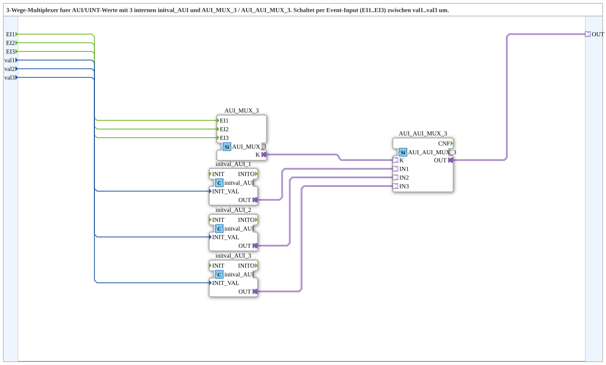

# AUI_AUI_MUX_3_VAL

* * * * * * * * * *

## Einleitung

Der Funktionsblock **AUI_AUI_MUX_3_VAL** ist ein 3‑Wege‑Multiplexer für AUI‑Adapterwerte (unidirektionaler Typ) mit drei vorgegebenen UINT‑Initialwerten. Er ermöglicht es, über drei Ereignis‑Eingänge (EI1‑EI3) zwischen drei verschiedenen Eingangswerten (val1‑val3) umzuschalten. Der ausgewählte Wert wird über einen AUI‑Adapterausgang (OUT) bereitgestellt. Der Baustein integriert dabei einen Ereignis‑Multiplexer (AUI_MUX_3), einen Adapter‑Multiplexer (AUI_AUI_MUX_3) sowie drei Initialisierungsbausteine (initval_AUI), die die Anfangswerte setzen und intern in Adapterwerte umwandeln.

## Schnittstellenstruktur

### **Ereignis-Eingänge**

| Name | Datentyp | Kommentar |
|------|----------|-----------|
| EI1  | Event    | Event zur Auswahl von val1 |
| EI2  | Event    | Event zur Auswahl von val2 |
| EI3  | Event    | Event zur Auswahl von val3 |

### **Ereignis-Ausgänge**

Keine vorhanden.

### **Daten-Eingänge**

| Name | Datentyp | Kommentar |
|------|----------|-----------|
| val1 | UINT     | Initialer Ausgabewert bei EI1 |
| val2 | UINT     | Initialer Ausgabewert bei EI2 |
| val3 | UINT     | Initialer Ausgabewert bei EI3 |

### **Daten-Ausgänge**

Keine vorhanden.

### **Adapter**

| Name | Richtung | Typ                       | Kommentar |
|------|----------|---------------------------|-----------|
| OUT  | Ausgang  | adapter::types::unidirectional::AUI | Ausgewählter AUI-Adapter Output |

## Funktionsweise

Die Eingangsereignisse EI1, EI2 und EI3 werden direkt an den internen Ereignis‑Multiplexer `AUI_MUX_3` weitergeleitet. Abhängig davon, welches Ereignis eintritt, setzt dieser das Steuersignal für den Adapter‑Multiplexer `AUI_AUI_MUX_3` entsprechend. Gleichzeitig werden die drei UINT‑Eingangswerte val1, val2 und val3 über je einen `initval_AUI`‑Baustein in AUI‑Adapterwerte umgewandelt und als IN1, IN2 und IN3 an den Adapter‑Multiplexer übergeben. Der Adapter‑Multiplexer wählt anhand des Steuersignals (K) genau einen dieser drei Werte aus und stellt ihn am Ausgang OUT bereit.

Die Verbindung zwischen `AUI_MUX_3.K` und `AUI_AUI_MUX_3.K` überträgt die vom Ereignis‑Multiplexer erzeugte Auswahlinformation. Somit entspricht jeder Ereignis‑Eingang einem festen Daten‑Eingang: EI1 → val1, EI2 → val2, EI3 → val3.

## Technische Besonderheiten

- **Initialisierung über initval_AUI:** Die drei UINT‑Werte werden durch die internen FB `initval_AUI_1`, `initval_AUI_2` und `initval_AUI_3` in AUI‑Adapterwerte konvertiert. Dies ermöglicht eine saubere Schnittstellenanpassung zwischen Standard‑Daten (UINT) und dem AUI‑Adapterprotokoll.
- **Zwei‑Stufen‑Implementierung:** Die Trennung von Ereignis‑ und Adapter‑Multiplexer erlaubt eine flexible Erweiterung oder Wiederverwendung einzelner Komponenten.
- **Unidirektionaler Adapter:** Der Ausgang ist als unidirektionaler AUI‑Adapter definiert, d.h. er sendet nur Daten in eine Richtung.

## Zustandsübersicht

Der Baustein besitzt keine expliziten Zustände oder Zustandsautomaten. Die Funktionsweise ist rein ereignisgesteuert: Jedes Ereignis selektiert sofort den zugehörigen Eingangswert. Nach der Verarbeitung bleibt der Ausgangswert bis zum nächsten Ereignis stabil.

## Anwendungsszenarien

- Umschaltung zwischen verschiedenen Messwerten (als UINT) in einer Automatisierungsumgebung, die über AUI‑Adapter kommuniziert.
- Auswahl unterschiedlicher Sollwerte für einen Prozessregler basierend auf Betriebsmodi oder Sensoren.
- Konfiguration von Parametern zur Laufzeit, indem verschiedene vordefinierte Werte über Ereignisse ausgewählt werden.

## Vergleich mit ähnlichen Bausteinen

Im Vergleich zu einem einfachen Daten‑Multiplexer (z.B. MUX) bietet dieser Baustein eine direkte Integration mit AUI‑Adaptertypen und eine ereignisbasierte Auswahl, wodurch er sich für IEC 61499‑Anwendungen eignet, die adapterbasierte Kommunikation verwenden. Gegenüber einem zusätzlichen manuellen Setzen des Auswahlindexes werden hier die Ereignisse direkt verwendet, was die logische Verknüpfung vereinfacht. Ähnliche Bausteine wie `AUI_MUX_2_VAL` oder `AUI_AUI_MUX_4_VAL` könnten für geringere oder höhere Kanalzahlen existieren, bieten jedoch dieselbe prinzipielle Funktionsweise.

## Fazit

Der FB `AUI_AUI_MUX_3_VAL` stellt eine kompakte und robuste Lösung zur Auswahl eines von drei AUI‑Werten dar, wobei die Werte über UINT‑Eingänge vorgegeben und initialisiert werden. Die Kombination aus Ereignis‑ und Adapter‑Multiplexer sowie die eingebauten Initialisierungsbausteine machen ihn zu einem nützlichen Werkzeug in industriellen Automatisierungssystemen, die auf IEC 61499 und AUI‑Adapter basieren. Durch seine klare Schnittstellenstruktur und ereignisgesteuerte Arbeitsweise lässt er sich einfach in bestehende Steuerungsarchitekturen integrieren.