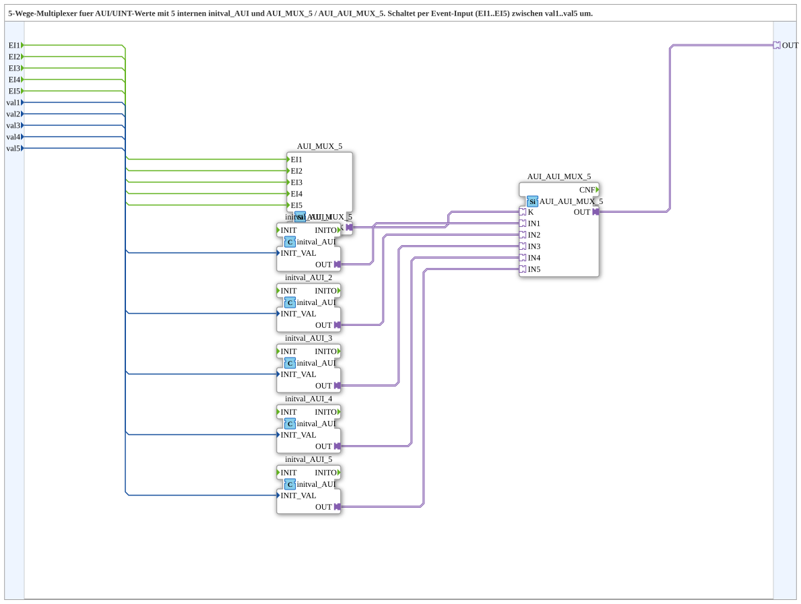

# AUI_AUI_MUX_5_VAL

* * * * * * * * * *

## Einleitung

Der Funktionsblock **AUI_AUI_MUX_5_VAL** ist ein 5-Wege-Multiplexer für AUI/UINT-Werte. Er wählt abhängig von einem eingehenden Ereignis (EI1 bis EI5) einen von fünf konfigurierbaren Ausgabewerten (val1 bis val5) aus und stellt diesen über einen AUI-Adapter (OUT) bereit. Intern werden die Eingangswerte mithilfe von `initval_AUI`-Bausteinen in AUI-Adapter konvertiert und über einen Adapter-Multiplexer an den Ausgang geschaltet.

## Schnittstellenstruktur

### **Ereignis-Eingänge**

| Name | Typ | Kommentar |
|------|-----|-----------|
| EI1  | Event | Event zur Auswahl von val1 |
| EI2  | Event | Event zur Auswahl von val2 |
| EI3  | Event | Event zur Auswahl von val3 |
| EI4  | Event | Event zur Auswahl von val4 |
| EI5  | Event | Event zur Auswahl von val5 |

### **Ereignis-Ausgänge**

Keine.

### **Daten-Eingänge**

| Name | Typ | Kommentar |
|------|-----|-----------|
| val1 | UINT | Initialer Ausgabewert bei EI1 |
| val2 | UINT | Initialer Ausgabewert bei EI2 |
| val3 | UINT | Initialer Ausgabewert bei EI3 |
| val4 | UINT | Initialer Ausgabewert bei EI4 |
| val5 | UINT | Initialer Ausgabewert bei EI5 |

### **Daten-Ausgänge**

Keine – die Ausgabe erfolgt ausschließlich über den Adapterausgang.

### **Adapter**

| Name | Richtung | Typ | Kommentar |
|------|----------|-----|-----------|
| OUT  | Ausgang  | adapter::types::unidirectional::AUI | Ausgewählter AUI-Adapter-Output |

## Funktionsweise

Die Subapp besteht aus mehreren internen Funktionsblöcken, die wie folgt verschaltet sind:

1. **Ereignisweiterleitung** – Die fünf Ereignisse EI1 bis EI5 werden direkt an den Funktionsblock `AUI_MUX_5` (vom Typ `adapter::events::unidirectional::AUI_MUX_5`) geleitet. Dieser dient als Ereignis-Multiplexer und gibt das empfangene Ereignis an den Adapter-Multiplexer weiter.

2. **Wertkonvertierung** – Die Dateneingänge val1 bis val5 werden jeweils einem eigenen `initval_AUI`-Baustein (Typ `adapter::types::unidirectional::AUI::initval::initval_AUI`) zugeführt. Diese Bausteine erzeugen aus einem UINT-Initialwert einen AUI-Adapter mit dem entsprechenden Wert.

3. **Adapterauswahl** – Der Funktionsblock `AUI_AUI_MUX_5` (Typ `adapter::selection::unidirectional::AUI_AUI_MUX_5`) empfängt die von den `initval_AUI`-Bausteinen bereitgestellten Adapter (IN1 bis IN5) sowie das vom Ereignis-Multiplexer übergebene Steuersignal (K). Anhand dieses Signals wird der passende Eingang auf den Ausgang OUT geschaltet.

4. **Ausgabe** – Der ausgewählte AUI-Adapter wird über den externen Adapterausgang OUT der Subapp bereitgestellt.

Durch das Auslösen eines Ereignisses EIx wird also der zugehörige Wert valx (als AUI-Adapter) weitergegeben.

## Technische Besonderheiten

- **Verwendung von AUI-Adaptern**: Die Datenübertragung erfolgt nicht über herkömmliche Datenausgänge, sondern über unidirektionale Adapter, was eine flexible und wiederverwendbare Schnittstellengestaltung ermöglicht.
- **Interne Wertinitialisierung**: Die `initval_AUI`-Bausteine dienen dazu, aus einem einfachen UINT-Wert einen AUI-Adapter zu erzeugen. Dies erlaubt es, die Ausgabewerte direkt an der Subapp zu konfigurieren.
- **Paketzuordnung**: Die Subapp ist im Paket `MyLib::sys` eingeordnet und folgt dem Standard IEC 61499-2.
- **Lizenz**: Der Baustein ist unter der Eclipse Public License 2.0 (EPL-2.0) verfügbar (siehe Copyright-Hinweis in der XML-Beschreibung).

## Zustandsübersicht

Da es sich um einen Multiplexer handelt, existiert kein komplexer Zustandsautomat. Das Verhalten ist rein ereignisgesteuert: Zu jedem Zeitpunkt ist genau einer der fünf Eingänge aktiviert, und der Ausgang liefert den entsprechenden Wert. Ein interner Zustand wird lediglich durch das zuletzt ausgelöste Ereignis bestimmt, solange kein neues Ereignis eintrifft. Eine explizite Initialisierung ist nicht erforderlich; sobald das erste Ereignis eintritt, wird der zugehörige Wert ausgegeben.

## Anwendungsszenarien

- **Konfigurationsauswahl in Automatisierungssystemen**: Auswahl unterschiedlicher Parameter oder Profile (z. B. Geschwindigkeiten, Zeitwerte) über Ereignisse.
- **Umschaltung zwischen mehreren Sensorwerten**: Wenn mehrere Sensoren Daten über AUI-Schnittstellen bereitstellen, kann je nach Ereignis ein bestimmter Sensorwert zur weiteren Verarbeitung ausgewählt werden.
- **Test- und Simulationsumgebungen**: Schnelles Umschalten zwischen verschiedenen Testwerten während der Entwicklung.

## Vergleich mit ähnlichen Bausteinen

Ein einfacher Multiplexer (z. B. `MUX`) arbeitet direkt mit elementaren Datentypen wie UINT und besitzt separate Datenausgänge. Im Gegensatz dazu nutzt `AUI_AUI_MUX_5_VAL` ausschließlich AUI-Adapter für die Ausgabe und integriert eine Initialisierung der Werte über `initval_AUI`. Dadurch ist eine direkte Anbindung an andere AUI-basierte Komponenten möglich, ohne zusätzliche Konvertierungslogik. Der Baustein bietet eine kompakte und wiederverwendbare Lösung für AUI-basierte Multiplexaufgaben.

## Fazit

Der Funktionsblock **AUI_AUI_MUX_5_VAL** stellt eine flexible und klar strukturierte Lösung zur Auswahl eines von fünf AUI-Werten dar. Durch die Kombination von Ereignissteuerung, UINT-Initialisierung und Adapterausgabe eignet er sich ideal für den Einsatz in modularen Automatisierungs- und Steuerungssystemen, die auf AUI-Schnittstellen basieren. Die interne Verschaltung ist nachvollziehbar und erleichtert Wartung und Erweiterung.
