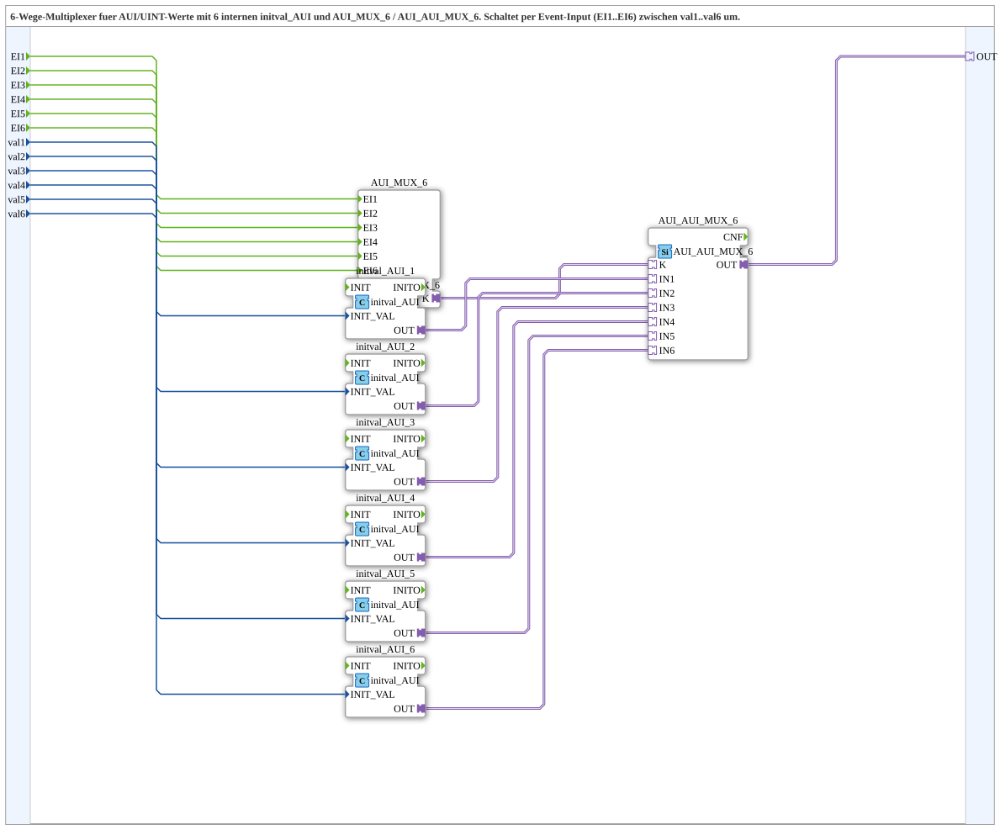

# AUI_AUI_MUX_6_VAL

* * * * * * * * * *
## Einleitung
Der Funktionsblock **AUI_AUI_MUX_6_VAL** ist ein 6-Wege-Multiplexer für AUI/UINT-Werte. Er enthält sechs interne `initval_AUI`-Bausteine sowie die beiden Adapter-Bausteine `AUI_MUX_6` und `AUI_AUI_MUX_6`. Über die Ereignis-Eingänge `EI1` bis `EI6` kann jeweils einer der sechs Eingangswerte `val1` bis `val6` ausgewählt und als AUI-Adapter-Signal am Ausgang `OUT` bereitgestellt werden.

## Schnittstellenstruktur
### **Ereignis-Eingänge**
- `EI1` : Event – Event zur Auswahl von `val1`  
- `EI2` : Event – Event zur Auswahl von `val2`  
- `EI3` : Event – Event zur Auswahl von `val3`  
- `EI4` : Event – Event zur Auswahl von `val4`  
- `EI5` : Event – Event zur Auswahl von `val5`  
- `EI6` : Event – Event zur Auswahl von `val6`

### **Ereignis-Ausgänge**
Keine

### **Daten-Eingänge**
- `val1` : UINT – Initialer Ausgabewert bei `EI1`  
- `val2` : UINT – Initialer Ausgabewert bei `EI2`  
- `val3` : UINT – Initialer Ausgabewert bei `EI3`  
- `val4` : UINT – Initialer Ausgabewert bei `EI4`  
- `val5` : UINT – Initialer Ausgabewert bei `EI5`  
- `val6` : UINT – Initialer Ausgabewert bei `EI6`

### **Daten-Ausgänge**
Keine

### **Adapter**
- `OUT` : Adapter vom Typ `adapter::types::unidirectional::AUI` – Ausgewählter AUI-Adapter Output

## Funktionsweise
Die externen Ereignisse `EI1` bis `EI6` werden direkt an den Adapter-Baustein `AUI_MUX_6` weitergeleitet. Parallel dazu werden die UINT-Eingangswerte `val1` bis `val6` über die internen `initval_AUI`-Bausteine in AUI-Adapter-Signale umgewandelt. Diese sechs AUI-Signale werden dem Auswahl-Baustein `AUI_AUI_MUX_6` über die Eingänge `IN1` bis `IN6` zugeführt. Das vom `AUI_MUX_6` erzeugte Selektionssignal (K) bestimmt, welcher der sechs Eingänge auf den Ausgang `OUT` durchgeschaltet wird. Somit wird durch das Auftreten eines Ereignisses `EIi` der zugehörige Wert `vali` als AUI-Signal am Ausgang aktiviert.

## Technische Besonderheiten
- Verwendung unidirektionaler AUI-Adapter für den Datentransport.
- Interne Umwandlung von UINT-Werten in AUI-Adapter über `initval_AUI`.
- Ereignisgesteuerte Auswahl ohne Datenausgänge – das Ergebnis wird ausschließlich über den Adapter `OUT` bereitgestellt.
- Keine internen Zustände; die Funktion ist rein kombinatorisch und ereignisgetrieben.

## Zustandsübersicht
Der Baustein besitzt keinen expliziten internen Zustand. Die Auswahl erfolgt direkt durch die eintreffenden Ereignisse. Nach einem Ereignis `EIi` bleibt der am Ausgang anliegende Wert `vali` solange aktiv, bis ein anderes Ereignis ausgelöst wird.

## Anwendungsszenarien
- **Umschaltung von Sollwerten oder Parametern**: In Automatisierungssystemen können über Events verschiedene Konfigurationswerte (z. B. Geschwindigkeiten, Temperaturen) ausgewählt und als AUI-Signale an weitere Funktionen weitergereicht werden.
- **Flexible Datenquellen**: Wenn mehrere AUI-Quellen zur Verfügung stehen und je nach Betriebsmodus eine davon aktiv sein soll, kann dieser Multiplexer die Umschaltung übernehmen.
- **Test- und Simulationsumgebungen**: Zur gezielten Aktivierung unterschiedlicher Testwerte über Ereignissteuerung.

## Vergleich mit ähnlichen Bausteinen
- Im Gegensatz zu einem klassischen Multiplexer mit mehreren Daten-Eingängen und einem Datenausgang arbeitet dieser Baustein mit Adapter-Schnittstellen (AUI). Die ausgewählten Werte werden nicht als direkte Variable, sondern als Adapter-Signal weitergereicht.
- Innerhalb der 4diac-Adapternetzwerke bieten solche Bausteine eine typsichere und ereignisorientierte Auswahl, während einfache MUX-Bausteine meist über einen selektierenden Datenwert gesteuert werden.

## Fazit
Der **AUI_AUI_MUX_6_VAL** stellt eine effiziente und flexible Lösung dar, um aus sechs UINT-Werten über Ereignisse einen auszuwählen und als AUI-Adapter-Signal auszugeben. Durch die Verwendung von Adaptern wird eine saubere und typisierte Anbindung an weitere Komponenten ermöglicht. Die integrierte Umwandlung von UINT zu AUI macht den Baustein direkt einsetzbar, ohne zusätzliche Konvertierungslogik. Dadurch eignet er sich hervorragend für Anwendungen, in denen mehrere konfigurierbare Parameter je nach Steuerungszustand aktiviert werden müssen.