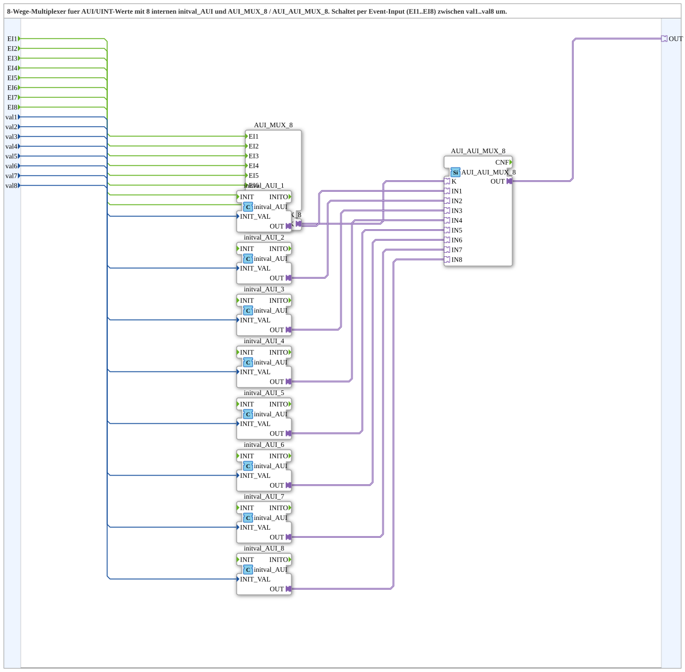

# AUI_AUI_MUX_8_VAL

* * * * * * * * * *
## Einleitung
Der Funktionsblock **AUI_AUI_MUX_8_VAL** ist ein als Subapplikation realisierter 8‑Wege‑Multiplexer für AUI‑Adapter‑Werte. Er wählt über acht Ereignis‑Eingänge (EI1…EI8) einen von acht UINT‑Eingangswerten (val1…val8) aus und stellt diesen Wert über einen unidirektionalen AUI‑Adapter an seinem Ausgang (OUT) bereit. Die Auswahl erfolgt rein ereignisgesteuert; die aktuellen Werte werden über interne Init‑Bausteine in AUI‑Signale umgewandelt.

## Schnittstellenstruktur
### **Ereignis-Eingänge**
- **EI1** (Event): Wählt den Wert von **val1** aus.
- **EI2** (Event): Wählt den Wert von **val2** aus.
- **EI3** (Event): Wählt den Wert von **val3** aus.
- **EI4** (Event): Wählt den Wert von **val4** aus.
- **EI5** (Event): Wählt den Wert von **val5** aus.
- **EI6** (Event): Wählt den Wert von **val6** aus.
- **EI7** (Event): Wählt den Wert von **val7** aus.
- **EI8** (Event): Wählt den Wert von **val8** aus.

### **Ereignis-Ausgänge**
Keine vorhanden.

### **Daten-Eingänge**
- **val1** (UINT): Initialer Ausgabewert für Aktivierung über EI1.
- **val2** (UINT): Initialer Ausgabewert für Aktivierung über EI2.
- **val3** (UINT): Initialer Ausgabewert für Aktivierung über EI3.
- **val4** (UINT): Initialer Ausgabewert für Aktivierung über EI4.
- **val5** (UINT): Initialer Ausgabewert für Aktivierung über EI5.
- **val6** (UINT): Initialer Ausgabewert für Aktivierung über EI6.
- **val7** (UINT): Initialer Ausgabewert für Aktivierung über EI7.
- **val8** (UINT): Initialer Ausgabewert für Aktivierung über EI8.

### **Daten-Ausgänge**
Keine vorhanden; der Ausgang erfolgt ausschließlich über den Adapter **OUT**.

### **Adapter**
- **OUT** (adapter::types::unidirectional::AUI): Liefert den aktuell ausgewählten Wert als AUI‑Signal.

## Funktionsweise
Die Subapplikation verknüpft drei interne Funktionsbaustein‑Typen:
1. **AUI_MUX_8** – Ein Ereignis‑Multiplexer, der anhand der ankommenden Events (EI1 bis EI8) ein Steuersignal (K) für den Adapter‑Multiplexer erzeugt.
2. **AUI_AUI_MUX_8** – Ein Adapter‑Multiplexer, der den entsprechenden Eingang (IN1…IN8) auf den Ausgang (OUT) durchschaltet.
3. **initval_AUI** – Acht Instanzen dieses Bausteins (initval_AUI_1 … initval_AUI_8) wandeln die übergebenen UINT‑Werte (val1…val8) in AUI‑Adapter‑Signale um und stellen sie als initiale Werte an die Eingänge des Adapter‑Multiplexers bereit.

Werden ein oder mehrere Ereignisse an den Eingängen EI1…EI8 ausgelöst, so aktiviert der Ereignis‑Multiplexer den Adapter‑Multiplexer, der dann den passenden der acht vorbereiteten AUI‑Werte an den Ausgang OUT legt. Da nur ein Auswahl‑Event gleichzeitig wirksam sein kann (typische Multiplexer‑Logik), wird immer nur ein Eingang aktiv geschaltet.

## Technische Besonderheiten
- **Unidirektionale AUI‑Kommunikation**: Der Ausgang ist ein unidirektionaler AUI‑Adapter; es sind keine Rückkanäle vorgesehen.
- **Initialwert‑Aufbereitung**: Die UINT‑Eingangswerte werden über die internen `initval_AUI`‑Bausteine in AUI‑kompatible Signale umgewandelt, sodass sie direkt an den Adapter‑Multiplexer übergeben werden können.
- **Event‑gesteuerte Auswahl**: Die Umschaltung erfolgt rein über Ereignisse – es gibt keinen „Select“‑Dateneingang. Jedes Event steht für einen festen Kanal.
- **Keine Ereignis‑Ausgänge**: Nach der Auswahl wird kein Bestätigungs‑Event ausgegeben; die Auswahl wird ausschließlich über den Adapter‑Ausgang sichtbar.

## Zustandsübersicht
Der Funktionsblock besitzt keine expliziten endlichen Zustände im klassischen Sinne. Es lassen sich acht stabile Auswahlzustände definieren, die durch das jeweils zuletzt ausgelöste Ereignis bestimmt werden:
- **Zustand 1** (EI1 aktiv): OUT liefert den Wert von val1.
- **Zustand 2** (EI2 aktiv): OUT liefert den Wert von val2.
- …
- **Zustand 8** (EI8 aktiv): OUT liefert den Wert von val8.

Überschneidende Events (z. B. gleichzeitige Aktivierung mehrerer Eingänge) werden vom internen Multiplexer auf eine eindeutige, feste Priorität aufgelöst (üblicherweise der niedrigste Index gewinnt), ohne dass ein expliziter Zustand dafür definiert ist.

## Anwendungsszenarien
- **Parameterumschaltung**: Auswahl eines von acht vordefinierten Betriebsparametern zur Laufzeit, z. B. Geschwindigkeitsprofile oder Regelungskonstanten.
- **Profilwahl**: Umschalten zwischen verschiedenen Konfigurationsprofilen in einer Maschinensteuerung.
- **Test- und Simulationsumgebungen**: Bereitstellung unterschiedlicher Messwerte oder Sollwerte über einen AUI‑Datenstrom.
- **Redundanzlösungen**: Auswahl eines aktiven Signalpfads aus mehreren redundanten Quellen.

## Vergleich mit ähnlichen Bausteinen
Gegenüber einfachen Multiplexern (z. B. ohne `initval_AUI`) bietet dieser Baustein den Vorteil, dass die UINT‑Eingangswerte bereits intern in AUI‑Adapter‑Signale konvertiert werden und direkt mit aui‑fähigen Komponenten verbunden werden können. Zudem sind die Auswahl‑Events klar einem bestimmten Kanal zugeordnet, was die Verdrahtung übersichtlicher macht. Im Vergleich zu einem generischen Adapter‑Multiplexer ohne Ereignis‑Steuerung ist dieser Baustein speziell für ereignisbasierte Umschaltungen optimiert.

## Fazit
Der **AUI_AUI_MUX_8_VAL** ist ein kompakter, ereignisgesteuerter 8‑Kanal‑Multiplexer für AUI‑Werte. Er kombiniert die Vorteile einer einfachen Datenauswahl mit der direkten Anbindung an unidirektionale AUI‑Schnittstellen. Durch die internen Initial‑Bausteine entfällt eine separate Konvertierung und die Logik bleibt klar strukturiert. Er eignet sich ideal für Anwendungen, in denen mehrere vordefinierte Werte über Ereignisse schnell und zuverlässig ausgewählt werden müssen.