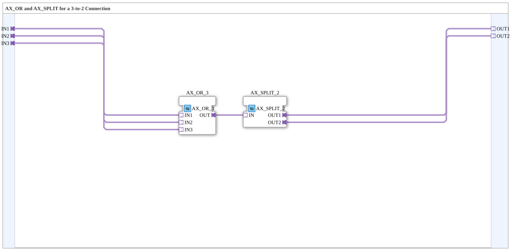

# AX_3_2

* * * * * * * * * *

## Einleitung

`AX_3_2` kombiniert `AX_OR_3` und `AX_SPLIT_2` zu einem fertigen Baustein: Drei `AX`-Quellen (`IN1`, `IN2`, `IN3`) werden per ODER zu einem gemeinsamen Signal verknüpft und anschließend auf zwei Ziele (`OUT1`, `OUT2`) verteilt.

## Verwendete Funktionsbausteine (FBs)

### Sub-Bausteine: AX_3_2

- **Typ**: SubAppType
- **Verwendete interne FBs**:
    - **AX_OR_3**: `adapter::booleanOperators::AX_OR_3` — verknüpft `IN1`/`IN2`/`IN3` per ODER.
    - **AX_SPLIT_2**: `adapter::events::unidirectional::AX_SPLIT_2` — verteilt das ODER-Ergebnis auf zwei Ausgänge.
- **Funktionsweise**: `IN1`/`IN2`/`IN3` → `AX_OR_3.OUT` → `AX_SPLIT_2.IN` → `OUT1`/`OUT2`.

## Programmablauf und Verbindungen

1. `IN1` → `AX_OR_3.IN1`; `IN2` → `AX_OR_3.IN2`; `IN3` → `AX_OR_3.IN3`.
2. `AX_OR_3.OUT` → `AX_SPLIT_2.IN`.
3. `AX_SPLIT_2.OUT1` → `OUT1`; `AX_SPLIT_2.OUT2` → `OUT2`.

## Anwendungsszenarien

- Zusammenführen dreier `AX`-Quellen (z. B. drei Kommandowege), deren gemeinsames Ergebnis an zwei unabhängige Ziele verteilt werden muss.

## Vergleich mit ähnlichen Bausteinen

Für andere Quellen-/Ziel-Anzahlen: [`AX_2_3`](./AX_2_3.md) (2→3), [`AX_3_3`](./AX_3_3.md) (3→3).

## Zusammenfassung

`AX_3_2` ist eine reine Verdrahtungshilfe, die drei `AX`-Quellen per ODER zusammenführt und auf zwei Ziele verteilt — ohne eigene Zustandslogik.

---

### 🌐 Passende Themen-Unterseiten auf ms-muc-docs.de

- [🌐 Eclipse 4diac IDE & Farb-Referenz auf ms-muc-docs.de](https://www.ms-muc-docs.de/iec-61499/eclipse-4diac/)
