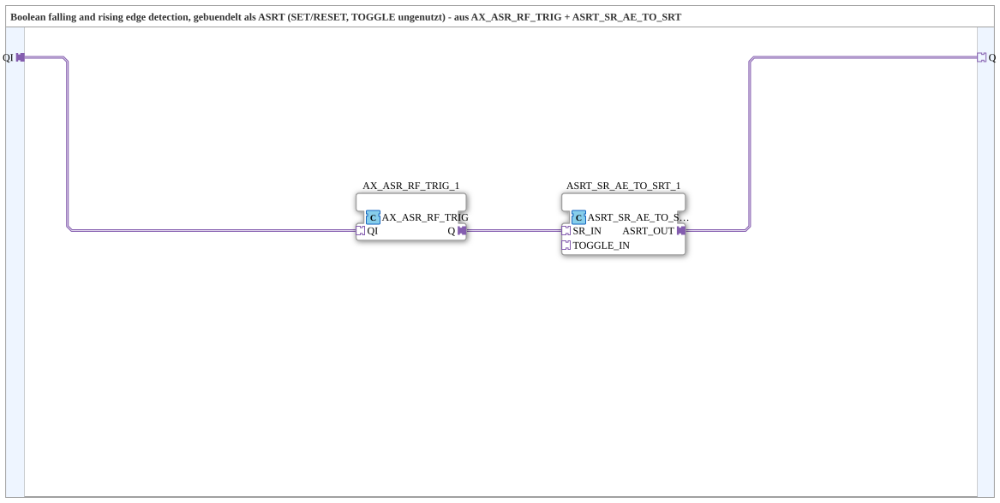

# AX_ASRT_RF_TRIG

* * * * * * * * * *

## Einleitung

`AX_ASRT_RF_TRIG` erkennt steigende und fallende Flanken eines `AX`-Signals und bündelt sie als `ASRT`-Adapter (Set/Reset, Toggle bleibt ungenutzt). Statt eines neuen Low-Level-`FBType` ist der Baustein als Composite aus dem bestehenden `AX_ASR_RF_TRIG` (liefert ein `ASR` aus einer Flanke) und `ASRT_SR_AE_TO_SRT` (kombiniert ein `ASR` mit einem optionalen AE-Toggle-Event zu einem `ASRT`) aufgebaut.

## Verwendete Funktionsbausteine (FBs)

### Sub-Bausteine: AX_ASRT_RF_TRIG

- **Typ**: SubAppType
- **Verwendete interne FBs**:
    - **AX_ASR_RF_TRIG_1**: `adapter::events::unidirectional::AX_ASR_RF_TRIG` — steigende Flanke an `QI` → SET, fallende Flanke → RESET, gebündelt als `ASR`.
    - **ASRT_SR_AE_TO_SRT_1**: `adapter::conversion::unidirectional::ASRT_SR_AE_TO_SRT` — übernimmt das `ASR` als `SR_IN` und bündelt es zu `ASRT_OUT`; der zweite Socket (`TOGGLE_IN`, ein einzelnes AE-Event) bleibt unverdrahtet und feuert nie, da sich aus einem reinen Flankensignal kein unabhängiges drittes Ereignis ableiten lässt.
- **Funktionsweise**: `AX_ASR_RF_TRIG_1` erzeugt aus der Flanke von `QI` ein `ASR`, das direkt als `SR_IN` in `ASRT_SR_AE_TO_SRT_1` gespeist wird, dessen `ASRT_OUT` den Plug `Q` bedient.

## Programmablauf und Verbindungen

1. `QI` (Socket) → `AX_ASR_RF_TRIG_1.QI`.
2. `AX_ASR_RF_TRIG_1.Q` → `ASRT_SR_AE_TO_SRT_1.SR_IN`.
3. `ASRT_SR_AE_TO_SRT_1.ASRT_OUT` → `Q` (Plug).

## Technische Besonderheiten

- **Composite statt neuem Low-Level-Baustein**: Wiederverwendet zwei bestehende Bausteine, statt einen neuen `FBType` zu implementieren.
- **TOGGLE-Socket bleibt ungenutzt**: `ASRT_SR_AE_TO_SRT_1.TOGGLE_IN` wird nie verdrahtet und feuert daher nie — der Baustein liefert also nur SET/RESET, nie ein echtes Toggle-Ereignis.

## Anwendungsszenarien

- Als eine von mehreren `ASRT`-Quellen für einen `ASRT_MERGE_2`, z. B. in `Uebung_232_AX`.

## Zusammenfassung

`AX_ASRT_RF_TRIG` liefert aus einer einzigen Flankenerkennung ein `ASRT`-Adapter-Signal (nur Set/Reset, Toggle ungenutzt) und ist damit direkt an Bausteine anschließbar, die einen `ASRT`-Socket erwarten.

---

### 🌐 Passende Themen-Unterseiten auf ms-muc-docs.de

- [🌐 Eclipse 4diac IDE & Farb-Referenz auf ms-muc-docs.de](https://www.ms-muc-docs.de/iec-61499/eclipse-4diac/)
