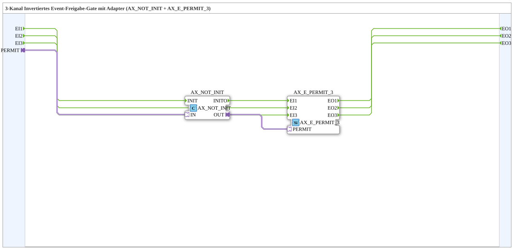

# AX_E_PERMIT_INVERT_3

* * * * * * * * * *
## Einleitung

Der Funktionsbaustein **AX_E_PERMIT_INVERT_3** ist eine Subapplikation (SubApp) zur Realisierung eines **3‑Kanal invertierten Event‑Freigabe‑Gates**. Er kombiniert die Bausteine `AX_NOT_INIT` (logische Negation eines Adaptersignals) und `AX_E_PERMIT_3` (3‑Kanal Event‑Freigabe) zu einer gekapselten, wiederverwendbaren Einheit.

Im Gegensatz zu einer direkten Freigabe werden die eingehenden Events **nur dann durchgeschaltet**, wenn das über den Adapter anliegende Freigabesignal **FALSE** ist. Ein aktives Freigabesignal (TRUE) sperrt dagegen alle drei Eventkanäle.

## Schnittstellenstruktur

### **Ereignis-Eingänge**

| Name | Typ   | Kommentar                  |
|------|-------|----------------------------|
| EI1  | Event | Ereignis‑Eingangskanal 1   |
| EI2  | Event | Ereignis‑Eingangskanal 2   |
| EI3  | Event | Ereignis‑Eingangskanal 3   |

### **Ereignis-Ausgänge**

| Name | Typ   | Kommentar                  |
|------|-------|----------------------------|
| EO1  | Event | Ereignis‑Ausgangskanal 1   |
| EO2  | Event | Ereignis‑Ausgangskanal 2   |
| EO3  | Event | Ereignis‑Ausgangskanal 3   |

### **Daten-Eingänge**

Keine vorhanden.

### **Daten-Ausgänge**

Keine vorhanden.

### **Adapter**

| Name   | Richtung | Typ                          | Kommentar                     |
|--------|----------|------------------------------|-------------------------------|
| PERMIT | Socket   | `adapter::types::unidirectional::AX` | Invertiertes Freigabesignal   |

## Funktionsweise

Die SubApp besteht aus zwei intern verbundenen Funktionsbausteinen:

1. **AX_NOT_INIT** – Ein unidirektionaler Adapterbaustein, der das am Eingang `IN` anliegende Signal logisch negiert und am Ausgang `OUT` bereitstellt.  
2. **AX_E_PERMIT_3** – Ein 3‑Kanal‑Event‑Freigabebaustein, der die Ereignisse von `EI1`/`EI2`/`EI3` an die entsprechenden Ausgänge `EO1`/`EO2`/`EO3` nur dann weiterleitet, wenn das Signal an seinem Freigabeeingang `PERMIT` **TRUE** ist.

Intern wird das äußere Freigabesignal `PERMIT` der SubApp an `AX_NOT_INIT.IN` geführt. Das negierte Ausgangssignal `AX_NOT_INIT.OUT` wird mit dem Freigabeeingang `PERMIT` von `AX_E_PERMIT_3` verbunden.

Somit gilt für jeden der drei Kanäle:

- Ist das äußere Freigabesignal `PERMIT` **FALSE**, ist das invertierte Signal **TRUE** und die Events werden durchgeschaltet.
- Ist das äußere Freigabesignal `PERMIT` **TRUE**, ist das invertierte Signal **FALSE** und die Events werden blockiert.

Die Verzögerung ist rein ereignisgesteuert und rein kombinatorisch; es werden keine Datenwerte verarbeitet oder gespeichert.

## Technische Besonderheiten

- **SubApp‑Kapselung**: Die Kombination aus Negation und Freigabe wird als eigener Baustein bereitgestellt und kann in verschiedenen Anwendungen wiederverwendet werden.
- **Unidirektionaler Adapter**: Der Adapter `PERMIT` vom Typ `AX` ist unidirektional und überträgt ausschließlich ein boolesches Freigabesignal.
- **Keine Datenpfade**: Die SubApp besitzt weder Daten‑Ein‑ noch Daten‑Ausgänge; die Funktionalität ist rein ereignisbasiert.
- **Keine interne Zustandshaltung**: Das Verhalten ist deterministisch und hängt nur vom aktuellen Wert des Freigabesignals ab.
- **Drei unabhängige Kanäle**: Die Kanäle 1–3 werden parallel und unabhängig voneinander gesteuert.

## Zustandsübersicht

Da die SubApp keine eigenen internen Zustände besitzt, ergibt sich die Zustandsübersicht aus der Kombination von Freigabesignal und Ereignisweiterleitung:

| PERMIT (extern) | Invertiertes Signal | Ereignis EIx → EOx |
|-----------------|---------------------|--------------------|
| FALSE           | TRUE                | durchgeschaltet    |
| TRUE            | FALSE               | blockiert          |

Diese Tabelle gilt für jeden einzelnen Kanal (x = 1, 2, 3) gleichermaßen.

## Anwendungsszenarien

- **Sperrlogik mit invertiertem Freigabesignal**: Wenn ein Steuerungssystem ein Sicherheitssignal als „Sperre“ interpretiert (TRUE = gesperrt) und Events nur im ungesperrten Zustand durchlaufen sollen.
- **Freigabe bei inaktivem Signal**: Anwendungen, bei denen eine Maschine oder ein Prozess nur dann Ereignisse verarbeiten darf, wenn ein bestimmtes Signal **nicht** aktiv ist – z. B. bei Ruhezustand oder manuellem Modus.
- **Mehrkanalige Ereignisverarbeitung**: Drei parallele Ereignispfade, die gemeinsam über ein einziges Freigabesignal gesteuert werden sollen, ohne dass die Negation separat implementiert werden muss.

## Vergleich mit ähnlichen Bausteinen

- **AX_E_PERMIT_3**: Der direkte Freigabebaustein leitet Events nur bei **TRUE** am Freigabeeingang weiter. `AX_E_PERMIT_INVERT_3` ist die invertierte Variante davon.
- **AX_NOT_INIT + AX_E_PERMIT_3** (einzeln verwendet): Bietet dieselbe Funktionalität, erfordert aber eine manuelle Verdrahtung. Die SubApp kapselt diese Verbindung und reduziert so die Fehleranfälligkeit und den Engineering‑Aufwand.
- **FBs mit Daten‑Eingängen**: Alternative Bausteine könnten ein Freigabesignal über einen Daten‑Eingang statt über einen Adapter erhalten – `AX_E_PERMIT_INVERT_3` nutzt dagegen eine standardisierte Adapterschnittstelle.

## Fazit

Die SubApp **AX_E_PERMIT_INVERT_3** stellt eine kompakte und klar strukturierte Lösung für eine dreikanalige, invertierte Event‑Freigabe dar. Durch die Kombination von Negation und Freigabe in einem Baustein vereinfacht sie das Engineering, erhöht die Wiederverwendbarkeit und macht die Applikationslogik besser lesbar. Sie eignet sich besonders für Szenarien, in denen Ereignisse nur bei inaktivem Freigabesignal verarbeitet werden dürfen.