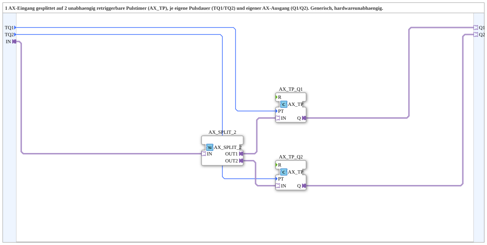

# AX_SPLIT_TO_2x_AX_TP

* * * * * * * * * *

## Einleitung

Der Baustein `AX_SPLIT_TO_2x_AX_TP` ist eine wiederverwendbare Subapplikation (SubApp), die einen einzelnen AX‑Eingang auf zwei unabhängig voneinander arbeitende, retriggerbare Pulstimer (Typ `AX_TP`) aufteilt. Jeder Ausgang besitzt eine eigene, einstellbare Pulsdauer (`TQ1` bzw. `TQ2`) und stellt einen separaten AX‑Ausgang (`Q1` bzw. `Q2`) bereit. Die SubApp ist generisch aufgebaut und hardwareunabhängig einsetzbar.

## Schnittstellenstruktur

### **Ereignis-Eingänge**

Es sind keine separaten Ereignis‑Eingänge vorhanden. Ereignissignale werden über die Adapter‑Schnittstelle `IN` übertragen.

### **Ereignis-Ausgänge**

Es sind keine separaten Ereignis‑Ausgänge definiert. Die ereignisbasierten Signale werden über die Adapter‑Ausgänge `Q1` und `Q2` ausgegeben.

### **Daten-Eingänge**

| Name | Typ   | Beschreibung                     |
|------|-------|----------------------------------|
| TQ1  | TIME  | Pulsdauer für den Timer `AX_TP_Q1` |
| TQ2  | TIME  | Pulsdauer für den Timer `AX_TP_Q2` |

### **Daten-Ausgänge**

Keine direkten Daten‑Ausgänge vorhanden. Die Ergebnisse werden über die Adapter‑Ausgänge `Q1` und `Q2` zur Verfügung gestellt.

### **Adapter**

| Richtung | Name | Typ                                  | Beschreibung                         |
|----------|------|--------------------------------------|--------------------------------------|
| Eingang  | IN   | `adapter::types::unidirectional::AX` | AX‑Eingangssignal, das aufgeteilt wird |
| Ausgang  | Q1   | `adapter::types::unidirectional::AX` | AX‑Ausgang des ersten Timers          |
| Ausgang  | Q2   | `adapter::types::unidirectional::AX` | AX‑Ausgang des zweiten Timers         |

## Funktionsweise

Die SubApp arbeitet in drei Stufen:

1. **Split:** Das an `IN` anliegende AX‑Signal wird durch den internen Baustein `AX_SPLIT_2` auf zwei identische Ausgänge (`OUT1` und `OUT2`) aufgeteilt.
2. **Timer:** Jeder der beiden geteilten Signale wird einem eigenen `AX_TP`‑Timer (`AX_TP_Q1` bzw. `AX_TP_Q2`) zugeführt. Diese Timer sind retriggerbar, d.h. bei jedem neuen Ereignis am Eingang startet die voreingestellte Pulsdauer erneut.
3. **Ausgabe:** Die Ausgangssignale der Timer (`Q`) werden direkt an die Adapter‑Plugs `Q1` bzw. `Q2` weitergeleitet.

Die Pulsdauern werden über die Dateneingänge `TQ1` (für `AX_TP_Q1`) und `TQ2` (für `AX_TP_Q2`) festgelegt. Da beide Timer vollständig unabhängig arbeiten, können unterschiedliche Pulszeiten gleichzeitig verwendet werden.

## Technische Besonderheiten

- **Vollständig entkoppelte Ausgänge:** Beide Ausgangskanäle besitzen eigene Timer und Pulsdauern – eine Beeinflussung ist nicht möglich.
- **Retriggerbarkeit:** Die eingesetzten Timer vom Typ `AX_TP` unterstützen das erneute Triggern während laufender Pulsdauer, was eine präzise Steuerung bei häufigen Ereignissen ermöglicht.
- **Generischer Aufbau:** Die SubApp verwendet keine hardwareabhängigen Elemente und kann in verschiedenen Projektumgebungen eingesetzt werden.
- **Wiederverwendbarkeit:** Der Baustein ist durch die klare Schnittstellentrennung leicht in größere Systeme integrierbar.

## Zustandsübersicht

Die SubApp selbst besitzt keinen eigenen Zustandsautomaten. Die internen Bausteine `AX_SPLIT_2` und `AX_TP` verfügen über typische Zustände eines AX‑Puls‑Timers:  
„Idle", „Timer läuft" und „Puls aktiv". Diese sind jedoch nicht Bestandteil dieser Dokumentation, da die SubApp nur deren Verschaltung kapselt.

## Anwendungsszenarien

- **Zwei unabhängige Ventile:** Ein gemeinsames Startsignal muss zwei Ventile mit unterschiedlicher Öffnungszeit ansteuern.
- **Signalkaskadierung:** Aufteilung eines Ereignisses auf zwei parallele Signalpfade mit getrennten Zeitvorgaben.
- **Testumgebungen:** Erzeugung unterschiedlicher Pulsbreiten aus einem Quellsignal für Prüfzwecke.

## Vergleich mit ähnlichen Bausteinen

| Baustein / Ansatz                     | Vorteile                                          | Nachteile                                 |
|---------------------------------------|---------------------------------------------------|-------------------------------------------|
| `AX_SPLIT_TO_2x_AX_TP` (vorliegend)   | Zwei getrennt einstellbare Timer, unabhängig      | Etwas mehr Overhead durch interne FBs     |
| Einfacher Split (ohne Timer)          | Minimaler Ressourcenbedarf                        | Keine Zeitsteuerung, nur Verteilung       |
| Split mit einem gemeinsamen Timer     | Geringe Komplexität                               | Keine getrennten Pulszeiten möglich       |

## Fazit

`AX_SPLIT_TO_2x_AX_TP` ist eine flexible und robuste Lösung, um ein einzelnes AX‑Ereignis in zwei zeitlich unabhängig steuerbare Ausgangssignale aufzuteilen. Durch die klare Trennung der Pulsdauern und die Retriggerbarkeit eignet sich der Baustein besonders für Anwendungen, bei denen unterschiedliche zeitliche Bedingungen pro Ausgang erforderlich sind. Die generische Bauweise ermöglicht eine unkomplizierte Integration in unterschiedliche Steuerungsarchitekturen.