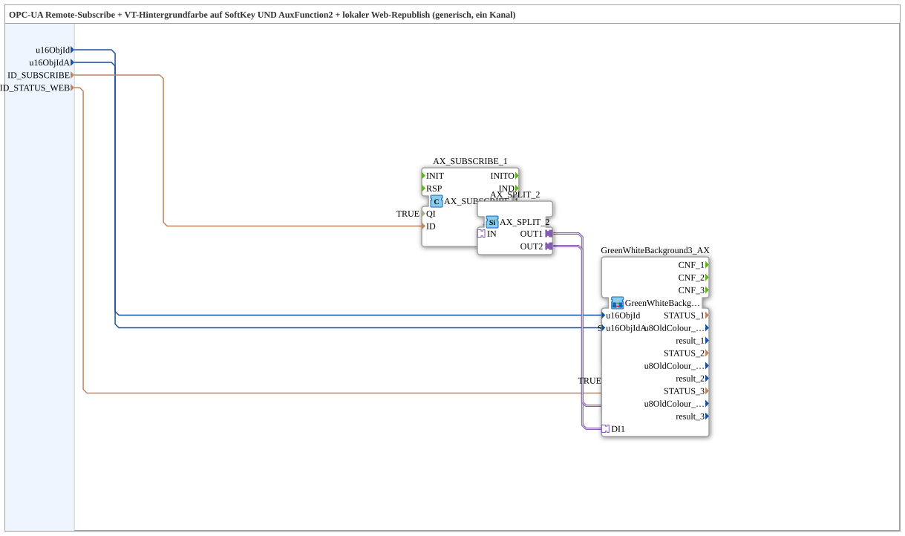

# AX_SUBSCRIBE_BG3_WEB_OPC

* * * * * * * * * *

## Einleitung

`AX_SUBSCRIBE_BG3_WEB_OPC` ist die Status-Hälfte von `Softkey_Aux_IXA_TO_Remote_WRITE_BG_OPC`, herausgelöst als eigenständiger Baustein: ein Remote-Subscribe-Wert wird sowohl als Hintergrundfarbe auf einem SoftKey UND einer AuxFunction2 dargestellt (`GreenWhiteBackground3_AX`) als auch lokal per OPC-UA erneut veröffentlicht, damit ein Web-Client (z. B. vt-ui-mirror) auf demselben Modul denselben Status ohne eigene Verbindung zum Zielmodul lesen kann.

## Verwendete Funktionsbausteine (FBs)

### Sub-Bausteine: AX_SUBSCRIBE_BG3_WEB_OPC

- **Typ**: SubAppType
- **Verwendete interne FBs**:
    - **AX_SUBSCRIBE_1**: `adapter::net::AX_SUBSCRIBE_1` (`QI=TRUE`) — Remote-Subscribe der Status/Farbe (`ID_SUBSCRIBE`).
    - **AX_SPLIT_2**: `adapter::events::unidirectional::AX_SPLIT_2` — verzweigt das empfangene Signal auf die VT-Anzeige und den lokalen Web-Republish.
    - **GreenWhiteBackground3_AX** (SubApp, `MyLib::sys`): färbt sowohl einen SoftKey (`u16ObjId`) als auch eine AuxFunction2 (`u16ObjIdA`) synchron.
    - **STATUS_WEB_PUBLISH**: `adapter::net::AX_PUBLISH_1` (`QI=TRUE`) — veröffentlicht den empfangenen Zustand erneut auf dem lokalen OPC-UA-Server dieses Moduls (`ID_STATUS_WEB`).
- **Funktionsweise**: Der per Remote-Subscribe empfangene Zustand wird über `AX_SPLIT_2` gleichzeitig an die VT-Hintergrundfarbe und an den lokalen Web-Republish weitergereicht.

## Programmablauf und Verbindungen

1. `u16ObjId` → `GreenWhiteBackground3_AX.u16ObjId`; `u16ObjIdA` → `GreenWhiteBackground3_AX.u16ObjIdA`; `ID_SUBSCRIBE` → `AX_SUBSCRIBE_1.ID`; `ID_STATUS_WEB` → `STATUS_WEB_PUBLISH.ID` (Datenverbindungen, ausgeblendet).
2. `AX_SUBSCRIBE_1.OUT` → `AX_SPLIT_2.IN` → `AX_SPLIT_2.OUT1` → `GreenWhiteBackground3_AX.DI1` (VT-Anzeige), `AX_SPLIT_2.OUT2` → `STATUS_WEB_PUBLISH.IN` (Web-Republish).

## Technische Besonderheiten

- **Erweiterung von `AX_SUBSCRIBE_BG_OPC`**: Gegenüber der einfacheren Variante (nur Subscribe + Hintergrundfarbe) kommen zwei Dinge hinzu: `GreenWhiteBackground3_AX` statt `GreenWhiteBackground1_AX` (färbt SoftKey und Aux gemeinsam) sowie der lokale Web-Republish über `AX_SPLIT_2`/`STATUS_WEB_PUBLISH`.
- **Entkopplung vom Zielmodul**: Ein Web-Client, der nur mit diesem Modul verbunden ist, muss keine eigene Verbindung zum Zielmodul aufbauen, um denselben Status wie das echte VT zu sehen.

## Anwendungsszenarien

- Statusanzeige für Funktionen, die sowohl auf einem SoftKey als auch auf einer AuxFunction2 (Joystick-Zuweisung) synchron dargestellt werden müssen, plus Web-Spiegelung.
- Für nur einen SoftKey ohne Aux ist stattdessen `AX_SUBSCRIBE_BG_OPC` zu verwenden (kein Web-Republish).

## Vergleich mit ähnlichen Bausteinen

Für die komplette, vorverdrahtete Kombination mit der Kommando-Seite (SoftKey/Aux-Auslesen + Remote-Write) ist weiterhin `Softkey_Aux_IXA_TO_Remote_WRITE_BG_OPC` zu verwenden, das diesen Baustein als Status-Teilbaustein enthält.

## Zusammenfassung

`AX_SUBSCRIBE_BG3_WEB_OPC` kapselt die Status-Seite eines Remote-Kanals: Empfang, synchrone SoftKey/Aux-Hintergrundfarbe und lokaler Web-Republish in einem eigenständig wiederverwendbaren Baustein.

---

### 🌐 Passende Themen-Unterseiten auf ms-muc-docs.de

- [🌐 Eclipse 4diac IDE & Farb-Referenz auf ms-muc-docs.de](https://www.ms-muc-docs.de/iec-61499/eclipse-4diac/)
