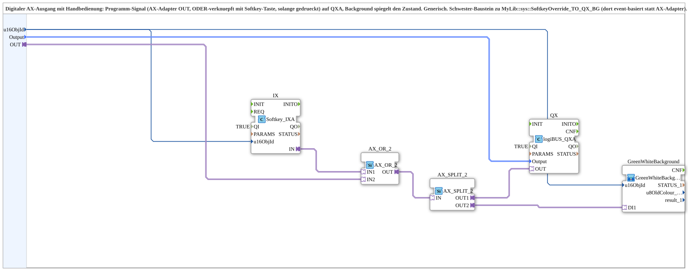

# AX_SoftkeyOverride_TO_QXA_BG

* * * * * * * * * *
## Einleitung
Der Funktionsbaustein `AX_SoftkeyOverride_TO_QXA_BG` ist eine wiederverwendbare Subapp zur Steuerung eines digitalen Ausgangs (QXA) mit manueller Übersteuerung über eine Softkey-Taste. Das Programm-Signal (AX-Adapter) wird mit dem Zustand der Taste ODER-verknüpft und auf den Ausgang gegeben. Ein integrierter Hintergrundbaustein visualisiert den aktuellen Zustand des Ausgangs. Der Baustein ist generisch aufgebaut und ermöglicht eine flexible Zuordnung von Objekt-IDs und Ausgangswerten.

## Schnittstellenstruktur
### **Ereignis-Eingänge**
Es sind keine Ereignis-Eingänge vorhanden.

### **Ereignis-Ausgänge**
Es sind keine Ereignis-Ausgänge vorhanden.

### **Daten-Eingänge**
- `u16ObjId` (UINT): Objekt-ID der Softkey-Taste bzw. des Buttons (Initialwert: `ID_NULL`).
- `Output` (logiBUS::io::DQ::logiBUS_DO_S): Ausgangswert, der an den digitalen Ausgang übergeben wird (Initialwert: `logiBUS_DO::Invalid`).

### **Daten-Ausgänge**
Es sind keine Daten-Ausgänge vorhanden.

### **Adapter**
- `OUT` (Socket, Typ `adapter::types::unidirectional::AX`): Eingangs-Adapter für das Programm-Signal (AX-Datenstrom).

## Funktionsweise
Das über den Adapter `OUT` ankommende AX-Programmsignal wird zusammen mit dem Softkey-Zustand logisch ODER-verknüpft. Der Softkey-Zustand wird über den Baustein `Softkey_IXA` mit der übergebenen Objekt-ID `u16ObjId` ermittelt. Die ODER-Verknüpfung erfolgt über den Baustein `AX_OR_2`, der die beiden AX-Signale (Programm und Taste) zusammenführt.

Das Ergebnis der Verknüpfung wird anschließend über `AX_SPLIT_2` in zwei Pfade aufgeteilt:
- **Pfad 1** (OUT1) steuert den Ausgangsbaustein `logiBUS_QXA` an, der das digitale Signal auf dem QXA-Port setzt. Der Datenwert `Output` wird dabei als Ausgangswert übergeben.
- **Pfad 2** (OUT2) speist den Hintergrundbaustein `GreenWhiteBackground1_AX`, der den Ausgangszustand visuell darstellt (z. B. Mit Farbe oder Text) und ebenfalls die Objekt-ID `u16ObjId` erhält.

Durch diese Struktur wird eine einfache Handbedienung ermöglicht: Solange die Taste gedrückt ist oder das Programm-Signal aktiv ist, ist der Ausgang aktiv.

## Technische Besonderheiten
- Verwendung von AX-Adapter-basierten Bausteinen (`AX_OR_2`, `AX_SPLIT_2`) zur Verarbeitung unidirektionaler AX-Signale – typisch für zyklische Signalverarbeitung ohne Event-Synchronisation.
- Der Baustein ist generisch und kann durch die Parameter `u16ObjId` und `Output` an verschiedene Anwendungen angepasst werden.
- Die Aufteilung des AX-Signals über `AX_SPLIT_2` ermöglicht die parallele Ausgabe an den eigentlichen Ausgang und an die Visualisierung (Hintergrund).
- Die Subapp ist modular aufgebaut und kann in übergeordnete Projekte als wiederverwendbare Komponente eingebunden werden.

## Zustandsübersicht
Der Baustein besitzt keinen eigenen Zustandsautomaten. Das Verhalten lässt sich jedoch logisch wie folgt beschreiben:

| Zustand des AX-Eingangs | Softkey gedrückt | Ausgang (QXA) |
|-------------------------|------------------|---------------|
| inaktiv                 | nein             | inaktiv       |
| aktiv                   | nein             | aktiv         |
| inaktiv                 | ja               | aktiv         |
| aktiv                   | ja               | aktiv         |

Der Hintergrund spiegelt den Zustand des Ausgangs entsprechend wider (z. B. Grün bei aktiv, Weiß bei inaktiv).

## Anwendungsszenarien
- **Manuelles Übersteuern** eines digitalen Ausgangs in Maschinensteuerungen oder Prozessanlagen, z. B. für Testzwecke oder im Wartungsbetrieb.
- **Not- oder Freigabe-Taster**: Ein Softkey kann verwendet werden, um eine sicherheitsrelevante Ausgabe kurzfristig zu aktivieren.
- **Visualisierung und Fernbedienung**: Der Hintergrundbaustein dient zur Zustandsanzeige auf Bedienpanels oder in SCADA-Systemen.

## Vergleich mit ähnlichen Bausteinen
Der Baustein `AX_SoftkeyOverride_TO_QXA_BG` ist ein Schwester-Baustein zu `MyLib::sys::SoftkeyOverride_TO_QX_BG`. Letzterer arbeitet event-basiert (über Event-Eingänge) statt mit AX-Adaptern. Während der event-basierte Ansatz eher für ereignisgesteuerte Abläufe geeignet ist, eignet sich der AX-basierte Baustein besser für zyklische Verarbeitung oder wenn bereits AX-Signale im System verwendet werden. Beide erfüllen die gleiche grundlegende Funktion: ODER-Verknüpfung von Programm- und Tastersignal auf einen digitalen Ausgang. Die Wahl hängt von der vorhandenen Signalarchitektur ab.

## Fazit
`AX_SoftkeyOverride_TO_QXA_BG` bietet eine robuste und flexible Lösung, um digitale Ausgänge manuell zu übersteuern und gleichzeitig den Zustand visuell darzustellen. Durch die Verwendung von AX-Adaptern lässt sich der Baustein nahtlos in moderne, zyklische Steuerungsarchitekturen integrieren. Seine generische Parametrierung und die modulare Bauweise machen ihn zu einem wertvollen Bestandteil in der Automatisierungstechnik, insbesondere wenn eine Mischung aus automatischem und manuellem Betrieb gewünscht ist.