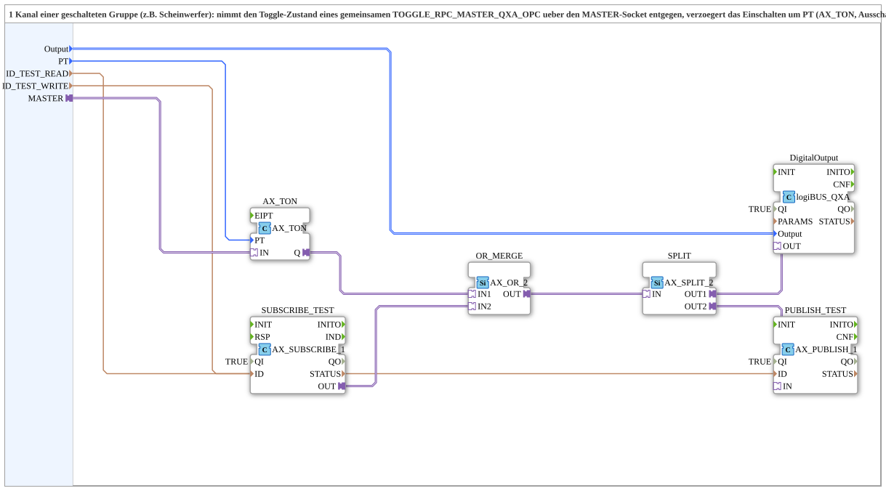

# AX_TON_MERGE_QXA_OPC

* * * * * * * * * *
## Einleitung

Der Baustein `AX_TON_MERGE_QXA_OPC` realisiert einen Kanal einer geschalteten Gruppe (z. B. eine Scheinwerfer‑Gruppe). Er nimmt den Toggle‑Zustand eines gemeinsamen Masters über den `MASTER`‑Socket entgegen, verzögert das Einschalten um eine einstellbare Zeit (`PT`) und schaltet den physischen Ausgang sofort aus. Das bestehende IO‑Test‑Kommando des Kanals wird über eine ODER‑Verknüpfung mit eingebunden. Dadurch lassen sich mehrere Kanäle mit unterschiedlichen Einschaltverzögerungen zu einer Gruppe zusammenfassen, um kapazitive Einschaltstrom‑Spitzen zu vermeiden.

## Schnittstellenstruktur

### **Ereignis-Eingänge**
Keine Ereignis‑Eingänge vorhanden. Der Baustein wird rein daten‑ und adaptergesteuert betrieben.

### **Ereignis-Ausgänge**
Keine Ereignis‑Ausgänge vorhanden.

### **Daten-Eingänge**

| Name | Typ | Beschreibung |
|------|-----|--------------|
| `Output` | `logiBUS::io::DQ::logiBUS_DO_S` | Physischer Ausgang dieses Kanals; Initialwert `logiBUS_DO::Invalid` |
| `PT` | `TIME` | Einschaltverzögerung gegenüber dem Master‑Toggle (z. B. `T#0ms`, `T#800ms`, `T#1600ms`); Ausschalten erfolgt immer sofort |
| `ID_TEST_READ` | `WSTRING` | Adresse für die bestehende IO‑Test‑Subscribe (z. B. `STG5_Q0x_READ`) |
| `ID_TEST_WRITE` | `WSTRING` | Adresse für die bestehende IO‑Test‑Publish (z. B. `STG5_Q0x_WRITE`) – **eigener Knoten**, nicht derselbe wie `ID_TEST_READ`, um Selbstrückkopplung/Latch zu vermeiden |

### **Daten-Ausgänge**
Keine Daten‑Ausgänge vorhanden.

### **Adapter**

| Name | Typ | Richtung | Beschreibung |
|------|-----|----------|--------------|
| `MASTER` | `adapter::types::unidirectional::AX` | Socket (Eingang) | Toggle‑Zustand vom gemeinsamen `TOGGLE_RPC_MASTER_QXA_OPC.OUT` |

## Funktionsweise

Der `MASTER`‑Socket überträgt den Toggle‑Zustand eines zentralen Masters. Dieser Zustand wird an den Timer‑Baustein `AX_TON` weitergeleitet. `AX_TON` verzögert nur das **Einschalten** um die konfigurierte Zeit `PT`; das Ausschalten geschieht unmittelbar. Das verzögerte Signal wird zusammen mit dem bestehenden IO‑Test‑Befehl des Kanals (über `AX_SUBSCRIBE_1`) in einer ODER‑Verknüpfung (`AX_OR_2`) kombiniert. Das Ergebnis wird über einen Split (`AX_SPLIT_2`) sowohl an den physischen Ausgang (`logiBUS_QXA`) als auch an die Publish‑Schnittstelle (`AX_PUBLISH_1`) gesendet. Dadurch bleibt der IO‑Test‑Befehlsweg erhalten und das verzögerte Toggle‑Signal wirkt parallel dazu.

## Technische Besonderheiten

- **Verzögerung nur beim Einschalten**: `AX_TON` sorgt dafür, dass das Einschalten um `PT` verzögert wird, das Ausschalten jedoch sofort erfolgt. Dies vermeidet unerwünschte Latenzen beim Abschalten.
- **Mehrere Kanäle mit einem Master**: Mehrere Instanzen dieses Bausteins können denselben Master‑Socket verwenden. Die Verdrahtung erfolgt lokal im SubApp‑Netzwerk, eine OPC‑UA‑Anbindung ist nicht erforderlich.
- **Integration des IO‑Tests**: Das bestehende Test‑Kommando (Subscribe) wird über eine ODER‑Verknüpfung in den Ausgangssignalpfad integriert. Dadurch bleiben Diagnose‑ und Testfunktionen erhalten.
- **Vermeidung von Selbstrückkopplung**: Für `ID_TEST_READ` und `ID_TEST_WRITE` müssen unterschiedliche OPC‑UA‑Knoten verwendet werden, um ungewolltes Latch‑Verhalten zu verhindern.
- **Flexible Verzögerungszeiten**: `PT` ist pro Instanz einstellbar, sodass eine gestaffelte Aktivierung mehrerer Kanäle einfach konfiguriert werden kann.

## Zustandsübersicht

Der Baustein selbst besitzt keinen expliziten Zustandsautomaten. Die Zustandslogik wird über die internen Funktionsbausteine bestimmt:

- **AX_TON**: Interner Timer mit den Zuständen `IN=TRUE` (Timer läuft) und `Q` (Ausgang nach Ablauf der Verzögerung). Bei `IN=FALSE` wird `Q` sofort `FALSE`.
- **AX_OR_2**: Logische ODER‑Verknüpfung der beiden Eingänge.
- **AX_SPLIT_2**: Verteilt das Eingangssignal auf zwei Ausgänge.

Daraus ergibt sich folgendes Verhalten des Gesamtbausteins:

| Master‑Toggle | Test‑Kommando | Verzögerte Ausgangslogik | Phys. Ausgang |
|---------------|---------------|--------------------------|---------------|
| `TRUE` (mit PT) | `FALSE` | nach Ablauf `PT` → `TRUE` | `TRUE` |
| `TRUE` (sofort) | `FALSE` | sofort `TRUE` (falls PT=0) | `TRUE` |
| `FALSE` (sofort) | `FALSE` | sofort `FALSE` | `FALSE` |
| egal | `TRUE` | `TRUE` (Test aktiv) | `TRUE` |

## Anwendungsszenarien

- **Beleuchtungsgruppen mit mehreren Scheinwerfer‑Kanälen**: Eine Gruppe von 6 LED‑Kanal‑Instanzen wird über einen gemeinsamen Master geschaltet. Durch gestaffelte `PT`‑Werte (z. B. 0 ms, 800 ms, 1600 ms, …) wird der Einschaltstrom der LED‑Treiber zeitlich verteilt, sodass kapazitive Lasten nicht gleichzeitig zugeschaltet werden.
- **Steuerung von Verbrauchern mit hohem Anlaufstrom**: Überall dort, wo mehrere Verbraucher nacheinander hochfahren sollen, um Spannungseinbrüche zu vermeiden.
- **Integration in bestehende IO‑Test‑Infrastruktur**: Der Baustein lässt sich problemlos in Anlagen mit vorhandenen OPC‑UA‑Testadressen einbinden, ohne die Testlogik zu verändern.

## Vergleich mit ähnlichen Bausteinen

- **`TOGGLE_RPC_MERGE_QXA_OPC`**: Dieser Baustein bietet eine **vollständig eigenständige** Kanalsteuerung mit eigenem SoftKey, ohne Abhängigkeit von einem externen Master. Er ist geeignet, wenn jeder Kanal unabhängig geschaltet werden soll.
- **`MERGE_SWITCH_1_QXA_OPC`**: Vereint ähnliche Funktionen, jedoch ohne die Option einer gemeinsamen Master‑Ansteuerung. Er eignet sich für einfache Ein‑/Aus‑Schaltungen.

Im Gegensatz zu diesen Bausteinen ermöglicht `AX_TON_MERGE_QXA_OPC` eine **zentrale** Toggle‑Steuerung durch einen Master und eine **zeitlich versetzte** Aktivierung der einzelnen Kanäle, was bei großen Lastgruppen von Vorteil ist.

## Fazit

`AX_TON_MERGE_QXA_OPC` ist ein flexibler Baustein für die verteilte Ansteuerung mehrerer Ausgangskanäle mit einem gemeinsamen Toggle‑Master. Die integrierte Einschaltverzögerung reduziert kritische Stromspitzen, ohne die Abschaltzeiten zu beeinflussen. Durch die ODER‑Verknüpfung mit dem bestehenden IO‑Test‑Befehl bleibt die Diagnosefähigkeit der Anlage vollständig erhalten. Die Parameter `PT`, `ID_TEST_READ` und `ID_TEST_WRITE` erlauben eine einfache Anpassung an die jeweilige Umgebung.