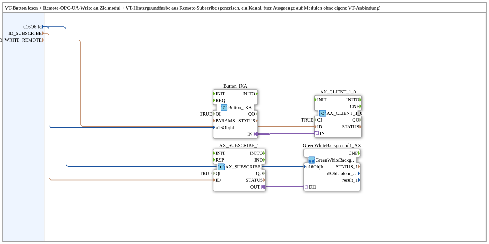

# Button_IXA_TO_Remote_WRITE_BG_OPC

* * * * * * * * * *
## Einleitung

Die Subapp `Button_IXA_TO_Remote_WRITE_BG_OPC` dient zum Lesen eines VT-Buttons und zum Senden eines Remote-OPC-UA-Write-Befehls an ein Zielmodul. Zusätzlich wird die VT-Hintergrundfarbe des Buttons über einen Remote-Subscribe (OPC-UA) aktualisiert. Die Subapp ist generisch ausgelegt und unterstützt einen Kanal; sie eignet sich für Ausgänge auf Modulen, die keine eigene VT-Anbindung besitzen.

## Schnittstellenstruktur

Die Subapp besitzt eine reine Datenschnittstelle nach außen. Es sind keine Ereignisse, Datenausgänge oder Adapter nach außen geführt.

### **Ereignis-Eingänge**

Keine.

### **Ereignis-Ausgänge**

Keine.

### **Daten-Eingänge**

- `u16ObjId` (UINT): Objekt-ID des Buttons/Hintergrunds (VT). Initialwert: `ID_NULL`
- `ID_SUBSCRIBE` (WSTRING): Remote-Subscribe-Adresse für Status/Farbe (ACTION=SUBSCRIBE)
- `ID_WRITE_REMOTE` (WSTRING): Remote-Write-Adresse zum Zielmodul für den Befehl (ACTION=WRITE, CLIENT)

### **Daten-Ausgänge**

Keine.

### **Adapter**

Nach außen werden keine Adapter bereitgestellt. Intern werden die Adapter `AX_CLIENT_1_0` und `AX_SUBSCRIBE_1` verwendet.

## Funktionsweise

Der Baustein stellt eine Verbindung zwischen einem VT-Bedienelement und einem entfernten Modul über OPC-UA her. Der `Button_IXA`-FB liest den Zustand des über `u16ObjId` referenzierten Buttons. Wird der Button betätigt, sendet der `AX_CLIENT_1_0`-Adapter den Schaltbefehl über die in `ID_WRITE_REMOTE` konfigurierte Remote-Write-Adresse an das Zielmodul.

Parallel empfängt der `AX_SUBSCRIBE_1`-Adapter über die in `ID_SUBSCRIBE` angegebene Adresse den aktuellen Status bzw. die Farbe des Zielmoduls. Diese Information wird über die Adapterverbindung an die Subapp `GreenWhiteBackground1_AX` übergeben, die die Hintergrundfarbe des VT-Buttons entsprechend aktualisiert. So wird eine Rückmeldung des Schaltzustands visualisiert.

Die `u16ObjId` wird sowohl an den `Button_IXA` als auch an die Subapp `GreenWhiteBackground1_AX` geleitet, um sicherzustellen, dass sich beide auf dasselbe Objekt beziehen.

## Technische Besonderheiten

- Verwendung von OPC-UA-Adaptern (`adapter::net::AX_CLIENT_1_0` und `adapter::net::AX_SUBSCRIBE_1`)
- Kombination von Remote-Write (Befehl) und Remote-Subscribe (Status/Farbe)
- Generische Konfiguration über Objekt-ID und Adressen als Eingänge
- Keine eigenen Ereignisse; die Subapp arbeitet rein daten- und adaptergesteuert
- Der Parameter `QI` der internen FBs ist auf `TRUE` gesetzt und muss bei Bedarf angepasst werden

## Zustandsübersicht

Die Subapp besitzt keine eigene Zustandsmaschine. Das Verhalten ergibt sich aus den internen Funktionsbausteinen. Der FB `Button_IXA` kann je nach Implementierung interne Zustände (z.B. gedrückt/nicht gedrückt) besitzen, die jedoch nicht nach außen sichtbar sind.

## Anwendungsszenarien

- Fernbedienung von Ausgängen an dezentralen Modulen über OPC-UA
- Visualisierung von Schaltzuständen in einer VT durch Hintergrundfarben (grün/weiß)
- Anbindung von Bedienelementen an Steuerungen, die keine direkte VT-Anbindung bieten
- Erweiterung bestehender HMI-Projekte um Remote-I/O-Funktionalität

## Vergleich mit ähnlichen Bausteinen

Im Gegensatz zu direkt gekoppelten VT-Buttons, die lokal über den Bus angebunden sind, realisiert dieser Baustein die Kommunikation vollständig über OPC-UA. Dadurch ist er flexibler einsetzbar, benötigt jedoch eine konfigurierte OPC-UA-Verbindung. Gegenüber einem generischen OPC-UA-Client bietet die Subapp eine höhere Abstraktion, da sie Button-Logik und Hintergrundfarbsteuerung integriert.

## Fazit

Die Subapp `Button_IXA_TO_Remote_WRITE_BG_OPC` ist eine nützliche Komponente für verteilte Automatisierungssysteme, bei denen Bedienelemente und Ausgänge über OPC-UA gekoppelt werden. Sie vereinfacht die Projektierung durch ihre generische Konfiguration und die integrierte Rückmelde-Visualisierung.