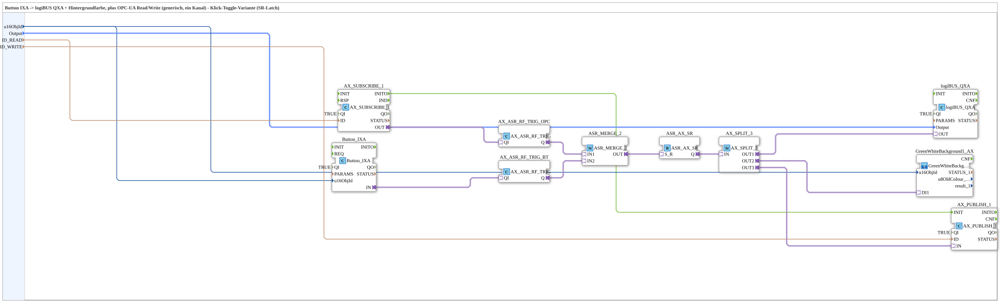

# Button_IXA_TO_logiBUS_QXA_BG_OPC_LATCHING

* * * * * * * * * *

## Einleitung

`Button_IXA_TO_logiBUS_QXA_BG_OPC_LATCHING` ist die Klick-Toggle-Variante (SR-Latch) von [`Button_IXA_TO_logiBUS_QXA_BG_OPC`](./Button_IXA_TO_logiBUS_QXA_BG_OPC.md): Ein Klick auf den VT-Button oder ein OPC-UA-Remote-Kommando schaltet den Ausgang EIN, ein zweiter Klick schaltet ihn wieder AUS — unabhängig davon, wie lange gedrückt wird. Der Baustein ist aufbewahrt für den Fall, dass dieses Klick-Toggle-Verhalten wieder gebraucht wird; seit 2026-09-07 verwendet `Button_IXA_TO_logiBUS_QXA_BG_OPC` selbst stattdessen ein einfaches, tastendes `AX_OR_2`. Beide Bausteine teilen dasselbe Interface (`u16ObjId`/`Output`/`ID_READ`/`ID_WRITE`) und sind 1:1 austauschbar.

## Verwendete Funktionsbausteine (FBs)

### Sub-Bausteine: Button_IXA_TO_logiBUS_QXA_BG_OPC_LATCHING

- **Typ**: SubAppType
- **Verwendete interne FBs**:
    - **Button_IXA**: `isobus::UT::io::Button::Button_IXA` (`QI=TRUE`) — VT-Taster, `u16ObjId` identifiziert die VT-Taste.
    - **AX_ASR_RF_TRIG_BT** / **AX_ASR_RF_TRIG_OPC**: je `adapter::events::unidirectional::AX_ASR_RF_TRIG` — wandeln steigende/fallende Flanke der VT-Taste bzw. des OPC-UA-Subscribe-Werts in ein Set/Reset-Ereignispaar (ASR) um.
    - **ASR_MERGE_2**: `adapter::events::unidirectional::ASR_MERGE_2` — führt die beiden ASR-Quellen (Button, OPC-UA) zusammen.
    - **ASR_AX_SR**: `adapter::events::unidirectional::ASR_AX_SR` — Set/Reset-Latch, das aus dem zusammengeführten ASR-Signal den gelatchten Ausgangszustand bildet (Last-Wins).
    - **AX_SPLIT_3**: `adapter::events::unidirectional::AX_SPLIT_3` — verteilt den Latch-Ausgang auf drei Ziele.
    - **logiBUS_QXA**: `logiBUS::io::DQ::logiBUS_QXA` (`QI=TRUE`) — physischer digitaler Ausgang.
    - **GreenWhiteBackground1_AX** (SubApp, `MyLib::sys`): VT-Hintergrundfarbe passend zum Ausgangszustand.
    - **AX_SUBSCRIBE_1** / **AX_PUBLISH_1**: je `adapter::net::AX_SUBSCRIBE_1`/`AX_PUBLISH_1` (`QI=TRUE`) — OPC-UA-Lese-/Schreibzugriff.
- **Funktionsweise**: Beide Schaltquellen (VT-Taster, OPC-UA-Kommando) werden je über `AX_ASR_RF_TRIG` in Set/Reset-Ereignisse gewandelt, per `ASR_MERGE_2` zusammengeführt und in `ASR_AX_SR` gelatcht — der Latch-Zustand speist gleichzeitig Hardware, VT-Statusfarbe und OPC-UA-Echo.

## Programmablauf und Verbindungen

1. `Button_IXA.IN` (Adapter) → `AX_ASR_RF_TRIG_BT.QI` → `AX_ASR_RF_TRIG_BT.Q` → `ASR_MERGE_2.IN2`.
2. `AX_SUBSCRIBE_1.OUT` → `AX_ASR_RF_TRIG_OPC.QI` → `AX_ASR_RF_TRIG_OPC.Q` → `ASR_MERGE_2.IN1`.
3. `ASR_MERGE_2.OUT` → `ASR_AX_SR.S_R` (Set/Reset-Eingang des Latch).
4. `ASR_AX_SR.Q` → `AX_SPLIT_3.IN` → `AX_SPLIT_3.OUT1` → `logiBUS_QXA.OUT`, `AX_SPLIT_3.OUT2` → `GreenWhiteBackground1_AX.DI1`, `AX_SPLIT_3.OUT3` → `AX_PUBLISH_1.IN`.
5. Initialisierung: `AX_SUBSCRIBE_1.INITO` → `AX_PUBLISH_1.INIT` (ausgeblendete Verbindung).
6. Parameter: `u16ObjId` → `Button_IXA.u16ObjId` und `GreenWhiteBackground1_AX.u16ObjId`; `Output` → `logiBUS_QXA.Output`; `ID_READ` → `AX_SUBSCRIBE_1.ID`; `ID_WRITE` → `AX_PUBLISH_1.ID`.

## Technische Besonderheiten

- **Klick-Toggle über ASR-Latch**: Im Unterschied zur tastenden (momentary) `AX_OR_2`-Variante wandelt dieser Baustein jede Betätigung in ein Set/Reset-Ereignis um, das in `ASR_AX_SR` gelatcht wird — der Ausgang bleibt nach Loslassen im zuletzt gesetzten Zustand.
- **Zwei unabhängige Toggle-Quellen**: VT-Button und OPC-UA-Kommando lösen je eigenständig ein Toggle aus; `ASR_MERGE_2` führt beide zu einem gemeinsamen Latch-Eingang zusammen.
- **Identisches Außeninterface**: Trotz komplett anderer interner Logik ist die Schnittstelle identisch zu `Button_IXA_TO_logiBUS_QXA_BG_OPC`, sodass beide Varianten austauschbar instanziiert werden können.

## Anwendungsszenarien

- Ausgänge, die per einzelnem Klick ein-/ausgeschaltet werden sollen (Toggle-Verhalten), statt nur solange aktiv zu sein, wie die Taste gehalten wird.

## Vergleich mit ähnlichen Bausteinen

Gegenüber [`Button_IXA_TO_logiBUS_QXA_BG_OPC`](./Button_IXA_TO_logiBUS_QXA_BG_OPC.md) (aktuell: tastendes `AX_OR_2`) ersetzt dieser Baustein die einfache ODER-Verknüpfung durch eine vollständige Flankenerkennungs-/Merge-/Latch-Kette (`AX_ASR_RF_TRIG` × 2, `ASR_MERGE_2`, `ASR_AX_SR`) für Klick-Toggle-Verhalten.

## Zusammenfassung

`Button_IXA_TO_logiBUS_QXA_BG_OPC_LATCHING` bietet dieselbe Grundfunktion wie `Button_IXA_TO_logiBUS_QXA_BG_OPC`, jedoch mit Klick-Toggle statt tastendem Verhalten — bei identischem Außeninterface direkt austauschbar.

---

### 🌐 Passende Themen-Unterseiten auf ms-muc-docs.de

- [🌐 Eclipse 4diac IDE & Farb-Referenz auf ms-muc-docs.de](https://www.ms-muc-docs.de/iec-61499/eclipse-4diac/)
