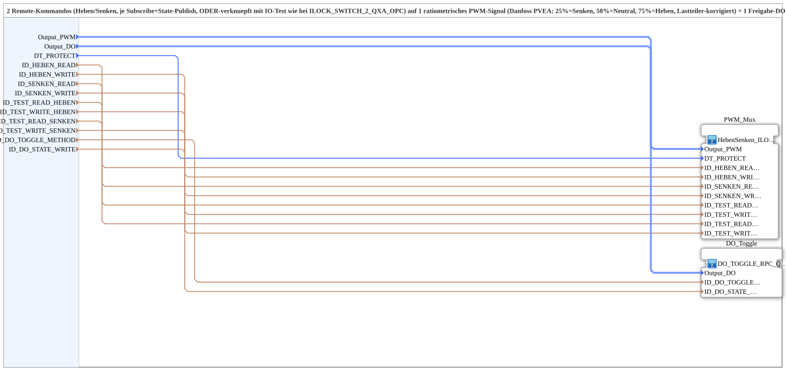

# Heben_Senken_TO_QDA_PWM_OPC

* * * * * * * * * *

## Einleitung

Die SubApp `Heben_Senken_TO_QDA_PWM_OPC` ist ein generischer Baustein zur Steuerung eines Danfoss PVEA-Aktors mit zwei physischen Kanälen: linkem PWM-Kanal (25% Senken, 50% Neutral, 75% Heben, lastteilerkorrigiert) und rechtem Freigabe-Kanal (Klick-Toggle, Default AN). Sie verarbeitet zwei Remote-Kommandos (Heben/Senken) über Subscribe/Publish, verknüpft diese ODER mit bestehenden IO-Test-Signalen und erzeugt daraus ein ratiometrisches PWM-Signal sowie einen umschaltbaren Freigabe-DO. Der Baustein ist für die Bedienung von einem Modul ohne eigenes VT ausgelegt und unterstützt Not-Bedienung (z. B. Straßenmodus) über eine RPC-Methode.

## Schnittstellenstruktur

### **Ereignis-Eingänge**
Keine Ereignis-Eingänge vorhanden.

### **Ereignis-Ausgänge**
Keine Ereignis-Ausgänge vorhanden.

### **Daten-Eingänge**

| Name | Typ | Initialwert | Kommentar |
|------|-----|-------------|-----------|
| `Output_PWM` | `logiBUS::io::DQ::logiBUS_DO_S` | `logiBUS_DO::Invalid` | Physischer PWM-Ausgang (linker Kanal): 25/50/75% Tastgrad, ratiometrisch |
| `Output_DO` | `logiBUS::io::DQ::logiBUS_DO_S` | `logiBUS_DO::Invalid` | Physischer Freigabe-Ausgang (rechter Kanal): Klick-Toggle, Default AN |
| `DT_PROTECT` | `TIME` | `T#300ms` | Schutz-Totzeit vor Richtungswechsel |
| `ID_HEBEN_READ` | `WSTRING` | – | Echtes Funktions-Kommando Heben (Subscribe) |
| `ID_HEBEN_WRITE` | `WSTRING` | – | Echte Funktions-Rückmeldung Heben, HINTER dem ILOCK (Publish) |
| `ID_SENKEN_READ` | `WSTRING` | – | Echtes Funktions-Kommando Senken (Subscribe) |
| `ID_SENKEN_WRITE` | `WSTRING` | – | Echte Funktions-Rückmeldung Senken, HINTER dem ILOCK (Publish) |
| `ID_TEST_READ_HEBEN` | `WSTRING` | – | Bestehende IO-Test-Subscribe-Adresse Heben (z. B. STG2_Q0x_READ), ODER-verknüpft mit `ID_HEBEN_READ` vor dem ILOCK |
| `ID_TEST_WRITE_HEBEN` | `WSTRING` | – | Bestehende IO-Test-Publish-Adresse Heben, HINTER dem ILOCK (z. B. STG2_Q0x_WRITE) |
| `ID_TEST_READ_SENKEN` | `WSTRING` | – | Bestehende IO-Test-Subscribe-Adresse Senken, ODER-verknüpft mit `ID_SENKEN_READ` vor dem ILOCK |
| `ID_TEST_WRITE_SENKEN` | `WSTRING` | – | Bestehende IO-Test-Publish-Adresse Senken, HINTER dem ILOCK |
| `ID_DO_TOGGLE_METHOD` | `WSTRING` | – | Lokale Methodenadresse (ACTION=CREATE_METHOD) für den argumentlosen Freigabe-Toggle-Trigger – wird von STG1 (SoftKey-Relay) UND direkt vom OPC-Dashboard (CALL_METHOD) aufgerufen |
| `ID_DO_STATE_WRITE` | `WSTRING` | – | Lokale Publish-Adresse (ACTION=WRITE) für den tatsächlichen Freigabe-Zustand (AX_T_FF_INIT.Q) – wird von VT und Dashboard remote abonniert |

### **Daten-Ausgänge**
Keine externen Daten-Ausgänge vorhanden.

### **Adapter**
Keine Adapter vorhanden.

## Funktionsweise

Die SubApp ist eine Zusammensetzung aus zwei internen SubApps:

1. **PWM_Mux** (`MyLib::sys::HebenSenken_ILOCK_QDA_PWM_OPC`):  
   - Empfängt die Funktions- und IO-Test-Kommandos (Subscribe).  
   - Verknüpft jeweils `ID_HEBEN_READ` mit `ID_TEST_READ_HEBEN` (ODER) und `ID_SENKEN_READ` mit `ID_TEST_READ_SENKEN` (ODER).  
   - Leitet die kombinierten Befehle durch eine ILOCK-Logik, die Richtungswechsel nur nach Ablauf der Schutz-Totzeit `DT_PROTECT` zulässt.  
   - Erzeugt das ratiometrische PWM-Signal auf `Output_PWM` (25% Senken, 50% Neutral, 75% Heben) mit Lastteilerkorrektur.  
   - Publiziert die tatsächlichen Zustände über `ID_HEBEN_WRITE`, `ID_SENKEN_WRITE` sowie die entsprechenden Test-Publish-Adressen nach dem ILOCK.

2. **DO_Toggle** (`MyLib::sys::DO_TOGGLE_RPC_QXA_OPC`):  
   - Implementiert einen Klick-Toggle-Flipflop (`AX_T_FF_INIT`) für den Freigabe-Ausgang `Output_DO`.  
   - Der Ausgang ist initial AN und kann über die RPC-Methode `ID_DO_TOGGLE_METHOD` umgeschaltet werden.  
   - Der aktuelle Zustand wird über `ID_DO_STATE_WRITE` publiziert.

Die beiden Teile sind in der Schnittstelle vollständig gekapselt; extern ist nur die Parameterisierung und die Kommunikationsadressen sichtbar.

## Technische Besonderheiten

- **ODER-Verknüpfung von Fernbedienung und IO-Test** vor der Schutzlogik (ILOCK), dadurch können sowohl echte Funktionskommandos als auch Testsignale den gleichen Wirkpfad nutzen.
- **Zwei getrennte Bibliotheksbausteine** für PWM-/ILOCK-Logik und DO-Toggle, was die Wiederverwendbarkeit erhöht.
- **Freigabe-DO als Klick-Toggle** mit RPC-Methode: Erlaubt Not-Bedienung aus Dashboard oder Softkey, ohne eigene VT.
- **PWM-Ausgang mit lastteilerkorrigiertem Tastgrad** für den PVEA-Aktor.
- **Schutz-Totzeit** (`DT_PROTECT`) verhindert schädliche Richtungswechsel während des Betriebs.
- **Publish-Adressen für Status** liegen hinter dem ILOCK, sodass nur tatsächlich ausgeführte Befehle zurückgemeldet werden.

## Zustandsübersicht

Die SubApp selbst besitzt keinen eigenen Zustandsautomaten, sie delegiert die Zustandsverwaltung an die internen Bausteine:

- **PWM_Mux**: Enthält einen ILOCK (Interlock) mit Zuständen wie „Neutral“, „Heben aktiv“, „Senken aktiv“ und „Totzeit“. Die Umschaltung zwischen den Zuständen unterliegt der Totzeitüberwachung.
- **DO_Toggle**: Ein einfaches Flipflop (AX_T_FF_INIT) mit Zuständen AN/AUS. Der Zustand wird durch ein RPC-Triggerereignis getoggelt und bleibt auch nach einem Neustart des Bausteins erhalten (sofern der Initialwert definiert ist).

## Anwendungsszenarien

- Steuerung eines Danfoss PVEA-Aktors (z. B. für Anbaugeräte an Traktoren oder Kommunalfahrzeugen) über Remote-Kommandos.
- Einsatz in Systemen, in denen ein Modul ohne eigenes Visualisierungsterminal (VT) die Bedienung von Heben/Senken und Freigabe übernehmen muss.
- Not-Bedienung über ein OPC-Dashboard oder Softkey-Relay (z. B. Straßenmodus), wenn die normale Bedienoberfläche nicht verfügbar ist.
- Integration in bereits bestehende IO-Test-Strukturen, ohne die bisherigen Testadressen zu verlieren.

## Vergleich mit ähnlichen Bausteinen

- **ILOCK_SWITCH_2_QXA_OPC** (im Kommentar erwähnt): Dieser Baustein steuert vermutlich zwei digitale Ausgänge mit ILOCK, hat aber keine PWM-Erzeugung und keinen separaten Freigabe-Toggle. `Heben_Senken_TO_QDA_PWM_OPC` erweitert dieses Konzept um den PWM-Mux und die RPC-gesteuerte Freigabe.
- **Direkte PWM-Steuerung ohne ILOCK**: Bau steine ohne Interlock sind schneller, bergen aber das Risiko von mechanischen Schäden bei sofortigem Richtungswechsel. Dieser Baustein bietet durch `DT_PROTECT` eine sichere Alternative.
- **Separate Bausteine für PWM und DO**: Die Kombination in einer SubApp reduziert den Verdrahtungsaufwand und kapselt die Logik in einer wiederverwendbaren Einheit.

## Fazit

`Heben_Senken_TO_QDA_PWM_OPC` vereint PWM-Erzeugung, ILOCK-Schutz, IO-Test-Option und einen RPC-umschaltbaren Freigabeausgang in einem kompakten Baustein. Durch die modulare Aufteilung in bestehende Bibliotheksbausteine bleibt die Wartung einfach und die Schnittstelle klar. Die Berücksichtigung von Schutz-Totzeit und Status-Publishing nach dem ILOCK macht den Baustein robust für reale Einsatzfälle, insbesondere in der mobilen Automation.