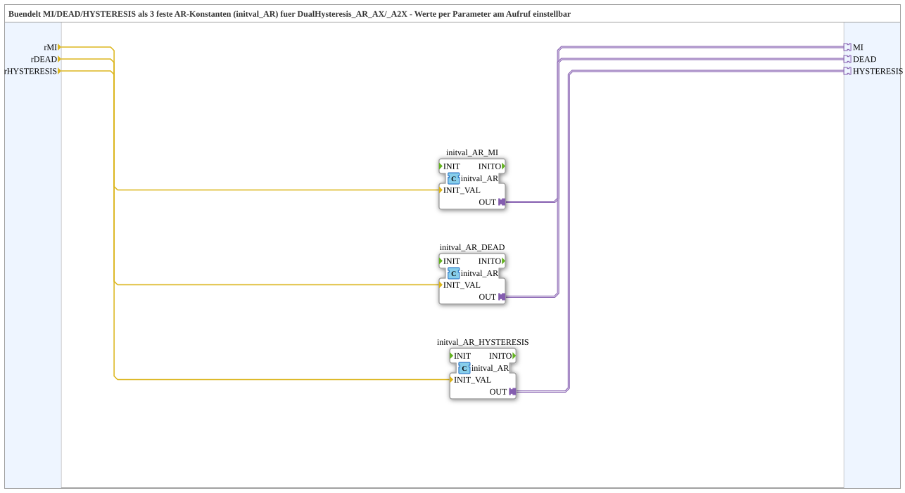

# HysteresisParams_AR

* * * * * * * * * *

## Einleitung

`HysteresisParams_AR` bündelt die drei Parameter `MI` (Mittelwert/Sollwert), `DEAD` (Totzone) und `HYSTERESIS` (zusätzliche Hysterese) als feste `AR`-Adapter-Konstanten für `DualHysteresis_AR_AX`/`DualHysteresis_AR_A2X`. Statt drei `initval_AR`-Instanzen in jeder Übung/SubApp einzeln zu wiederholen, fasst dieser Baustein sie zusammen.

## Verwendete Funktionsbausteine (FBs)

### Sub-Bausteine: HysteresisParams_AR

- **Typ**: SubAppType
- **Verwendete interne FBs**:
    - **initval_AR_MI** / **initval_AR_DEAD** / **initval_AR_HYSTERESIS**: je `adapter::types::unidirectional::AR::initval::initval_AR` — wandeln einen `REAL`-Eingangswert in einen festen `AR`-Adapter-Plug um.
- **Funktionsweise**: Die drei `InputVars` `rMI`/`rDEAD`/`rHYSTERESIS` werden je über eine `initval_AR`-Instanz in die entsprechenden `AR`-Plugs (`MI`/`DEAD`/`HYSTERESIS`) umgewandelt.

## Programmablauf und Verbindungen

1. `rMI` → `initval_AR_MI.INIT_VAL`; `rDEAD` → `initval_AR_DEAD.INIT_VAL`; `rHYSTERESIS` → `initval_AR_HYSTERESIS.INIT_VAL` (Datenverbindungen).
2. `initval_AR_MI.OUT` → `MI`; `initval_AR_DEAD.OUT` → `DEAD`; `initval_AR_HYSTERESIS.OUT` → `HYSTERESIS` (Adapterverbindungen, direkt an die SubApp-Schnittstelle).

## Technische Besonderheiten

- **Parametrierbare Standardwerte**: `rMI`/`rDEAD`/`rHYSTERESIS` besitzen sinnvolle Standardwerte (`500.0`/`20.0`/`30.0`), die am Aufruf per Parameter überschreibbar sind — analog zu `u16ObjId` bei den GreenWhiteBackground-Bausteinen.
- **Wiederverwendung statt Wiederholung**: Ersetzt das manuelle Duplizieren dreier `initval_AR`-Instanzen, wie es zuerst in `Uebung_234_AX`/`Uebung_235_AX` gemacht wurde.

## Anwendungsszenarien

- Parametrierung von `DualHysteresis_AR_AX`/`DualHysteresis_AR_A2X`, wenn Sollwert, Totzone und Hysterese als feste, am Aufruf überschreibbare Konstanten benötigt werden.
- Konsistente Parametrierung mehrerer vergleichbarer Übungen (z. B. `Uebung_234_AX` für Hardware und `Uebung_235_AX` für VT), die mit identischen Werten direkt vergleichbar bleiben sollen.

## Zusammenfassung

`HysteresisParams_AR` bündelt drei feste `AR`-Parameter-Konstanten für die Hysterese-Bausteine hinter einem einzigen, parametrierbaren Baustein.

---

### 🌐 Passende Themen-Unterseiten auf ms-muc-docs.de

- [🌐 Eclipse 4diac IDE & Farb-Referenz auf ms-muc-docs.de](https://www.ms-muc-docs.de/iec-61499/eclipse-4diac/)
