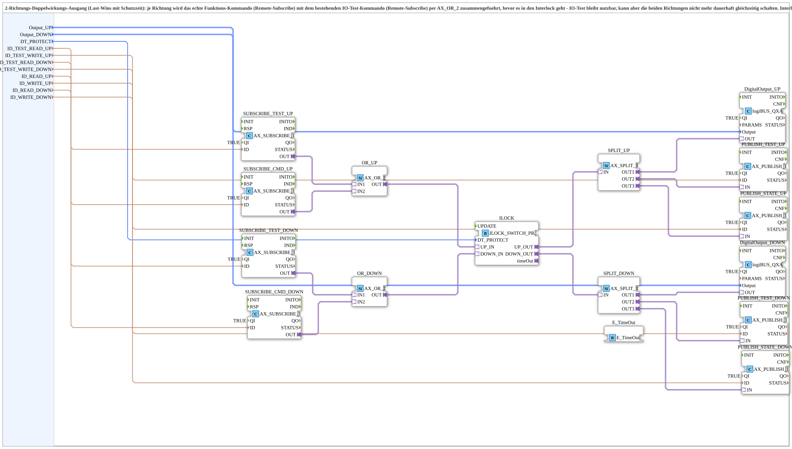

# ILOCK_SWITCH_2_QXA_OPC

* * * * * * * * * *
## Einleitung

Der Funktionsbaustein **ILOCK_SWITCH_2_QXA_OPC** ist eine generische Subapplikation zur Ansteuerung eines digitalen Doppelwirkungs-Ausgangs (z. B. für Ventile oder Schaltanlagen) mit integriertem Schutz-Interlock und Rückmeldung über OPC. Er kombiniert zwei unabhängige Steuerkanäle (Richtung „UP“ und „DOWN“), die über logiBUS-Module physisch geschaltet werden.

Der Baustein vereint drei Hauptaufgaben:
- **Zusammenführung von Funktions- und Testkommandos** für jede Richtung,
- **Verriegelung gegen gleichzeitiges Schalten** beider Richtungen mit einstellbarer Schutzzeit,
- **Rückmeldung** des tatsächlichen Ausgangszustands über OPC-Publizierung, sowohl für die Funktionssteuerung als auch für das IO-Test-System.

Er ist speziell für Anlagen konzipiert, bei denen die Bedienung über ein zentrales Modul ohne eigenes Vor-Ort-Terminal erfolgt und eine zuverlässige Absicherung gegen Fehlschaltungen erforderlich ist.

## Schnittstellenstruktur

Die Subapplikation besitzt keine Ereignis-Eingänge oder -Ausgänge, keine Adapter an der Subapplikationsgrenze, sondern ausschließlich **Daten-Eingänge** (InputVars). Die interne Steuerung erfolgt rein über diese Datenwerte und asynchrone Kommunikation (über die intern eingebetteten Subscribe/Publish-Bausteine).

### **Ereignis-Eingänge**
Keine (nicht vorhanden).

### **Ereignis-Ausgänge**
Keine (nicht vorhanden).

### **Daten-Eingänge**
| Name | Datentyp | Kommentar |
|------|----------|-----------|
| `Output_UP` | `logiBUS::io::DQ::logiBUS_DO_S` | Physischer Ausgang Richtung UP/Links. Initialwert: `logiBUS_DO::Invalid` |
| `Output_DOWN` | `logiBUS::io::DQ::logiBUS_DO_S` | Physischer Ausgang Richtung DOWN/Rechts. Initialwert: `logiBUS_DO::Invalid` |
| `DT_PROTECT` | `TIME` | Schutz-Totzeit vor Richtungswechsel. Initialwert: `T#300ms` |
| `ID_TEST_READ_UP` | `WSTRING` | Bestehende IO-Test-Subscribe-Adresse UP (z. B. `STG3_Q0x_READ`) |
| `ID_TEST_WRITE_UP` | `WSTRING` | Bestehende IO-Test-Publish-Adresse UP (z. B. `STG3_Q0x_WRITE`) |
| `ID_TEST_READ_DOWN` | `WSTRING` | Bestehende IO-Test-Subscribe-Adresse DOWN |
| `ID_TEST_WRITE_DOWN` | `WSTRING` | Bestehende IO-Test-Publish-Adresse DOWN |
| `ID_READ_UP` | `WSTRING` | Echtes Funktions-Kommando UP (Subscribe) |
| `ID_WRITE_UP` | `WSTRING` | Echte Funktions-Rückmeldung UP (Publish) |
| `ID_READ_DOWN` | `WSTRING` | Echtes Funktions-Kommando DOWN (Subscribe) |
| `ID_WRITE_DOWN` | `WSTRING` | Echte Funktions-Rückmeldung DOWN (Publish) |

### **Daten-Ausgänge**
Keine (nicht vorhanden).

### **Adapter**
Keine (nicht vorhanden).

## Funktionsweise

Die Subapplikation verarbeitet pro Richtung (UP/DOWN) zwei Signale: ein **Funktions-Kommando** und ein **IO-Test-Kommando**. Diese werden über die jeweiligen Subscribe-Bausteine (`SUBSCRIBE_CMD_UP`, `SUBSCRIBE_TEST_UP`, etc.) empfangen und anschließend über eine ODER-Verknüpfung (`AX_OR_2`) zusammengeführt. Das Ergebnis ist das effektive Schaltkommando für diese Richtung.

Das effektive Kommando wird an den zentralen Interlock-Baustein (`ILOCK_SWITCH_PROTECT_AX`) übergeben. Dieser Baustein verhindert, dass beide Richtungen gleichzeitig aktiv werden. Zusätzlich implementiert er eine Schutzzeit (`DT_PROTECT`), die vor einem Richtungswechsel eingehalten werden muss. Nach Ablauf der Schutzzeit wird das Kommando freigegeben.

Der Ausgang des Interlocks wird über einen Splitter (`AX_SPLIT_3`) an drei Stellen verteilt:
1. An den physischen logiBUS-Kanal (`logiBUS_QXA`), der den tatsächlichen Ausgang steuert.
2. An einen Publish-Baustein für die **IO-Test-Rückmeldung** (`PUBLISH_TEST_UP` bzw. `PUBLISH_TEST_DOWN`), damit das IO-Test-System den realen Zustand erhält.
3. An einen Publish-Baustein für die **Funktions-Rückmeldung** (`PUBLISH_STATE_UP` bzw. `PUBLISH_STATE_DOWN`), z. B. für die Anzeige „GreenWhiteBackground“ am SoftKey.

Die Rückmeldungen werden also immer von dem tatsächlichen, verriegelten Zustand abgeleitet. Dadurch bleiben IO-Test und Funktionssteuerung konsistent und es kann nicht zu Fehlinterpretationen kommen.

## Technische Besonderheiten

- **Last-Wins-Logik:** Die ODER-Verknüpfung zwischen Funktions- und Testkommando bedeutet, dass das zuletzt eintreffende Signal (egal ob Test oder Funktion) den Zustand bestimmt – es gilt also „Last-Wins“. Der Interlock sorgt aber dafür, dass nie beide Richtungen gleichzeitig geschaltet werden können.
- **Schutzzeit:** Der Parameter `DT_PROTECT` definiert eine Totzeit, die ein Richtungswechsel dauern darf. Diese Zeit verhindert ein schnelles Umschalten, das mechanische oder elektrische Schäden verursachen könnte. Der Interlock-Baustein signalisiert über sein `timeOut`-Ereignis das Ende dieser Zeit.
- **IO-Test bleibt nutzbar:** Durch die Zusammenführung vor dem Interlock kann der IO-Test weiterhin jeden Kanal einzeln ansteuern – jedoch nicht dauerhaft beide gleichzeitig, was durch den Interlock unterbunden wird.
- **OPC-Anbindung:** Die Kommunikation erfolgt über OPC UA (implizit durch die Subscribe/Publish-Bausteine). Die Adressen werden über die String-Parameter konfiguriert.

## Zustandsübersicht

Der Interlock-Baustein (`ILOCK_SWITCH_PROTECT_AX`) verwaltet im Wesentlichen drei Zustände:

- **Neutral:** Keiner der beiden Eingänge (UP_IN, DOWN_IN) ist aktiv; der Ausgang ist inaktiv.
- **UP aktiv:** Der Eingang `UP_IN` ist aktiv und die Schutzzeit für einen Wechsel von DOWN auf UP ist abgelaufen; der Ausgang `UP_OUT` ist gesetzt.
- **DOWN aktiv:** Analog für die Richtung DOWN.

Während der Schutzzeit nach einem aktiven Zustand wechselt der Interlock in einen Blockierzustand, in dem das Schalten der anderen Richtung verzögert wird. Die Dauer wird durch `DT_PROTECT` bestimmt. Das Ereignis `timeOut` wird ausgelöst, wenn die Schutzzeit abgelaufen ist und ein Richtungswechsel erlaubt wird.

Der Ausgang des Interlocks ist also **entweder UP oder DOWN oder keiner**, nie beide gleichzeitig. Diese Zustandslogik wird direkt auf den physischen Kanal übertragen.

## Anwendungsszenarien

- **Steuerung von Doppelwirkungs-Ventilen** oder Klappen, die mit zwei getrennten Ausgängen (Auf/Zu) angesteuert werden.
- **Anlagen mit separater IO-Test-Funktion**, bei denen der IO-Test parallel zur normalen Funktionssteuerung laufen soll, jedoch ohne die Gefahr von Kurzschluss-Kommandos.
- **Systeme mit OPC-UA-Anbindung**, bei denen die Rückmeldungen des tatsächlichen Schaltzustands für Visualisierung oder Leittechnik benötigt werden.
- **Module ohne eigenes Bedien-Terminal**, bei denen die Steuerung zentral über eine übergeordnete Steuerung erfolgt.

## Vergleich mit ähnlichen Bausteinen

Gegenüber einfachen Ausgangsbausteinen (z. B. ohne Interlock) bietet dieser FB erweiterte Sicherheit: Er verhindert unzulässige Doppelansteuerung und führt eine definierte Totzeit ein. Im Gegensatz zu einem Baustein, der nur Funktionskommandos verarbeitet, integriert er zusätzlich das IO-Test-Signal, wodurch zwei getrennte Kommunikationspfade vereinheitlicht werden. Vergleicht man ihn mit einem reinen IO-Test-Baustein, so ergänzt er die Rückmeldung für die Funktionssteuerung und sorgt für eine konsistente Zustandsanzeige.

Einfachere Alternativen bieten möglicherweise keine Schutzzeit oder keine separate Test-/Funktions-Rückmeldung; dieser Baustein bündelt alle Anforderungen in einer kompakten Subapplikation.

## Fazit

`ILOCK_SWITCH_2_QXA_OPC` ist eine vielseitige und sichere Lösung für die Ansteuerung digitaler Doppelwirkungs-Aktoren. Durch die Kombination von Interlock, Schutzzeit und OPC-Anbindung wird sowohl die physische Sicherheit als auch die Informationskonsistenz gewährleistet. Die klare Trennung von Funktions- und Testbefehlen ermöglicht einen flexiblen Einsatz in industriellen Umgebungen, in denen mehrere Steuerungswege existieren. Die Parametrierung der Kommunikationsadressen über die Daten-Eingänge macht den Baustein leicht an verschiedene Systemarchitekturen anpassbar.