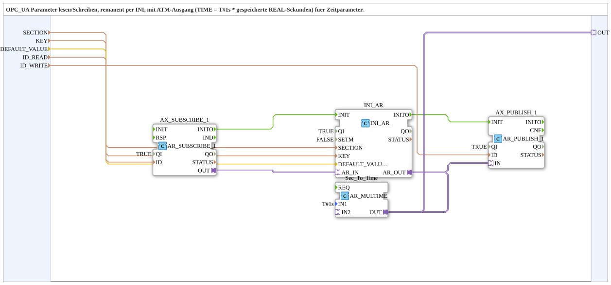

# INI_OPC_PARAM_ATM

* * * * * * * * * *

## Einleitung

`INI_OPC_PARAM_ATM` ist die Zeitparameter-Variante von [`INI_OPC_PARAM_AR`](./INI_OPC_PARAM_AR.md): Der remanent gespeicherte REAL-Wert wird zusätzlich in einen `ATM`-Adapter (`TIME`) umgerechnet — `DEFAULT_VALUE` und der gespeicherte Wert werden dabei als Sekunden interpretiert (`T#1s * Sekunden`).

## Verwendete Funktionsbausteine (FBs)

### Sub-Bausteine: INI_OPC_PARAM_ATM

- **Typ**: SubAppType
- **Verwendete interne FBs**:
    - **AX_SUBSCRIBE_1**: `adapter::net::AR_SUBSCRIBE_1` (`QI=TRUE`) — abonniert neue Werte vom OPC-UA-Client (`ID_READ`).
    - **INI_AR**: `eclipse4diac::storage::INI_AR` (`QI=TRUE`, `SETM=FALSE`) — speichert den Wert remanent in der INI-Datei unter `SECTION`/`KEY`, mit `DEFAULT_VALUE` (in Sekunden) als Startwert.
    - **AX_PUBLISH_1**: `adapter::net::AR_PUBLISH_1` (`QI=TRUE`) — veröffentlicht den aktuellen REAL-Wert per OPC-UA (`ID_WRITE`).
    - **Sec_To_Time**: `adapter::iec61131::arithmetic::AR_MULTIME` (`IN1=T#1s`) — multipliziert den gespeicherten REAL-Wert (Sekunden) mit `T#1s`, um ihn als `TIME`-Wert bereitzustellen.
- **Funktionsweise**: Wie `INI_OPC_PARAM_AR`, zusätzlich wird `INI_AR.AR_OUT` über `Sec_To_Time` (`AR_MULTIME`) in `TIME` umgerechnet und als `ATM`-Plug `OUT` bereitgestellt.

## Programmablauf und Verbindungen

1. **Initialisierungskette**: `AX_SUBSCRIBE_1.INITO` → `INI_AR.INIT` → `INI_AR.INITO` → `AX_PUBLISH_1.INIT`.
2. **Parameter**: `SECTION` → `INI_AR.SECTION`; `KEY` → `INI_AR.KEY`; `DEFAULT_VALUE` (Sekunden) → `INI_AR.DEFAULT_VALUE`; `ID_READ` → `AX_SUBSCRIBE_1.ID`; `ID_WRITE` → `AX_PUBLISH_1.ID`.
3. **Adapterkette**: `AX_SUBSCRIBE_1.OUT` → `INI_AR.AR_IN` → `INI_AR.AR_OUT` → `AX_PUBLISH_1.IN` (REAL, unverändert per OPC-UA veröffentlicht) **und** → `Sec_To_Time.IN2` → `Sec_To_Time.OUT` → `OUT` (als `TIME`).

## Technische Besonderheiten

- **`AR_MULTIME` mit festem `IN1=T#1s`**: Die Multiplikation `T#1s * REAL-Sekunden` wandelt den gespeicherten Zahlenwert direkt in einen `TIME`-Wert um, ohne dass der Aufrufer selbst umrechnen muss.
- **OPC-UA-Publish bleibt REAL**: `ID_WRITE` veröffentlicht weiterhin den ursprünglichen REAL-Wert (Sekunden) — nur der zusätzliche `OUT`-Plug liefert `TIME`.
- Ansonsten identisch zu [`INI_OPC_PARAM_AR`](./INI_OPC_PARAM_AR.md).

## Anwendungsszenarien

- Remanent gespeicherte Zeitparameter (z. B. Verzögerungs- oder Timeout-Zeiten in Sekunden), die per OPC-UA als einfache Zahl editierbar sein sollen, aber intern als `TIME`-Wert (z. B. für einen `E_DELAY` oder `timeOut`-Adapter) gebraucht werden.

## Vergleich mit ähnlichen Bausteinen

Gegenüber [`INI_OPC_PARAM_AR`](./INI_OPC_PARAM_AR.md) kommt nur die zusätzliche `Sec_To_Time`-Umrechnung (`AR_MULTIME`) hinzu; der `OUT`-Plug ist hier vom Typ `ATM` statt `AR`. [`INI_OPC_PARAM_AX`](./INI_OPC_PARAM_AX.md) ist die BOOL-Variante.

## Zusammenfassung

`INI_OPC_PARAM_ATM` liefert einen remanent gespeicherten, per OPC-UA editierbaren Zeitparameter als fertigen `TIME`-Adapter, berechnet aus einem in Sekunden gespeicherten REAL-Wert.

---

### 🌐 Passende Themen-Unterseiten auf ms-muc-docs.de

- [🌐 Eclipse 4diac IDE & Farb-Referenz auf ms-muc-docs.de](https://www.ms-muc-docs.de/iec-61499/eclipse-4diac/)
