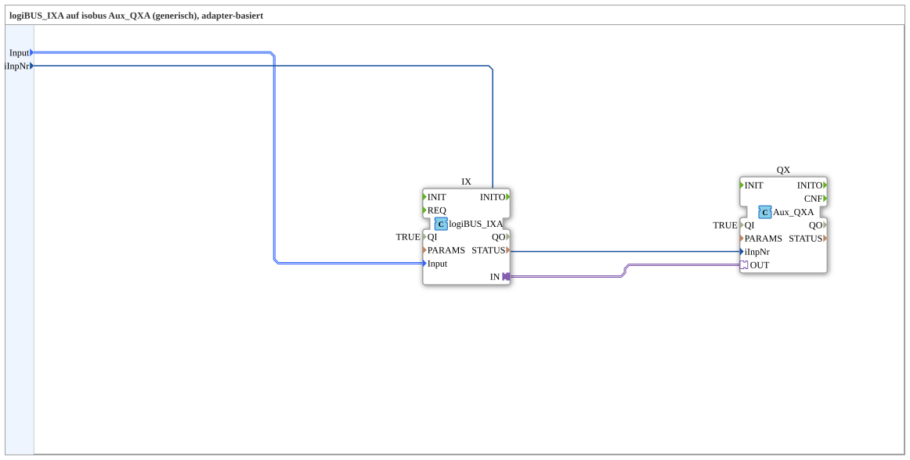

# IXA_TO_Aux_QXA

* * * * * * * * * *

## Einleitung

Die SubApp **IXA_TO_Aux_QXA** dient als generischer, adapterbasierter Konverter zwischen einem logiBUS‑Eingangsbaustein (`logiBUS_IXA`) und einem isobus‑Ausgangsbaustein (`isobus::UT::io::Auxiliary::OUT::Aux_QXA`). Sie ermöglicht die Übertragung digitaler Eingangssignale des logiBUS‑Systems auf einen Auxiliary‑Kanal des isobus‑Netzwerks. Die SubApp wurde aus einer bestehenden Übung ausgelagert, um sie als wiederverwendbaren Baustein in verschiedenen Projekten einzusetzen. Alle Verbindungen erfolgen über standardisierte Adapter, wodurch eine flexible und schnelle Integration in 4diac‑Applikationen möglich ist.

## Schnittstellenstruktur

### **Ereignis-Eingänge**

Keine.

### **Ereignis-Ausgänge**

Keine.

### **Daten-Eingänge**

| Name | Typ | Beschreibung |
|------|-----|--------------|
| `Input` | `logiBUS::io::DI::logiBUS_DI_S` | Identifiziert den logiBUS‑Eingang (z. B. Input_I1..I8). Initialwert: `Invalid` |
| `iInpNr` | `USINT` | Nummer des Auxiliary‑Arrays, entspricht der Reihenfolge im Pool (d. h. erster Aux‑Eingang im Pool = 0). Initialwert: `0` |

### **Daten-Ausgänge**

Keine.

### **Adapter**

Keine an der SubApp selbst. Intern sind die Adapter der enthaltenen Funktionsbausteine `IX` und `QX` miteinander verbunden (Adapter‑Ausgang von `IX` mit Adapter‑Eingang von `QX`).

## Funktionsweise

Die SubApp enthält zwei Funktionsbausteine:

- **`IX`** – ein `logiBUS_IXA`‑Baustein, der die über den Daten‑Eingang `Input` zugeführten logiBUS‑Daten (vom Typ `logiBUS_DI_S`) in ein adapterspezifisches Format wandelt und über seinen Adapter‑Ausgang `IN` bereitstellt.
- **`QX`** – ein `Aux_QXA`‑Baustein, der die über seinen Adapter‑Eingang `OUT` empfangenen Daten auf einen isobus‑Auxiliary‑Kanal ausgibt. Die Auswahl des Kanals erfolgt über den Eingang `iInpNr`.

Die beiden Bausteine sind über eine Adapterverbindung (`IX.IN` → `QX.OUT`) direkt gekoppelt, sodass die logiBUS‑Daten ohne zusätzliche Konfiguration auf den isobus‑Kanal übertragen werden. Die SubApp selbst besitzt keine Event‑ oder Daten‑Ausgänge; die Schnittstelle nach außen besteht ausschließlich aus den beiden Daten‑Eingängen. Durch die Verwendung von Adaptern wird die SubApp unabhängig von spezifischen Implementierungsdetails und leicht in verschiedene Systemumgebungen integrierbar.

## Technische Besonderheiten

- **Adapterbasierte Kopplung**: Die Kommunikation zwischen `logiBUS_IXA` und `Aux_QXA` erfolgt ausschließlich über standardisierte Adapter, wodurch die SubApp protokollunabhängig einsetzbar ist.
- **Generischer Ansatz**: Die SubApp ist generisch ausgelegt und kann durch unterschiedliche Konfigurationen der internen Bausteine (z. B. Änderung der `PARAMS` oder Zuweisung von Eingängen) an verschiedene Anforderungen angepasst werden.
- **Kein Event-Handling**: Die Datenübertragung erfolgt rein datengetrieben über die Adapterverbindung – es sind keine Ereignisse erforderlich.
- **Wiederverwendbarkeit**: Die SubApp wurde aus einer bestehenden Übung (Uebung_003c_sub_AX) ausgelagert, um eine klare, modulare Wiederverwendung zu ermöglichen.
- **Initialisierungen**: Beide Funktionsbausteine sind mit `QI = TRUE` initialisiert, d. h. sie sind standardmäßig aktiv. Der `PARAMS`‑Parameter des `IX`‑Bausteins ist leer gesetzt, was auf Standardeinstellungen hinweist.

## Zustandsübersicht

Da die SubApp keine eigenen Zustände besitzt, wird das Zustandsverhalten durch die internen Funktionsbausteine `logiBUS_IXA` und `Aux_QXA` bestimmt. Diese Bausteine verfügen über eine interne Zustandslogik, die von der jeweiligen Implementierung abhängt (z. B. Initialisierung, Fehlerbehandlung, Datenaustausch). Die SubApp delegiert alle Operationen an diese Bausteine und bietet eine zusammengefasste funktionale Schnittstelle.

## Anwendungsszenarien

- **Integration von logiBUS‑Eingängen in isobus‑Systeme**: Die SubApp eignet sich, um digitale Eingangssignale (z. B. Sensoren oder Schalter) eines logiBUS‑Netzwerks als Auxiliary‑Ausgänge im isobus‑Netzwerk verfügbar zu machen.
- **Wiederverwendbare Konverter‑Komponente**: In Projekten, in denen wiederholt logiBUS‑Signale auf isobus‑Auxiliary‑Kanäle abgebildet werden müssen, bietet die SubApp eine einheitliche und getestete Lösung.
- **Modulare Systemarchitektur**: Durch die Kapselung der Konvertierung in einer SubApp wird die Gesamtapplikation übersichtlicher und leichter wartbar. Änderungen an der Konvertierungslogik können zentral vorgenommen werden.

## Vergleich mit ähnlichen Bausteinen

- **Direkte Verbindung ohne SubApp**: Statt die beiden Bausteine `logiBUS_IXA` und `Aux_QXA` direkt in einer Applikation zu verdrahten, kapselt die SubApp die Verbindung logisch und ermöglicht eine einfachere Wiederverwendung.
- **Andere Konverter‑SubApps**: Es existieren möglicherweise SubApps, die mehrere Eingänge bündeln oder zusätzliche Logik (z. B. Filter, Skalierung) integrieren. `IXA_TO_Aux_QXA` ist bewusst einfach gehalten und fokussiert ausschließlich auf die Adapterkopplung.
- **Generische Protokoll‑Adapter**: Im Vergleich zu universellen Protokoll‑Konvertern ist dieser Baustein auf die spezifische Kombination aus logiBUS und isobus‑Auxiliary optimiert und dadurch weniger konfigurabel, aber auch einfacher in der Anwendung.

## Fazit

Die SubApp **IXA_TO_Aux_QXA** stellt eine kompakte und effiziente Lösung zur Kopplung von logiBUS‑Eingängen mit isobus‑Auxiliary‑Ausgängen dar. Durch den adapterbasierten Aufbau ist sie flexibel, standardkonform und leicht in bestehende 4diac‑Anwendungen integrierbar. Mit nur zwei Daten‑Eingängen ist die Schnittstelle minimal und klar. Die SubApp eignet sich hervorragend für Projekte, die eine saubere Trennung und Wiederverwendbarkeit der Konvertierungslogik verlangen.
