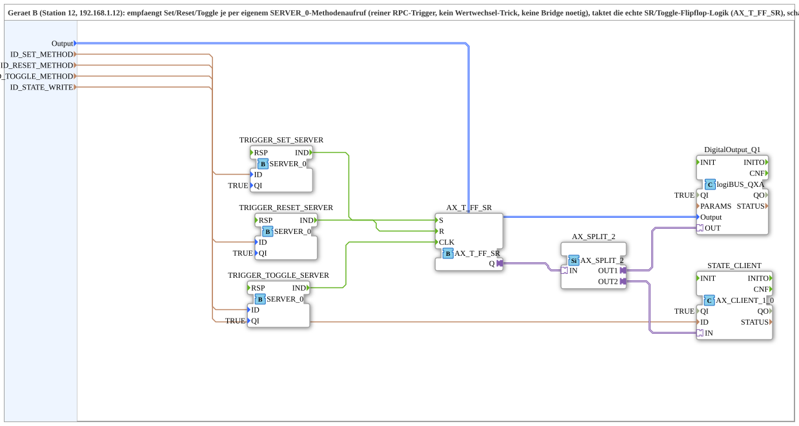

# SRT_RPC_FROM_Remote_QXA_OPC

* * * * * * * * * *
## Einleitung
Die SubApp `SRT_RPC_FROM_Remote_QXA_OPC` dient als RPC-basierte Fernsteuerung für ein Set/Reset/Toggle‑Flipflop auf einem entfernten Gerät (Gerät B). Sie empfängt über drei separate OPC‑UA‑Methoden (Set, Reset, Toggle) Trigger‑Aufrufe von einem übergeordneten System (Gerät A), steuert die interne Flipflop‑Logik, schaltet einen Digitalausgang und schreibt den neuen Zustand aktiv über einen OPC‑UA‑Client zurück an Gerät A. Die komplette Protokolllogik ist in der SubApp gekapselt, sodass keine zusätzliche Konfiguration in der Geräteressource erforderlich ist.

## Schnittstellenstruktur
Die SubApp besitzt ausschließlich Daten‑Eingänge, keine externen Ereignis‑ oder Adapter‑Schnittstellen. Die Kommunikation erfolgt intern über OPC‑UA‑RPC‑Trigger, die in den SERVER_0‑Blöcken erzeugt werden.

### **Ereignis-Eingänge**
Keine.

### **Ereignis-Ausgänge**
Keine.

### **Daten-Eingänge**
| Name | Typ | Beschreibung |
|------|-----|--------------|
| `Output` | `logiBUS::io::DQ::logiBUS_DO_S` | Identifiziert den Digitalausgang (z.B. Q1..Q8). Initialwert: `logiBUS_DO::Invalid` |
| `ID_SET_METHOD` | `WSTRING` | Lokale Methodenadresse (ACTION=CREATE_METHOD) für den Set‑Methodenaufruf |
| `ID_RESET_METHOD` | `WSTRING` | Lokale Methodenadresse für den Reset‑Methodenaufruf |
| `ID_TOGGLE_METHOD` | `WSTRING` | Lokale Methodenadresse für den Toggle‑Methodenaufruf |
| `ID_STATE_WRITE` | `WSTRING` | Remote‑Zieladresse (BOOL, ACTION=WRITE) für den Flipflop‑Zustand auf Gerät A |

### **Daten-Ausgänge**
Keine.

### **Adapter**
Keine externen Adapter – die SubApp verwendet intern Adapterverbindungen für den Datenaustausch zwischen den Funktionsblöcken.

## Funktionsweise
Die SubApp realisiert eine vollständige Fernsteuerkette:

1. **Empfang**: Drei verschiedene `SERVER_0`‑Instanzen (`TRIGGER_SET_SERVER`, `TRIGGER_RESET_SERVER`, `TRIGGER_TOGGLE_SERVER`) warten auf eingehende OPC‑UA‑Methodenaufrufe. Jeder Aufruf erzeugt am jeweiligen `IND`‑Ereignis einen Impuls.
2. **Flipflop‑Logik**: Diese Impulse werden an die Eingänge des Funktionsblocks `AX_T_FF_SR` weitergeleitet: Set → `S`, Reset → `R`, Toggle → `CLK`. Dadurch entsteht ein SR‑Flipflop mit zusätzlicher Toggle‑Funktion.
3. **Ausgangsverteilung**: Der Ausgang `Q` des Flipflops wird über den Adapter `AX_SPLIT_2` auf zwei Pfade aufgeteilt:
   - **Pfad 1** → `DigitalOutput_Q1` (logiBUS_QXA) steuert den physischen Digitalausgang.
   - **Pfad 2** → `STATE_CLIENT` (AX_CLIENT_1_0) übernimmt den Zustand und schreibt ihn aktiv an die in `ID_STATE_WRITE` hinterlegte Remote‑Adresse (Gerät A).
4. **Rückmeldung**: Die `RSP`‑Ereignisse der drei SERVER_0‑Blöcke sind direkt mit den jeweiligen `IND`‑Ereignissen verbunden, sodass die Methodenbestätigung sofort erfolgt und keine Wartezeit entsteht.

## Technische Besonderheiten
- **Drei getrennte Methodenblöcke**: Set, Reset und Toggle werden als eigenständige OPC‑UA‑Methoden realisiert, was eine klare und semantisch eindeutige Kommunikation ermöglicht – kein Wertwechsel‑Trick oder zusätzliche Bridge nötig.
- **Optimierte RSP‑Verdrahtung**: Die direkte Verdrahtung von `IND` zu `RSP` verhindert Blockaden des OPC‑UA‑Server‑Threads und beschleunigt die Antwortzeit erheblich.
- **Gekapselte Logik**: Die gesamte Protokoll‑ und Steuerlogik liegt im `MyLib::sys`‑Composite, nicht in der Geräteressource. Dadurch ist die SubApp portabel und einfach in andere Projekte integrierbar.
- **Verwendung von logiBUS**‑Typen und Adaptern für den Datenaustausch mit den Hardware‑Ausgängen.

## Zustandsübersicht
Die interne Flipflop‑Logik (`AX_T_FF_SR`) besitzt genau einen Zustand (`Q`). Die Übergänge sind:
- **Set** (`S=TRUE`): Q wird `TRUE`.
- **Reset** (`R=TRUE`): Q wird `FALSE`.
- **Toggle** (`CLK`): Q wird invertiert.
Der Digitalausgang `DigitalOutput_Q1` spiegelt den Zustand von `Q` wider. Der per `STATE_CLIENT` zurückgeschriebene Wert entspricht ebenfalls `Q`.

## Anwendungsszenarien
- **Fernsteuerung digitaler Ausgänge** über OPC‑UA‑Methoden, z.B. in verteilten Automatisierungssystemen, wenn ein zentrales Steuerungssystem (Gerät A) Aktionen auf einem entfernten I/O‑Gerät (Gerät B) auslösen muss.
- **Zustandsrückmeldung**: Der aktuelle Flipflop‑Zustand wird aktiv zurückgeschrieben, wodurch die Synchronisation zwischen beiden Geräten gewährleistet ist.
- **Modularer Einsatz**: Die SubApp kann in unterschiedlichen Umgebungen wiederverwendet werden, ohne die Ressourcenkonfiguration des Zielgeräts zu ändern.

## Vergleich mit ähnlichen Bausteinen
- Gegenüber einem einfachen OPC‑UA‑Server, der nur Werte akzeptiert, bietet dieser Baustein klar definierte Methoden, die spezifische Aktionen auslösen.
- Die aktive Rückschreibung über einen Client ist robuster als eine reine Wertüberwachung und reduziert Latenzen bei der Zustandsverteilung.
- Durch die Integration des Flipflops können komplexe Logikoperationen direkt in der SubApp abgebildet werden, ohne zusätzliche externe Logikblöcke.

## Fazit
Die SubApp `SRT_RPC_FROM_Remote_QXA_OPC` stellt eine effiziente und zuverlässige Lösung zur Fernsteuerung digitaler Ausgänge über OPC‑UA dar. Die getrennten Methoden, die optimierte RSP‑Verdrahtung und die aktive Zustandsrückmeldung machen sie besonders geeignet für industrielle Automatisierungsumgebungen, in denen klare Kommunikation und kurze Reaktionszeiten gefordert sind. Die gekapselte Logik erhöht zudem die Wiederverwendbarkeit und vereinfacht die Projektintegration.