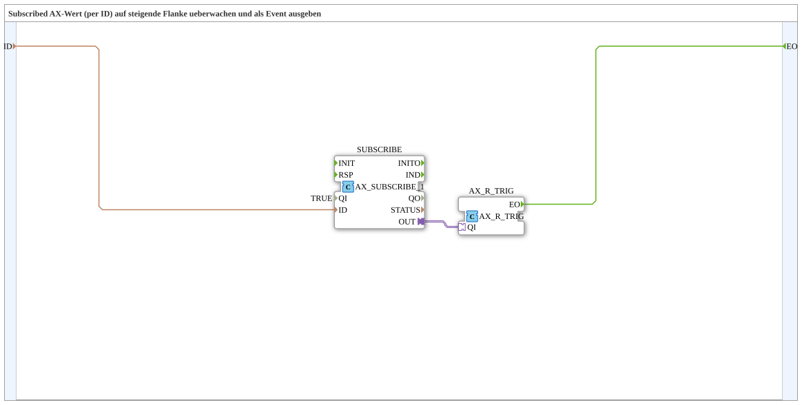

# SUBSCRIBE_R_TRIG

* * * * * * * * * *

## Einleitung

`SUBSCRIBE_R_TRIG` überwacht einen per OPC-UA abonnierten `AX`-Wert (BOOL) auf eine steigende Flanke und gibt diese als einzelnes Ereignis (`EO`) aus. Damit lässt sich ein entfernter, remote gesetzter BOOL-Wert direkt als auslösendes Ereignis verwenden, ohne den Pegel selbst weiterverarbeiten zu müssen.

## Verwendete Funktionsbausteine (FBs)

### Sub-Bausteine: SUBSCRIBE_R_TRIG

- **Typ**: SubAppType
- **Verwendete interne FBs**:
    - **SUBSCRIBE**: `adapter::net::AX_SUBSCRIBE_1` (`QI=TRUE`) — abonniert den entfernten BOOL-Wert (`ID`, z. B. `Anlage_EIN_READ`).
    - **AX_R_TRIG**: `adapter::events::unidirectional::AX_R_TRIG` — erkennt die steigende Flanke des abonnierten Werts und feuert `EO`.
- **Funktionsweise**: Der per OPC-UA empfangene Wert wird direkt in `AX_R_TRIG` geführt, dessen Flankenerkennung das SubApp-Ereignis `EO` auslöst.

## Programmablauf und Verbindungen

1. `ID` → `SUBSCRIBE.ID` (Datenverbindung, ausgeblendet).
2. `SUBSCRIBE.OUT` → `AX_R_TRIG.QI`.
3. `AX_R_TRIG.EO` → `EO` (SubApp-Ereignisausgang).

## Anwendungsszenarien

- Ein entferntes OPC-UA-Signal (z. B. "Anlage EIN") soll ein einmaliges Ereignis auslösen (z. B. Start einer Initialisierung), statt als dauerhafter Pegel weiterverarbeitet zu werden.

## Zusammenfassung

`SUBSCRIBE_R_TRIG` verbindet OPC-UA-Subscribe direkt mit einer Flankenerkennung und liefert ein einzelnes Ereignis bei steigender Flanke des entfernten Werts.

---

### 🌐 Passende Themen-Unterseiten auf ms-muc-docs.de

- [🌐 Eclipse 4diac IDE & Farb-Referenz auf ms-muc-docs.de](https://www.ms-muc-docs.de/iec-61499/eclipse-4diac/)
