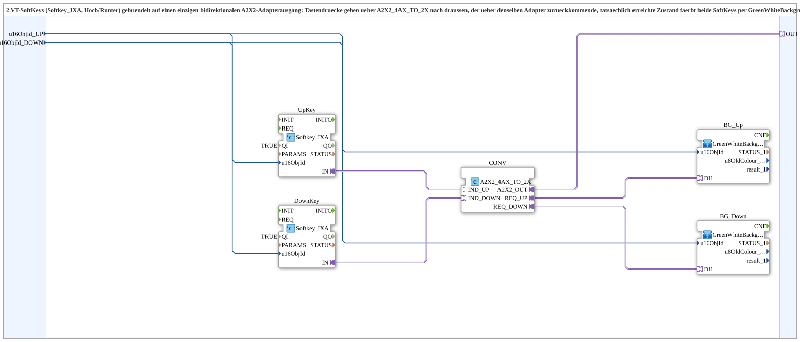

# Softkey2_TO_A2X2_BG

* * * * * * * * * *

## Einleitung

Der Funktionsblock **Softkey2_TO_A2X2_BG** ist ein Composite-SubApp, der zwei virtuelle Softkeys (Hoch/Runter) eines ISOBUS-Terminals über einen einzigen bidirektionalen A2X2-Adapter nach außen führt. Er bündelt die Tastendrücke beider Softkeys und sendet sie über den Adapter. Gleichzeitig wertet er den über denselben Adapter zurückkommenden Ist-Zustand aus und färbt die Softkeys entsprechend grün oder weiß (GreenWhiteBackground). Die Bündelung erfolgt im Composite selbst, nicht in der Geräteressource.

## Schnittstellenstruktur

### **Ereignis-Eingänge**

Keine.

### **Ereignis-Ausgänge**

Keine.

### **Daten-Eingänge**

| Name           | Datentyp | Initialwert | Kommentar                                                                |
|----------------|----------|-------------|--------------------------------------------------------------------------|
| `u16ObjId_UP`   | `UINT`   | `ID_NULL`   | Objekt-ID des SoftKeys „Hoch“ (trägt auch das Green‑White‑Background).    |
| `u16ObjId_DOWN` | `UINT`   | `ID_NULL`   | Objekt-ID des SoftKeys „Runter“ (trägt auch das Green‑White‑Background).  |

### **Daten-Ausgänge**

Keine.

### **Adapter**

| Name  | Typ                                            | Richtung     | Kommentar                                                                     |
|-------|------------------------------------------------|--------------|-------------------------------------------------------------------------------|
| `OUT` | `adapter::types::bidirectional::A2X2` | bidirektional | Gebündelter Roundtrip: sendet UP/DOWN‑Tastendrücke, empfängt UP/DOWN‑Rückmeldezustand. |

## Funktionsweise

Der SubApp enthält zwei Instanzen des Softkey-Bausteins `Softkey_IXA` (`UpKey` und `DownKey`), die jeweils einen eigenen Tastendruck liefern. Diese beiden Einzelkanäle werden über den Adapterkonverter `A2X2_4AX_TO_2X` zusammengeführt und als ein gemeinsamer A2X2‑Datenstrom über den Adapter `OUT` ausgegeben.

Parallel dazu wird der vom Adapter zurückkommende Zustand (der tatsächlich erreichte Softkey‑Zustand) durch denselben Konverter in zwei separate Rückmeldesignale `REQ_UP` und `REQ_DOWN` aufgeteilt. Diese werden an die beiden SubApps `GreenWhiteBackground1_AX` übergeben, die die Objekt‑IDs der Softkeys mit der entsprechenden Hintergrundfarbe (grün = aktiv, weiß = inaktiv) belegen.

Die Verbindung der Objekt‑IDs von den Eingängen zu den beiden Softkeys sowie zu den Hintergrund‑SubApps erfolgt intern über Datenverbindungen.

## Technische Besonderheiten

- **Keine Ereignisse:** Der Baustein arbeitet rein daten‑ und adapterbasiert ohne IEC‑61499‑Ereignisse.
- **Bidirektionale Kommunikation:** Der A2X2‑Adapter ermöglicht gleichzeitiges Senden (Tastendrücke) und Empfangen (Rückmeldung) über dieselbe Verbindung.
- **Interner Konverter `A2X2_4AX_TO_2X`:** Bündelt zwei Einzelkanäle zu einem A2X2‑Datenstrom und teilt den eingehenden A2X2‑Strom wieder in zwei getrennte Signale auf.
- **Wiederverwendbare SubApps:** Für die Hintergrundfärbung wird die SubApp `GreenWhiteBackground1_AX` aus der Bibliothek `MyLib::sys` eingesetzt.
- **Vorgabe der Softkey‑Aktivierung:** Beide Softkey‑Instanzen sind fest mit `QI = TRUE` parametriert, sodass sie permanent aktiv sind.

## Zustandsübersicht

Der Baustein selbst besitzt keine eigenen Zustände. Die internen Softkey‑Bausteine `Softkey_IXA` verfügen jedoch über eine Zustandslogik, die über die Rückmeldung den tatsächlichen Softkey‑Zustand (z. B. gedrückt/aktiv) abbildet. Diese Zustände werden über die Hintergrundfärbung sichtbar gemacht.

## Anwendungsszenarien

- **ISOBUS‑Terminals mit Softkeys:** Zwei Softkeys (z. B. „Hoch“ und „Runter“) sollen über einen einzigen A2X2‑Adapter mit einer externen Steuerung kommunizieren.
- **Visualisierung von Rückmeldungen:** Der tatsächlich erreichte Zustand der Softkeys (z. B. aktiv/inaktiv) wird durch Grün/Weiß‑Hintergrund direkt auf dem Terminal angezeigt.
- **Platzsparende Verdrahtung:** Durch die Bündelung im Composite kann die Anzahl der Adapter‑Verbindungen reduziert werden, ohne die Logik in die Ressource zu verlagern.

## Vergleich mit ähnlichen Bausteinen

- **Ohne Bündelung:** Ein direkter Anschluss jedes Softkeys an einen eigenen A2X2‑Adapter würde zwei Adapter erfordern. Der vorliegende Baustein spart eine Adapterverbindung.
- **Mit mehr als zwei Softkeys:** Für mehr Softkeys könnte das Prinzip erweitert werden, indem der Konverter entsprechend mehr Kanäle zusammenfasst (z. B. `A2X2_6AX_TO_3X`). Der Baustein ist speziell für zwei Softkeys ausgelegt.
- **SubApp statt Ressource:** Das Bündeln erfolgt im Composite, nicht in der Geräteressource – dies erleichtert die Wiederverwendung und Portierung.

## Fazit

`Softkey2_TO_A2X2_BG` ist ein kompaktes, wiederverwendbares Composite, das zwei Softkeys über einen einzigen bidirektionalen A2X2‑Adapter anbindet und gleichzeitig die Rückmeldung visualisiert. Durch die klare Trennung von Tastendruck und Zustandsanzeige sowie die Verwendung standardisierter Bausteine eignet er sich gut für ISOBUS‑Bedienoberflächen.