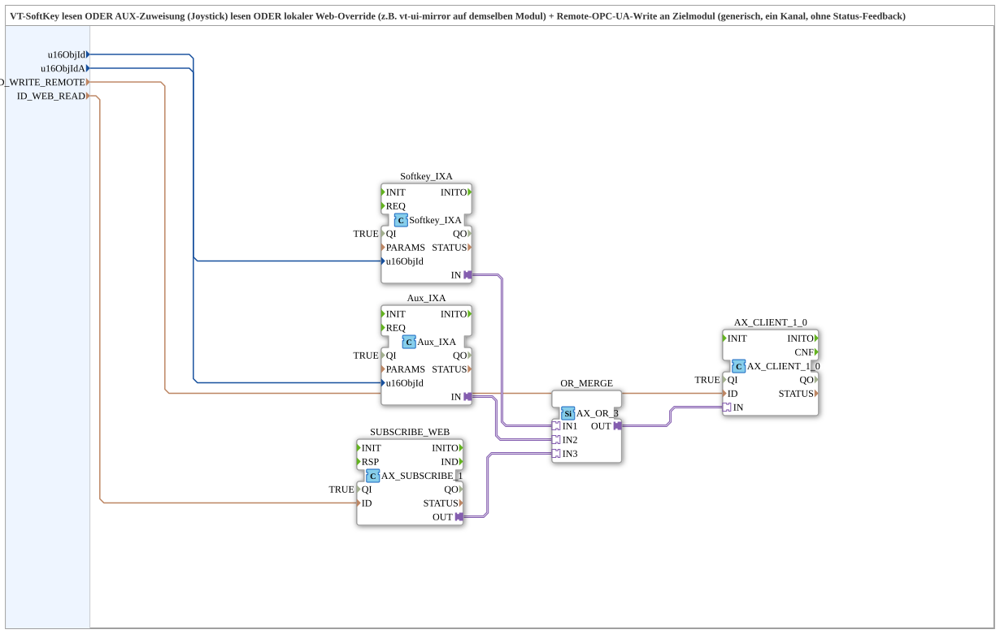

# Softkey_Aux_IXA_TO_Remote_WRITE

* * * * * * * * * *

## Einleitung

`Softkey_Aux_IXA_TO_Remote_WRITE` ist die Kommando-Hälfte von `Softkey_Aux_IXA_TO_Remote_WRITE_BG_OPC`, herausgelöst als eigenständiger Baustein: VT-SoftKey, AUX-Zuweisung (Joystick) und ein lokaler Web-Override (z. B. vt-ui-mirror auf demselben Modul) werden per ODER zusammengeführt und per Remote-Write an ein Zielmodul geschrieben — ohne Status-Feedback.

## Verwendete Funktionsbausteine (FBs)

### Sub-Bausteine: Softkey_Aux_IXA_TO_Remote_WRITE

- **Typ**: SubAppType
- **Verwendete interne FBs**:
    - **Softkey_IXA**: `isobus::UT::io::Softkey::Softkey_IXA` (`QI=TRUE`) — VT-SoftKey-Adapter (`u16ObjId`).
    - **Aux_IXA**: `isobus::UT::io::Auxiliary::IN::Aux_IXA` (`QI=TRUE`) — AUX-Zuweisung/Joystick-Adapter (`u16ObjIdA`).
    - **SUBSCRIBE_WEB**: `adapter::net::AX_SUBSCRIBE_1` (`QI=TRUE`) — lokaler Web-Subscribe (`ID_WEB_READ`), z. B. von einem vt-ui-mirror auf demselben Modul.
    - **OR_MERGE**: `adapter::booleanOperators::AX_OR_3` — führt SoftKey, Aux und Web-Override per ODER zusammen.
    - **AX_CLIENT_1_0**: `adapter::net::AX_CLIENT_1_0` (`QI=TRUE`) — schreibt das zusammengeführte Signal per Remote-Write (`ID_WRITE_REMOTE`) an das Zielmodul.
- **Funktionsweise**: Drei unabhängige Kommandoquellen (SoftKey, Aux, lokaler Web-Override) werden per `AX_OR_3` zusammengeführt und als einzelnes Remote-Write-Kommando an das Zielmodul übertragen.

## Programmablauf und Verbindungen

1. `u16ObjId` → `Softkey_IXA.u16ObjId`; `u16ObjIdA` → `Aux_IXA.u16ObjId`; `ID_WEB_READ` → `SUBSCRIBE_WEB.ID`; `ID_WRITE_REMOTE` → `AX_CLIENT_1_0.ID` (Datenverbindungen, ausgeblendet).
2. `Softkey_IXA.IN` → `OR_MERGE.IN1`; `Aux_IXA.IN` → `OR_MERGE.IN2`; `SUBSCRIBE_WEB.OUT` → `OR_MERGE.IN3`.
3. `OR_MERGE.OUT` → `AX_CLIENT_1_0.IN`.

## Technische Besonderheiten

- **Drei gleichberechtigte Kommandoquellen**: SoftKey, AUX-Zuweisung und lokaler Web-Override wirken über das ODER gleichwertig — jede der drei Quellen kann das Kommando auslösen.
- **Kein Status-Feedback**: Im Gegensatz zu `Softkey_Aux_IXA_TO_Remote_WRITE_BG_OPC` enthält dieser Baustein keine Rückmeldung/Hintergrundfarbe; dafür ist `AX_SUBSCRIBE_BG3_WEB_OPC` mit denselben `u16ObjId`/`u16ObjIdA`-Werten danebenzustellen.

## Anwendungsszenarien

- Fern-Bedienung eines Zielmoduls über SoftKey, AUX-Joystick-Zuweisung oder einen lokalen Web-Client, ohne dass am selben Modul auch eine Statusanzeige benötigt wird.

## Vergleich mit ähnlichen Bausteinen

Für die komplette, vorverdrahtete Kombination beider Seiten (Kommando + Status) ist weiterhin `Softkey_Aux_IXA_TO_Remote_WRITE_BG_OPC` zu verwenden, das diesen Baustein als Kommando-Teilbaustein enthält.

## Zusammenfassung

`Softkey_Aux_IXA_TO_Remote_WRITE` kapselt die reine Kommando-Seite eines Remote-Kanals: drei ODER-verknüpfte Quellen (SoftKey, Aux, lokaler Web-Override), geschrieben per Remote-Write an ein Zielmodul.

---

### 🌐 Passende Themen-Unterseiten auf ms-muc-docs.de

- [🌐 Eclipse 4diac IDE & Farb-Referenz auf ms-muc-docs.de](https://www.ms-muc-docs.de/iec-61499/eclipse-4diac/)
