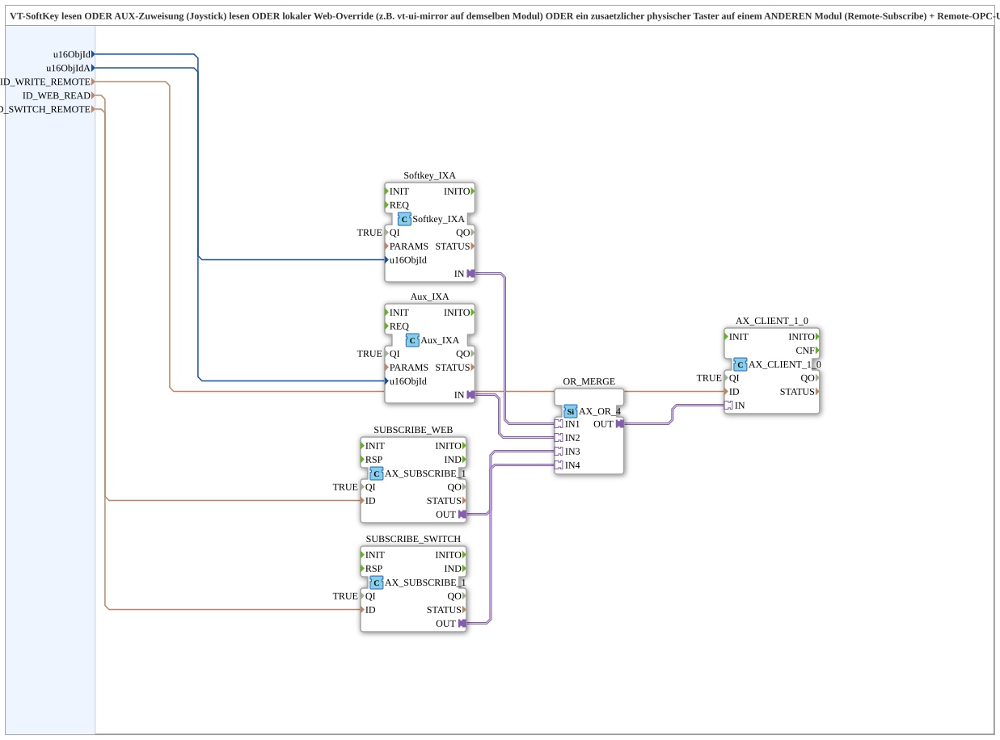

# Softkey_Aux_Switch_TO_Remote_WRITE

* * * * * * * * * *

## Einleitung

Der Funktionsbaustein `Softkey_Aux_Switch_TO_Remote_WRITE` ist eine Subapp, die vier unabhängige Quellen – einen VT-Softkey, eine Auxiliary-Funktion (z. B. Joystick), einen lokalen Web‑Override (z. B. vt‑ui‑mirror) und einen zusätzlichen physischen Taster auf einem anderen Modul (Remote‑Subscribe) – zu einer einzigen ODER‑Verknüpfung zusammenführt. Das resultierende Signal wird anschließend per OPC‑UA‑Client‑Write als Kommando an ein entferntes Zielmodul gesendet. Die Subapp erweitert das Konzept von `Softkey_Aux_IXA_TO_Remote_WRITE` um eine vierte Quelle und ist speziell für Anwendungen gedacht, bei denen neben SoftKey/AUX/Web noch ein fest verbauter Taster auf einem dritten Modul vorhanden ist, z. B. bei einer Schnittverstellung.

## Schnittstellenstruktur

### **Ereignis-Eingänge**

Keine.

### **Ereignis-Ausgänge**

Keine.

### **Daten-Eingänge**

| Name | Typ | Kommentar |
|------|-----|-----------|
| `u16ObjId` | `UINT` | Object ID SoftKey (VT) |
| `u16ObjIdA` | `UINT` | Object ID AuxFunction2 (VT) |
| `ID_WRITE_REMOTE` | `WSTRING` | Remote‑Write‑Adresse zum Zielmodul (Befehl, ACTION=WRITE, CLIENT) |
| `ID_WEB_READ` | `WSTRING` | Lokale Subscribe‑Adresse für einen Web‑Client (z. B. vt‑ui‑mirror) auf demselben Modul, ODER‑verknüpft mit SoftKey und AUX |
| `ID_SWITCH_REMOTE` | `WSTRING` | Remote‑Subscribe‑Adresse eines zusätzlichen physischen Tasters auf einem **anderen** Modul (z. B. STG4_I2_REMOTE), ODER‑verknüpft mit SoftKey/AUX/Web |

Alle Eingänge sind als `InputVars` definiert; es gibt keine Daten‑Ausgänge.

### **Daten-Ausgänge**

Keine.

### **Adapter**

Die Subapp besitzt **keine externen Adapter‑Schnittstellen**. Die internen Adapterverbindungen dienen ausschließlich zur Verdrahtung der enthaltenen Funktionsbausteine.

## Funktionsweise

Die Subapp kombiniert vier boolesche Zustände logisch ODER:

1. **SoftKey** – über `u16ObjId` wird der aktive Zustand eines VT‑Softkeys gelesen (intern über `Softkey_IXA`).
2. **Auxiliary‑Funktion** – über `u16ObjIdA` wird der Zustand einer Auxiliary‑Zuweisung (z. B. Joystick‑Taste) erfasst (intern über `Aux_IXA`).
3. **Web‑Override** – über `ID_WEB_READ` wird ein lokal per OPC‑UA‑Subscription empfangenes Signal eines Web‑Clients (z. B. vt‑ui‑mirror) integriert (intern über `SUBSCRIBE_WEB`).
4. **Remote‑Taster** – über `ID_SWITCH_REMOTE` wird ein zusätzlicher physischer Taster auf einem anderen Modul per Remote‑Subscription gelesen (intern über `SUBSCRIBE_SWITCH`).

Alle vier Signale werden im Baustein `AX_OR_4` zusammengeführt. Das Ergebnis dient als Eingang für den OPC‑UA‑Client `AX_CLIENT_1_0`, der das Kommando (als Write‑Request) an die in `ID_WRITE_REMOTE` spezifizierte Zieladresse sendet. Die gesamte Verarbeitung erfolgt asynchron; es gibt keine Rückmeldung über den Erfolg des Schreibvorgangs.

## Technische Besonderheiten

- **Lokale ODER‑Verknüpfung**: Alle vier Quellen werden im Bedienmodul (z. B. STG1) zusammengeführt und **erst dann** als ein einziges Kommando an das Zielmodul gesendet. Dies vermeidet Race‑Conditions oder „Last‑Write‑Wins“‑Probleme, die bei mehreren unabhängigen Writern auf denselben Zielknoten auftreten könnten.
- **Kein Status‑Feedback**: Der Baustein sendet ausschließlich Kommandos. Für eine Rückmeldung (z. B. Hintergrundfarbe) muss ein separater Baustein wie `AX_SUBSCRIBE_BG3_WEB_OPC` verwendet werden, dem dieselben Objekt‑IDs (`u16ObjId`, `u16ObjIdA`) durchgereicht werden.
- **Generisch**: Die Adressen (`ID_WRITE_REMOTE`, `ID_WEB_READ`, `ID_SWITCH_REMOTE`) sind frei konfigurierbar, sodass die Subapp für verschiedene Zielmodule und Netztopologien einsetzbar ist.
- **Vier Quellen**: Im Vergleich zu `Softkey_Aux_IXA_TO_Remote_WRITE` wird eine vierte Quelle (Remote‑Taster) unterstützt, was für Anwendungen mit mehreren Bedienorten wichtig ist.

## Zustandsübersicht

Die Subapp implementiert eine **kombinatorische Logik**; sie besitzt keinen internen Zustand. Der Ausgang (das Write‑Kommando) ist eine reine Funktion der aktuellen Eingangswerte. Alle Eingänge werden kontinuierlich überwacht und jede Änderung kann sofort ein Kommando auslösen.

## Anwendungsszenarien

- **Schnittverstellung**:  
  - SoftKey „Aufnahme Heben/Senken“ auf Bedienmodul STG1  
  - Auxiliary‑Funktion (Joystick) auf STG1  
  - Web‑Override über vt‑ui‑mirror auf STG1  
  - Physischer Taster S06/S07 auf STG4, per Remote‑Subscribe (STG4_I2/I3_REMOTE) eingelesen  
  - Aktor (z. B. Hydraulikventil) auf STG2, angesteuert über `ID_WRITE_REMOTE`  

- **Alternative Bedienkonzepte** in Maschinen mit mehreren Bedienständen oder Fernbedienungen.

## Vergleich mit ähnlichen Bausteinen

- **`Softkey_Aux_IXA_TO_Remote_WRITE`**: Kombiniert nur drei Quellen (SoftKey, AUX, Web) und verfügt über keinen zusätzlichen Remote‑Taster‑Eingang. Das hier dokumentierte SubApp‑Element erweitert diese Logik um `ID_SWITCH_REMOTE` und verwendet einen vierfachen ODER‑Baustein (`AX_OR_4`) anstelle eines dreifachen.
- **Direkte Mehrfach‑Writer‑Lösungen**: Wenn mehrere Clients direkt auf denselben Zielknoten schreiben, treten häufig unerwünschte Überlagerungen auf. Dieser Baustein konsolidiert alle Quellen an einer zentralen Stelle.

## Fazit

`Softkey_Aux_Switch_TO_Remote_WRITE` ist ein leistungsfähiger und flexibler Baustein, der eine zuverlässige ODER‑Verknüpfung von bis zu vier Bedienquellen ermöglicht und das Ergebnis als einzelnes OPC‑UA‑Write‑Kommando an ein entferntes Zielmodul überträgt. Durch die zentrale Auswertung wird die Gefahr von Race‑Conditions minimiert. Die fehlende Statusrückmeldung wird durch die Existenz separater Statusbausteine kompensiert, sodass sich der Baustein ideal für reine Steuerungsaufgaben eignet. Seine Einfachheit und Erweiterbarkeit machen ihn zu einer guten Wahl für verteilte Automatisierungssysteme.