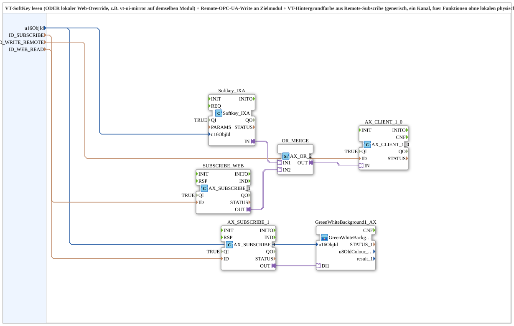

# Softkey_IXA_TO_Remote_WRITE_BG_OPC

* * * * * * * * * *

## Einleitung

Dieser Baustein realisiert eine Fernbedienungs‑Funktion für einen SoftKey, der auf einem VT‑Steuergerät (STG1) sitzt, während der eigentliche Aktor auf einem anderen Modul ohne eigene VT‑Anbindung angeordnet ist. Der lokale SoftKey wird gelesen und per OPC‑UA als Remote‑Write an das Zielmodul gesendet. Der tatsächliche Zustand des Aktors wird per Remote‑Subscribe zurückgeholt und als Hintergrundfarbe direkt am SoftKey visualisiert. Zusätzlich kann ein lokaler Web‑Client (z. B. ein vt‑ui‑mirror auf demselben Modul) denselben Befehl auslösen; beide Quellen werden per ODER‑Verknüpfung kombiniert.

## Schnittstellenstruktur

Die SubApp besitzt ausschließlich Dateneingänge. Es gibt keine Ereignisse, Datenausgänge oder Adapter als externe Schnittstellen.

### **Ereignis-Eingänge**  
Keine.

### **Ereignis-Ausgänge**  
Keine.

### **Daten-Eingänge**

| Name          | Datentyp | Beschreibung                                                                                     |
|---------------|----------|--------------------------------------------------------------------------------------------------|
| `u16ObjId`    | UINT     | Object‑ID des SoftKeys bzw. des Hintergrund‑Objekts (VT). Initialwert: `ID_NULL`                 |
| `ID_SUBSCRIBE`| WSTRING  | Remote‑Subscribe‑Adresse (Status/Farbe, ACTION=SUBSCRIBE)                                        |
| `ID_WRITE_REMOTE`| WSTRING| Remote‑Write‑Adresse zum Zielmodul (Befehl, ACTION=WRITE, CLIENT)                                |
| `ID_WEB_READ` | WSTRING  | Lokale Subscribe‑Adresse für einen Web‑Client (z. B. vt‑ui‑mirror) auf demselben Modul, ODER‑verknüpft mit dem echten SoftKey |

### **Daten-Ausgänge**  
Keine.

### **Adapter**  
Keine.

## Funktionsweise

Die SubApp besteht aus mehreren Funktionsblöcken, die über Adapterverbindungen und Datenverbindungen zusammenwirken:

1. **Softkey_IXA** (Typ `isobus::UT::io::Softkey::Softkey_IXA`): Liest den lokalen SoftKey‑Zustand anhand der übergebenen `u16ObjId`. Der Zustand wird über seinen Adapter‑Ausgang `IN` bereitgestellt.

2. **SUBSCRIBE_WEB** (Typ `adapter::net::AX_SUBSCRIBE_1`): Abonniert die Adresse aus `ID_WEB_READ`. Der empfangene Wert (z. B. vom Web‑Client) wird über den Adapter‑Ausgang `OUT` geliefert.

3. **OR_MERGE** (Typ `adapter::booleanOperators::AX_OR_2`): Verknüpft die Signale von `Softkey_IXA.IN` (Eingang `IN1`) und `SUBSCRIBE_WEB.OUT` (Eingang `IN2`) logisch per ODER. Das Ergebnis erscheint am Ausgang `OUT`.

4. **AX_CLIENT_1_0** (Typ `adapter::net::AX_CLIENT_1_0`): Nimmt das ODER‑Signal entgegen und führt über die Adresse `ID_WRITE_REMOTE` einen OPC‑UA‑Write‑Befehl auf dem Zielmodul aus.

5. **AX_SUBSCRIBE_1** (Typ `adapter::net::AX_SUBSCRIBE_1`): Abonniert die Adresse `ID_SUBSCRIBE`, über die der tatsächliche Aktorzustand vom Zielmodul zurückgemeldet wird. Der Ausgang `OUT` liefert den binären Status.

6. **GreenWhiteBackground1_AX** (SubApp vom Typ `MyLib::sys::GreenWhiteBackground1_AX`): Erhält den Status vom Subscribe‑Ausgang an ihrem Eingang `DI1` und setzt die VT‑Hintergrundfarbe des SoftKeys entsprechend: grün für aktiv, weiß für inaktiv.

Die Adapter­verbindungen gewährleisten den Datenfluss:  
`Softkey_IXA.IN` → `OR_MERGE.IN1`,  
`SUBSCRIBE_WEB.OUT` → `OR_MERGE.IN2`,  
`OR_MERGE.OUT` → `AX_CLIENT_1_0.IN`,  
`AX_SUBSCRIBE_1.OUT` → `GreenWhiteBackground1_AX.DI1`.

## Technische Besonderheiten

- Der Baustein verwendet isolierte Funktionsblöcke aus den Bibliotheken `isobus`, `adapter` und `MyLib::sys`.
- Der Initialwert von `u16ObjId` ist `ID_NULL`, eine im Compiler‑Import definierte Konstante.
- Die OPC‑UA‑Kommunikation ist zweigeteilt: Ein Write‑Kanal für den Befehl und ein Subscribe‑Kanal für das Rückfeedback. Dadurch wird eine unabhängige Status‑Aktualisierung ermöglicht.
- Die SubApp ist generisch für **genau einen** Kanal ausgelegt; durch Konfiguration verschiedener Adressen kann sie für unterschiedliche Objekte verwendet werden.
- Es existieren Varianten für Auxiliary‑Funktionen (Joystick) sowie für VT‑Buttons, die in der Baustein‑Dokumentation erwähnt werden.

## Zustandsübersicht

Die SubApp besitzt keinen expliziten Zustandsautomaten. Aus Sicht des Zielsystems gibt es jedoch zwei stabile Zustände, die über die Hintergrundfarbe visualisiert werden:

- **Aktiv** (Grün): Der Aktor ist eingeschaltet – der über `ID_SUBSCRIBE` empfangene Status ist `TRUE`.
- **Inaktiv** (Weiß): Der Aktor ist ausgeschaltet – der Status ist `FALSE`.

Der Übergang zwischen diesen Zuständen wird durch den ODER‑verknüpften Befehl (SoftKey oder Web‑Client) ausgelöst. Der Rückkanal über das Subscribe‑Abonnement aktualisiert die Anzeige unmittelbar nach dem Write‑Befehl.

## Anwendungsszenarien

- **Fernbedienung eines Aktors**: Der Bediener drückt auf einem VT‑Steuergerät (STG1) einen SoftKey und erhält über die Hintergrundfarbe eine visuelle Rückmeldung des Aktorzustands, ohne dass ein weiteres Display am Zielmodul erforderlich ist.
- **Einbindung eines Web‑Clients**: Ein auf demselben Steuergerät laufender Web‑Client (z. B. Spiegel der Bedienoberfläche) kann dieselbe Funktion über `ID_WEB_READ` auslösen; die ODER‑Verknüpfung stellt sicher, dass beide Bedienwege funktionieren.
- **Modul ohne eigene VT‑Anbindung**: Wenn der Aktor auf einem Modul sitzt, das weder Display noch Tastatur hat, wird die Bedienung über OPC‑UA realisiert – die Kommunikation läuft vollständig über die konfigurierten Adressen.

## Vergleich mit ähnlichen Bausteinen

Die SubApp `Softkey_IXA_TO_Remote_WRITE_BG_OPC` ist eine spezialisierte Variante in einer Produktfamilie. In der internen Dokumentation werden zwei verwandte Typen erwähnt:

- **Softkey_Aux_IXA_TO_Remote_WRITE_BG_OPC**: Unterstützt zusätzlich eine dritte Quelle (z. B. eine Auxiliary‑Funktion/Joystick). Der logische Aufbau ist ähnlich, jedoch wird `GreenWhiteBackground3_AX` anstelle von `GreenWhiteBackground1_AX` verwendet.
- **Button_IXA_TO_Remote_WRITE_BG_OPC**: Für einen regulären VT‑Button anstelle eines SoftKeys; die Grundstruktur bleibt gleich.

Diese Varianten unterscheiden sich hauptsächlich in der Anzahl der möglichen Eingabequellen und in der Art des Bedienelements.

## Fazit

Die SubApp `Softkey_IXA_TO_Remote_WRITE_BG_OPC` bietet eine kompakte und generische Lösung, um einen SoftKey‑basierten Befehl über OPC‑UA an ein entferntes Modul zu senden und den Zustand des Aktors direkt am SoftKey sichtbar zu machen. Durch die ODER‑Verknüpfung mit einem Web‑Client wird die Bedienung flexibel, und die Trennung von Befehls‑ und Statuskanal erhöht die Zuverlässigkeit. Sie ist besonders für verteilte Systeme geeignet, bei denen die Bedienoberfläche und der Aktor getrennt sind.