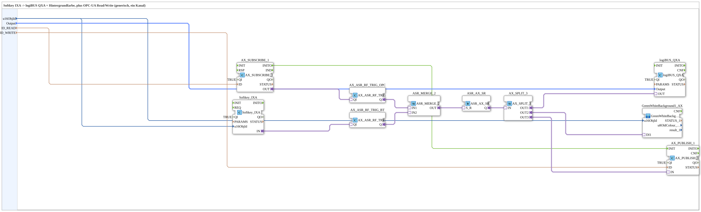

# Softkey_IXA_TO_logiBUS_QXA_BG_OPC

* * * * * * * * * *

## Einleitung

`Softkey_IXA_TO_logiBUS_QXA_BG_OPC` ist das SoftKey-Pendant zu [`Button_IXA_TO_logiBUS_QXA_BG_OPC`](./Button_IXA_TO_logiBUS_QXA_BG_OPC.md): Ein VT-SoftKey und ein OPC-UA-Remote-Kommando werden je über eine Flankenerkennung in Set/Reset-Ereignisse gewandelt, in einem gemeinsamen Latch zusammengeführt und schalten einen einzelnen digitalen logiBUS-Ausgang — inklusive VT-Statusanzeige und OPC-UA-Echo. Ein Klick auf den SoftKey oder ein Remote-Kommando schaltet den Ausgang EIN, ein zweiter AUS (Klick-Toggle-Verhalten).

## Verwendete Funktionsbausteine (FBs)

### Sub-Bausteine: Softkey_IXA_TO_logiBUS_QXA_BG_OPC

- **Typ**: SubAppType
- **Verwendete interne FBs**:
    - **Softkey_IXA**: `isobus::UT::io::Softkey::Softkey_IXA` (`QI=TRUE`) — VT-SoftKey, `u16ObjId` identifiziert den SoftKey.
    - **AX_ASR_RF_TRIG_BT** / **AX_ASR_RF_TRIG_OPC**: je `adapter::events::unidirectional::AX_ASR_RF_TRIG` — wandeln steigende/fallende Flanke des SoftKeys bzw. des OPC-UA-Subscribe-Werts in ein Set/Reset-Ereignispaar (ASR).
    - **ASR_MERGE_2**: `adapter::events::unidirectional::ASR_MERGE_2` — führt die beiden ASR-Quellen (SoftKey, OPC-UA) zusammen.
    - **ASR_AX_SR**: `adapter::events::unidirectional::ASR_AX_SR` — Set/Reset-Latch, bildet aus dem zusammengeführten ASR-Signal den gelatchten Ausgangszustand.
    - **AX_SPLIT_3**: `adapter::events::unidirectional::AX_SPLIT_3` — verteilt den Latch-Ausgang auf drei Ziele.
    - **logiBUS_QXA**: `logiBUS::io::DQ::logiBUS_QXA` (`QI=TRUE`) — physischer digitaler Ausgang.
    - **GreenWhiteBackground1_AX** (SubApp, `MyLib::sys`): VT-Hintergrundfarbe passend zum Ausgangszustand.
    - **AX_SUBSCRIBE_1** / **AX_PUBLISH_1**: je `adapter::net::AX_SUBSCRIBE_1`/`AX_PUBLISH_1` (`QI=TRUE`) — OPC-UA-Lese-/Schreibzugriff.
- **Funktionsweise**: Identisch zur Latching-Struktur von `Button_IXA_TO_logiBUS_QXA_BG_OPC_LATCHING`, jedoch mit `Softkey_IXA` statt `Button_IXA` als lokale Bedienquelle.

## Programmablauf und Verbindungen

1. `Softkey_IXA.IN` (Adapter) → `AX_ASR_RF_TRIG_BT.QI` → `AX_ASR_RF_TRIG_BT.Q` → `ASR_MERGE_2.IN2`.
2. `AX_SUBSCRIBE_1.OUT` → `AX_ASR_RF_TRIG_OPC.QI` → `AX_ASR_RF_TRIG_OPC.Q` → `ASR_MERGE_2.IN1`.
3. `ASR_MERGE_2.OUT` → `ASR_AX_SR.S_R`.
4. `ASR_AX_SR.Q` → `AX_SPLIT_3.IN` → `AX_SPLIT_3.OUT1` → `logiBUS_QXA.OUT`, `AX_SPLIT_3.OUT2` → `GreenWhiteBackground1_AX.DI1`, `AX_SPLIT_3.OUT3` → `AX_PUBLISH_1.IN`.
5. Initialisierung: `AX_SUBSCRIBE_1.INITO` → `AX_PUBLISH_1.INIT` (ausgeblendete Verbindung).
6. Parameter: `u16ObjId` → `Softkey_IXA.u16ObjId` und `GreenWhiteBackground1_AX.u16ObjId`; `Output` → `logiBUS_QXA.Output`; `ID_READ` → `AX_SUBSCRIBE_1.ID`; `ID_WRITE` → `AX_PUBLISH_1.ID`.

## Technische Besonderheiten

- **Klick-Toggle über ASR-Latch**: Wie bei `Button_IXA_TO_logiBUS_QXA_BG_OPC_LATCHING` bleibt der Ausgang nach Loslassen im zuletzt gesetzten Zustand — im Unterschied zu einer tastenden ODER-Verschaltung.
- **Zwei unabhängige Toggle-Quellen**: SoftKey und OPC-UA-Kommando lösen je eigenständig ein Toggle aus; `ASR_MERGE_2` führt beide zu einem gemeinsamen Latch-Eingang zusammen.

## Anwendungsszenarien

- Digitale Ausgänge, die per SoftKey oder Remote-Kommando ein-/ausgeschaltet werden sollen (Toggle-Verhalten), mit VT-Statusanzeige und OPC-UA-Rückmeldung.

## Vergleich mit ähnlichen Bausteinen

Strukturell identisch zu [`Button_IXA_TO_logiBUS_QXA_BG_OPC_LATCHING`](./Button_IXA_TO_logiBUS_QXA_BG_OPC_LATCHING.md), nur mit `Softkey_IXA` statt `Button_IXA` als lokale Bedienquelle. Gegenüber dem einfacheren [`Softkey_IXA_TO_logiBUS_QXA_BG`](./Softkey_IXA_TO_logiBUS_QXA_BG.md) (nur lokaler SoftKey, keine OPC-UA-Anbindung, keine Latch-Logik) kommen hier die komplette Flankenerkennungs-/Merge-/Latch-Kette sowie OPC-UA-Subscribe/Publish hinzu.

## Zusammenfassung

`Softkey_IXA_TO_logiBUS_QXA_BG_OPC` schaltet einen digitalen logiBUS-Ausgang per SoftKey ODER Remote-OPC-UA-Kommando im Klick-Toggle-Verfahren, inklusive VT-Statusfarbe und OPC-UA-Echo.

---

### 🌐 Passende Themen-Unterseiten auf ms-muc-docs.de

- [🌐 Eclipse 4diac IDE & Farb-Referenz auf ms-muc-docs.de](https://www.ms-muc-docs.de/iec-61499/eclipse-4diac/)
