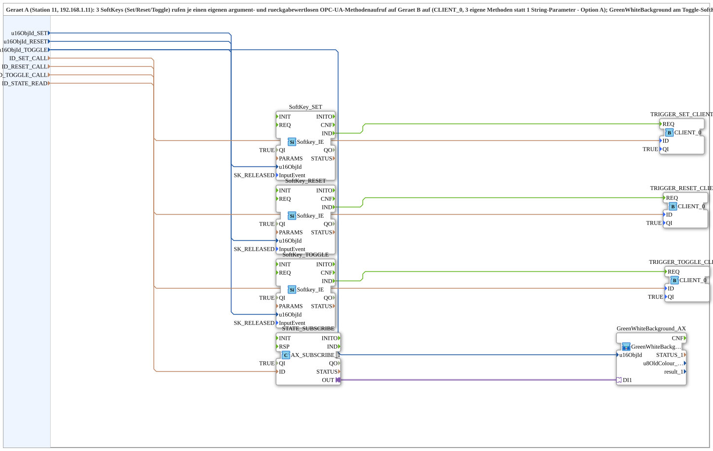

# Softkey_SRT_RPC_TO_Remote_BG_OPC

* * * * * * * * * *
## Einleitung
Die SubApp **Softkey_SRT_RPC_TO_Remote_BG_OPC** verbindet physische Softkeys einer Bedieneinheit mit einem entfernten OPC-UA-Server (Gerät B). Über drei separate OPC-UA-Clients (`CLIENT_0`) werden Methodenaufrufe zum Setzen, Rücksetzen und Toggeln eines Binärausgangs auf Gerät B ausgelöst. Ein zusätzlicher Abonnement-Adapter überwacht den zugehörigen Flipflop-Zustand und übergibt ihn an eine Visualisierungs-SubApp (GreenWhiteBackground), die den Zustand farblich darstellt. Die gesamte Kommunikationslogik ist in dieser SubApp gekapselt und daher wiederverwendbar.

## Schnittstellenstruktur
### **Ereignis-Eingänge**
Keine – die SubApp besitzt keine externen Ereigniseingänge. Die Softkey-Erkennung erfolgt über intern implementierte Funktionsblöcke.

### **Ereignis-Ausgänge**
Keine.

### **Daten-Eingänge**
| Name | Typ | Beschreibung |
|------|-----|--------------|
| `u16ObjId_SET` | UINT | Objekt-ID für den Softkey „Set“ (initial `ID_NULL`) |
| `u16ObjId_RESET` | UINT | Objekt-ID für den Softkey „Reset“ |
| `u16ObjId_TOGGLE` | UINT | Objekt-ID für den Softkey „Toggle“ (trägt auch das GreenWhiteBackground) |
| `ID_SET_CALL` | WSTRING | Remote-Methodenadresse (ACTION=CALL_METHOD) für den Set-Aufruf auf Gerät B |
| `ID_RESET_CALL` | WSTRING | Remote-Methodenadresse (ACTION=CALL_METHOD) für den Reset-Aufruf auf Gerät B |
| `ID_TOGGLE_CALL` | WSTRING | Remote-Methodenadresse (ACTION=CALL_METHOD) für den Toggle-Aufruf auf Gerät B |
| `ID_STATE_READ` | WSTRING | Adresse (BOOL, ACTION=READ) für den Flipflop-Zustand, der von Gerät B überwacht wird |

### **Daten-Ausgänge**
Keine.

### **Adapter**
Keine externen Adapter.

## Funktionsweise
Die SubApp nutzt drei Instanzen des Funktionsblocks `isobus::UT::io::Softkey::Softkey_IE`, die auf das Loslassen eines Softkeys reagieren (konfiguriert über `SK_RELEASED`). Jedes Drücken eines Softkeys erzeugt ein internes Ereignis (`IND`), das einen zugeordneten `CLIENT_0`-FB (OPC-UA-Client) dazu veranlasst, die konfigurierte Methode (Set, Reset, Toggle) auf dem entfernten Gerät aufzurufen. Die dafür benötigten Methodenadressen werden über die Eingänge `ID_SET_CALL`, `ID_RESET_CALL` und `ID_TOGGLE_CALL` bereitgestellt.

Parallel abonniert die SubApp über den Adapter `STATE_SUBSCRIBE` kontinuierlich den booleschen Zustand eines Flipflops auf Gerät B (Adresse aus `ID_STATE_READ`). Dieser Zustand wird an die SubApp `GreenWhiteBackground_AX` übergeben, die eine farbige Rückmeldung (grün/weiß) erzeugt – typischerweise für den Toggle-Softkey.

Die SubApp ist in zwei Ebenen organisiert: die Bedienlogik (Softkeys + OPC-UA-Clients) und die Anzeigelogik (Abonnement + GreenWhiteBackground). Dadurch wird eine klare Trennung von Aktorik und Sensorik erreicht.

## Technische Besonderheiten
- **Drei separate OPC-UA-Clients** (`CLIENT_0`) pro Methode, was eine eindeutige Zuordnung zwischen Softkey und Fernaufruf ermöglicht und Fehlkonfigurationen vermeidet.
- **CALL_METHOD ohne Parameter und Rückgabewert** – die Methode wird als „fire-and-forget“-Aufruf behandelt.
- **Zustandsüberwachung per Abonnement** (`adapter::net::AX_SUBSCRIBE_1`) statt Polling – dies liefert ereignisgenaue Statusänderungen ohne zusätzliche Latenz.
- **Parametrierbarkeit** über Objekt-IDs (`UINT`) und Methodenadressen (`WSTRING`) ermöglicht die Wiederverwendung in verschiedenen Anlagen und Konfigurationen.
- **Import externer Konstanten** (`ID_NULL`, `SK_RELEASED`) zur sicheren Initialisierung und einheitlichen Ereignisdefinition.
- **SubApp-basierte Kapselung** – das Protokoll liegt in der SubApp, nicht in der Ressource eines Geräts, was die Portabilität erhöht.

## Zustandsübersicht
Die SubApp selbst besitzt keinen expliziten endlichen Zustandsautomaten. Der interne Ablauf wird durch die externen Ereignisse der Softkeys gesteuert:
- **Softkey-Ereignis** (Loslassen) → löst einen OPC-UA-Methodenaufruf aus.
- **Abonnement** liefert asynchron Änderungen des Flipflop-Zustands (0 oder 1), die an die Anzeige weitergegeben werden.
Der aktuelle Zustand des Flipflops (0 = weiß, 1 = grün) wird visuell dargestellt, ohne dass eine zusätzliche Zustandslogik in der SubApp erforderlich ist.

## Anwendungsszenarien
- Fernsteuerung eines Binärausgangs (z.B. Ventil, Lampe, Motor) über Taster an einer Bedieneinheit.
- Visualisierung eines übergeordneten Steuerbits (Toggle-Funktion) mit Farbwechsel zur Statusanzeige.
- Integration in Maschinensteuerungen, bei denen OPC-UA als Kommunikationsprotokoll zwischen Bedienpanel und SPS dient.
- Einsatz als wiederverwendbare Bibliothekskomponente in verschiedenen Anlagen, da alle Adressen und IDs extern gesetzt werden können.

## Vergleich mit ähnlichen Bausteinen
- **Einzelner Client mit String-Parametern:** Eine Alternative wäre ein CLIENT_0-FB, der Methoden mit einem String-Parameter aufruft, um die Methode zu unterscheiden. Hierfür wären jedoch zusätzliche Parsing-Logik und Fehlerbehandlung nötig, während die SubApp durch separate Clients pro Aktion eine klarere und sicherere Zuordnung bietet.
- **Polling-basierte Zustandsabfrage:** Statt eines Abonnements könnte der Zustand zyklisch gelesen werden. Dies würde jedoch Verzögerungen verursachen und unnötige Netzwerklast erzeugen. Das hier verwendete Abonnement ist effizienter und aktueller.
- **Monolithische Ressourcenlogik:** Ohne SubApp-Struktur wäre die Kommunikationslogik in der Ressource des Geräts integriert, was die Wiederverwendung und Wartung erschwert. Die SubApp kapselt die gesamte Logik und macht sie portabel.

## Fazit
Die SubApp `Softkey_SRT_RPC_TO_Remote_BG_OPC` ist eine durchdachte, modulare Lösung zur Fernsteuerung und Zustandsanzeige über OPC-UA. Durch die Kombination von Softkey-Erkennung, dedizierten OPC-UA-Clients und einem ereignisbasierten Zustandsabonnement bietet sie eine hohe Zuverlässigkeit, Flexibilität und einfache Integration in industrielle Steuerungssysteme. Ihre parametrierbaren Eingänge machen sie universell einsetzbar, und die klare Trennung von Bedienung und Anzeige erleichtert die Wartung und Erweiterung.