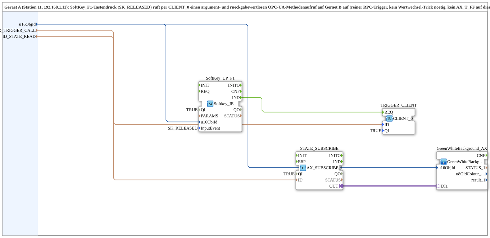

# Softkey_Toggle_RPC_TO_Remote_BG_OPC

* * * * * * * * * *
## Einleitung
Die Subapp `Softkey_Toggle_RPC_TO_Remote_BG_OPC` kapselt ein schlankes RPC-Protokoll über OPC-UA. Sie ist für eine Zwei-Geräte-Anwendung ausgelegt: Ein Softkey-Ereignis auf Gerät A löst über einen OPC-UA-Methodenaufruf einen Trigger auf Gerät B aus. Parallel wird ein von Gerät B remote gesetzter Bool-Zustand abonniert und über eine grafische SubApp als grüner oder weißer Hintergrund dargestellt. Das Protokoll ist vollständig in diesem Composite-Baustein gekapselt und nicht an eine bestimmte Geräteresource gebunden.

## Schnittstellenstruktur
### **Ereignis-Eingänge**
Keine.

### **Ereignis-Ausgänge**
Keine.

### **Daten-Eingänge**
| Name | Typ | Beschreibung |
|------|-----|--------------|
| `u16ObjId` | `UINT` | Objekt-ID für Softkey und Hintergrund; Initialwert `ID_NULL`. |
| `ID_TRIGGER_CALL` | `WSTRING` | Remote-Methodenadresse (`ACTION=CALL_METHOD`) für den argumentlosen Trigger-Methodenaufruf auf Gerät B. |
| `ID_STATE_READ` | `WSTRING` | Lokal überwachte Adresse (`BOOL`, `ACTION=READ`) für den Flipflop-Zustand, wird von Gerät B remote beschrieben. |

### **Daten-Ausgänge**
Keine.

### **Adapter**
Keine an der Subapp-Schnittstelle. Intern wird die Adapterverbindung `STATE_SUBSCRIBE.OUT` an den Adaptereingang `DI1` der SubApp `GreenWhiteBackground_AX` genutzt.

## Funktionsweise
Der Baustein enthält drei funktionale Pfade:

1. **Trigger-Pfad:** Der Eingangsbaustein `SoftKey_UP_F1` (Typ `Softkey_IE`) überwacht einen Softkey auf Gerät A. Beim konfigurierten Ereignis `SK_RELEASED` (Softkey F1 losgelassen) erzeugt er am Ausgang `IND` ein Ereignis, das den Eingang `REQ` des `TRIGGER_CLIENT` (Typ `CLIENT_0`) ansteuert. Dadurch wird ein OPC-UA-Methodenaufruf an die Adresse `ID_TRIGGER_CALL` ausgelöst. Es handelt sich um einen reinen RPC-Trigger ohne Argumente und ohne Rückgabewert.

2. **Zustands-Pfad:** Der Baustein `STATE_SUBSCRIBE` (Typ `AX_SUBSCRIBE_1`) abonniert kontinuierlich eine Bool-Variable auf Gerät B unter der Adresse `ID_STATE_READ`. Dieser Wert wird über den Adapterausgang `OUT` an den Adaptereingang `DI1` der SubApp `GreenWhiteBackground_AX` übergeben.

3. **Anzeige-Pfad:** Die SubApp `GreenWhiteBackground_AX` (Typ `GreenWhiteBackground1_AX`) wertet den abonnierten Bool-Zustand aus und steuert die Hintergrundfarbe (grün oder weiß) auf Gerät A.

Der ursprüngliche Kommentar beschreibt, dass auf Gerät A kein Wertwechsel-Trick und kein `AX_T_FF` (lokaler Toggle-Funktionsbaustein) erforderlich ist. Der Flipflop-Zustand wird bereits auf Gerät B lokal überwacht und muss von Gerät A nur noch angezeigt werden. Der Aufbau folgt dem „SUB style“: Das komplette Protokoll ist im MyLib::sys-Composite enthalten, nicht in der Ressource des Geräts.

## Technische Besonderheiten
- Verwendet OPC-UA-Mechanismen: `CALL_METHOD` für den Remote-Trigger und `READ` für die Zustandsüberwachung.
- Keine Ereignis- oder Datenausgänge an der Subapp-Schnittstelle; die Subapp ist rein intern verdrahtet und wirkt direkt auf die grafische Anzeige.
- Alle Eingänge sind als Konfigurationsparameter ausgeführt: Objekt-ID, Trigger-Adresse und State-Adresse.
- Konstante Initialwerte: `QI=TRUE`, `InputEvent=SK_RELEASED`, `u16ObjId=ID_NULL`.
- Importiert Definitionen aus `isobus::UT::Q::const::IDs` und `isobus::UT::io::Softkey`.
- Die verwendete SubApp `GreenWhiteBackground_AX` stammt aus der Bibliothek `MyLib::sys` und ist Teil des gekapselten Composite-Protokolls.

## Zustandsübersicht
Die Subapp selbst besitzt keinen expliziten Zustandsautomaten. Der relevante Zustand ist der remote auf Gerät B gehaltene Flipflop-Zustand, der über `AX_SUBSCRIBE_1` kontinuierlich beobachtet wird. Dieser wird in der Anzeige-SubApp `GreenWhiteBackground_AX` interpretiert und als eine von zwei Farben dargestellt:

- **Grün:** Bool-Zustand aktiv (Flipflop gesetzt)
- **Weiß:** Bool-Zustand inaktiv (Flipflop gelöscht)

Durch den Softkey-Trigger wird der Flipflop auf Gerät B umgeschaltet, wodurch sich der abonnommene Zustand und damit auch die Hintergrundfarbe ändert.

## Anwendungsszenarien
- Bedienpanel auf Gerät A mit einem Softkey F1, der eine Methode auf einem entfernten Gerät B aufruft, um einen Flipflop zu toggeln.
- Anzeige des entfernten Flipflop-Zustands als grün/weißer Hintergrund auf dem Bedienpanel.
- Wiederverwendbarer Protokollbaustein in einer Composite-Bibliothek zur Entkopplung von Geräteressource und Anwendungslogik.
- Einsatz überall dort, wo ein einfacher RPC-Trigger mit optionaler Rückmeldung über OPC-UA benötigt wird.

## Vergleich mit ähnlichen Bausteinen
- Gegenüber einem einfachen `CLIENT_0`-Baustein bietet diese Subapp eine abgeschlossene, kombinierte Trigger- und Anzeigefunktionalität.
- Im Unterschied zu einer Variante mit lokalem `AX_T_FF` (Toggle-Funktionsbaustein) wird hier kein lokaler Flipflop benötigt; der Zustand wird remote erzeugt und nur gespiegelt.
- Während andere Bausteine den Zustand als Datenausgang liefern, wirkt diese Subapp direkt auf eine grafische SubApp (`GreenWhiteBackground_AX`) und benötigt keine externen Ausgänge.
- Die Kapselung des gesamten Protokolls in einem Composite-Baustein unterscheidet sie von einer direkten Ressourcen-Verdrahtung und erhöht die Wiederverwendbarkeit.

## Fazit
`Softkey_Toggle_RPC_TO_Remote_BG_OPC` ist ein kompakter, wiederverwendbarer Subapp-Baustein zur Kopplung eines lokalen Bedienelements mit einem entfernten OPC-UA-Gerät. Er verbindet einen RPC-Trigger mit einer Zustandsanzeige und kapselt das gesamte Protokoll im MyLib::sys-Composite. Die klare Trennung von Trigger- und Anzeigepfad sowie die minimale Schnittstelle mit nur drei Eingängen machen den Baustein einfach konfigurierbar und gut in verschiedene Bedienpanels integrierbar.