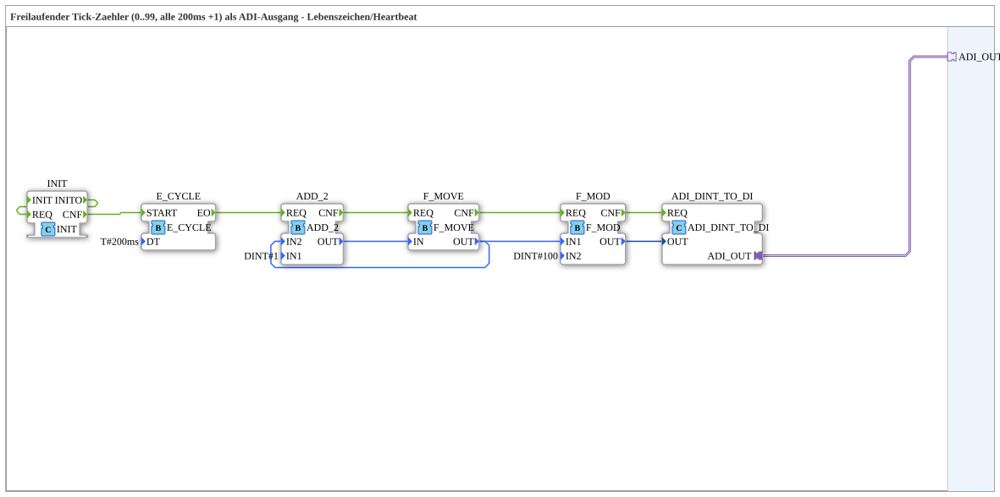

# SystemTick

* * * * * * * * * *

## Einleitung

Der Funktionsblock `SystemTick` ist eine Subapplikation, die einen freilaufenden Tick-Zähler realisiert. Er zählt alle 200 ms um 1 hoch, beginnend bei 0, und wird bei Erreichen von 100 auf 0 zurückgesetzt. Der aktuelle Zählerstand (0…99) wird über einen unidirektionalen ADI-Adapter (`ADI_OUT`) bereitgestellt. Der Baustein dient als Lebenszeichen (Heartbeat): Solange sich der Ausgabewert periodisch ändert, ist die erzeugende Steuerung aktiv.

## Schnittstellenstruktur

### **Ereignis-Eingänge**

- Keine

### **Ereignis-Ausgänge**

- Keine

### **Daten-Eingänge**

- Keine

### **Daten-Ausgänge**

- Keine

### **Adapter**

- **`ADI_OUT`** (Plug, Typ: `adapter::types::unidirectional::ADI`)  
  Liefert den aktuellen Tick-Zählerstand als DINT-Wert (0…99). Der Adapter enthält typischerweise ein Ereignis und einen Datenwert.

## Funktionsweise

Die Subapplikation wird durch das Initialisierungsereignis `INIT` gestartet. Dieses Ereignis löst den internen Baustein `E_CYCLE` aus, der mit einer Periodendauer von 200 ms konfiguriert ist. Nach Ablauf jeder Periode erzeugt `E_CYCLE` ein Ereignis, das den Additionsbaustein `ADD_2` anstößt. `ADD_2` addiert den konstanten Wert 1 (`IN1 = DINT#1`) auf den aktuellen Zählerstand, der im Baustein `F_MOVE` gespeichert ist. Das Ergebnis wird wieder in `F_MOVE` geschrieben und steht als interner Wert zur Verfügung.

Gleichzeitig wird der interne Wert dem Modulo-Baustein `F_MOD` zugeführt, der den Wert auf den Bereich 0…99 begrenzt (Modulo 100). Das Ergebnis wird über den Konvertierungsbaustein `ADI_DINT_TO_DI` in das `ADI`-Adapterformat umgewandelt und über den Plug `ADI_OUT` ausgegeben.

Die Verkettung der Ereignisse ist so aufgebaut, dass nach der Initialisierung zyklisch weitergezählt wird, ohne dass ein externes Ereignis erforderlich ist.

## Technische Besonderheiten

- **Speicherung des Zählerstandes:** Der Baustein `F_MOVE` fungiert als Speicher für den aktuellen Zählerwert. Die Rückkopplung von `F_MOVE.OUT` zu `ADD_2.IN2` stellt die Aktualisierung im nächsten Zyklus sicher.
- **Modulare Grenze:** Der Modulo-Baustein (`F_MOD`) mit Parameter `IN2 = DINT#100` begrenzt den Wertebereich hart auf 100 – eine Änderung der Zykluslänge erfordert nur die Anpassung dieses Parameters.
- **Periodengesteuert:** Die Periodendauer wird über den Baustein `E_CYCLE` mit `DT = T#200ms` festgelegt. Eine Änderung der Taktrate erfolgt durch Anpassung dieses Zeitparameters.
- **Adapter-Konvertierung:** Der Baustein `ADI_DINT_TO_DI` kapselt die Umwandlung eines DINT-Werts in das ADI-Protokoll, sodass der Ausgang direkt an andere 4diac-Komponenten angeschlossen werden kann.

## Zustandsübersicht

Die Subapplikation besitzt keinen expliziten Zustandsautomaten. Der einzige relevante Zustand ist der aktuelle Zählerstand, der sich nach jedem 200-ms-Intervall um 1 erhöht und bei 99 wieder auf 0 springt. Der Zyklus dauert 20 Sekunden (100 × 200 ms). Nach der Initialisierung läuft der Zähler ununterbrochen weiter, bis die Subapplikation deaktiviert wird.

## Anwendungsszenarien

- **Heartbeat/ Lebenszeichen:** Durch Beobachten des `ADI_OUT`-Werts kann eine übergeordnete Steuerung erkennen, ob die Subapplikation (bzw. der sie ausführende Controller) noch aktiv ist.
- **Synchronisation:** Der Tick-Zähler kann als gemeinsames Zeitraster für mehrere Teilnehmer dienen, die über den gleichen Zählstand ihren Ablauf abstimmen.
- **Diagnose:** Der periodisch wechselnde Wert lässt sich in Visualisierungen oder OPC-UA-Bereichen nutzen, um die Kommunikation zu überprüfen.

## Vergleich mit ähnlichen Bausteinen

Ein einfacher Zähler mit fester Periode könnte alternativ mit einem `E_CYCLE` und einem IEC-61131-3-Zählerbaustein (z. B. `CTU`) aufgebaut werden. Der Unterschied liegt darin, dass `SystemTick` als Subapplikation einen standardisierten ADI-Ausgang bietet und die Wertbegrenzung über Modulo realisiert, während ein herkömmlicher Zähler einen Reset-Eingang benötigt und typischerweise keine Adapter-Schnittstelle besitzt. Durch die modulare Struktur lässt sich `SystemTick` leicht in bestehende 4diac-Systeme integrieren.

## Fazit

`SystemTick` ist eine kompakte, periodisch arbeitende Subapplikation zur Erzeugung eines fortlaufenden Zählerwerts im Bereich 0…99. Sie eignet sich hervorragend als Lebenszeichen für verteilte Steuerungen und bietet durch den ADI-Ausgang eine saubere Schnittstelle für den Datenaustausch in 4diac-Umgebungen. Aufgrund der einfachen Parameter (Periodendauer, Modulowert) ist sie flexibel an unterschiedliche Anforderungen anpassbar.
