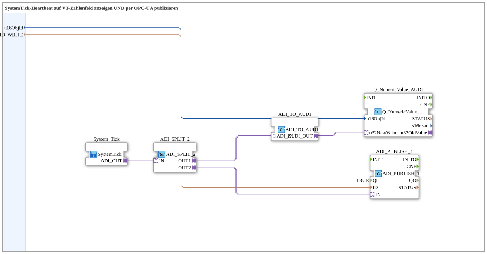

# SystemTickSender_ISO_OPC

* * * * * * * * * *

## Einleitung

`SystemTickSender_ISO_OPC` kombiniert [`SystemTickSender_ISO`](./SystemTickSender_ISO.md) (Anzeige auf einem lokalen VT-Zahlenfeld) mit [`SystemTickSender_OPC`](./SystemTickSender_OPC.md) (Remote-Publish per OPC-UA), damit dasselbe Lebenszeichen sowohl am eigenen Bildschirm sichtbar ist als auch von anderen Modulen per Remote-Subscribe überwacht werden kann.

## Verwendete Funktionsbausteine (FBs)

### Sub-Bausteine: SystemTickSender_ISO_OPC

- **Typ**: SubAppType
- **Verwendete interne FBs**:
    - **System_Tick** (SubApp, `MyLib::sys`): liefert den Zählerstand als `ADI`-Adapter (DINT).
    - **ADI_SPLIT_2**: `adapter::events::unidirectional::ADI_SPLIT_2` — verzweigt `System_Tick.ADI_OUT` auf zwei Ziele, da ein Adapter-Socket nur eine Quelle annehmen kann: ein Ausgang geht (über `ADI_TO_AUDI`) an die VT-Anzeige, der andere an `ADI_PUBLISH_1` für den OPC-UA-Publish.
    - **ADI_TO_AUDI**: `adapter::conversion::unidirectional::ADI_TO_AUDI` — wandelt DINT in UDINT um, für die VT-Anzeige.
    - **Q_NumericValue_AUDI**: `isobus::UT::Q::Q_NumericValue_AUDI` — zeigt den Wert lokal auf dem VT an (`u16ObjId`).
    - **ADI_PUBLISH_1**: `adapter::net::ADI_PUBLISH_1` (`QI=TRUE`) — veröffentlicht denselben Zählerwert per OPC-UA (`ID_WRITE`).
- **Funktionsweise**: Der Zählerstand von `System_Tick` wird per `ADI_SPLIT_2` verzweigt: ein Zweig geht wie bei `SystemTickSender_ISO` über `ADI_TO_AUDI` an die VT-Anzeige, der andere direkt an `ADI_PUBLISH_1` für den OPC-UA-Publish — wie bei `SystemTickSender_OPC`.

## Programmablauf und Verbindungen

1. `System_Tick.ADI_OUT` → `ADI_SPLIT_2.IN`.
2. `ADI_SPLIT_2.OUT1` → `ADI_TO_AUDI.ADI_IN` → `ADI_TO_AUDI.AUDI_OUT` → `Q_NumericValue_AUDI.u32NewValue` (VT-Anzeige).
3. `ADI_SPLIT_2.OUT2` → `ADI_PUBLISH_1.IN` (OPC-UA-Publish).
4. Parameter: `u16ObjId` → `Q_NumericValue_AUDI.u16ObjId`; `ID_WRITE` → `ADI_PUBLISH_1.ID`.

## Technische Besonderheiten

- **Ein Zähler, zwei Verwendungen**: `ADI_SPLIT_2` erlaubt die parallele Nutzung desselben `System_Tick`-Zählers für VT-Anzeige und OPC-UA-Publish, ohne den Zähler zu duplizieren.

## Anwendungsszenarien

- Module mit eigener VT-Anbindung, deren Heartbeat zusätzlich von anderen Modulen per Remote-Subscribe überwacht werden soll.

## Vergleich mit ähnlichen Bausteinen

Wird nur eine der beiden Ausgaben gebraucht, sind die einfacheren [`SystemTickSender_ISO`](./SystemTickSender_ISO.md) (nur VT) bzw. [`SystemTickSender_OPC`](./SystemTickSender_OPC.md) (nur OPC-UA) zu verwenden. Dieses Muster (Split → VT-Anzeige + OPC-UA-Publish) entspricht strukturell dem älteren [`SystemTickSender`](./SystemTickSender.md).

## Zusammenfassung

`SystemTickSender_ISO_OPC` zeigt den SystemTick-Heartbeat gleichzeitig lokal auf dem VT und remote per OPC-UA an, indem es die beiden schlankeren Einzelvarianten zu einem Baustein zusammenführt.

---

### 🌐 Passende Themen-Unterseiten auf ms-muc-docs.de

- [🌐 Eclipse 4diac IDE & Farb-Referenz auf ms-muc-docs.de](https://www.ms-muc-docs.de/iec-61499/eclipse-4diac/)
