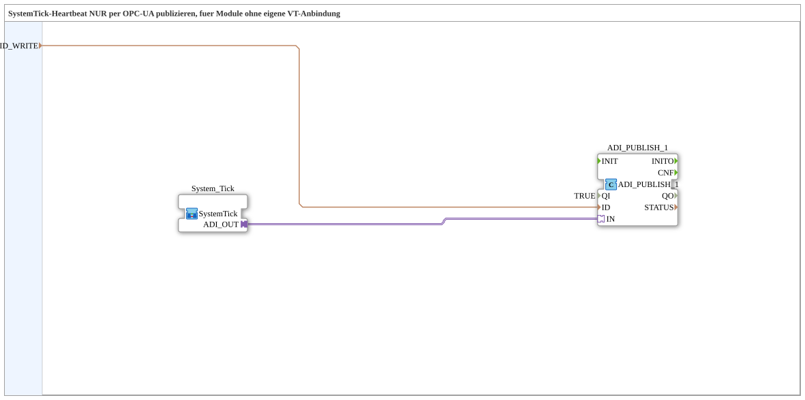

# SystemTickSender_OPC

* * * * * * * * * *

## Einleitung

`SystemTickSender_OPC` ist die schlankste SystemTick-Variante für Module ohne eigene VT-Anbindung: Der laufende Tick-Zähler von [`System_Tick`](./System_Tick.md) wird direkt per OPC-UA veröffentlicht, ohne lokale VT-Anzeige. Ein anderes Modul mit VT kann diesen Wert per Remote-Subscribe abonnieren und anzeigen, um die Lebendigkeit dieses Moduls zu überwachen.

## Verwendete Funktionsbausteine (FBs)

### Sub-Bausteine: SystemTickSender_OPC

- **Typ**: SubAppType
- **Verwendete interne FBs**:
    - **System_Tick** (SubApp, `MyLib::sys`): liefert den Zählerstand als `ADI`-Adapter (DINT).
    - **ADI_PUBLISH_1**: `adapter::net::ADI_PUBLISH_1` (`QI=TRUE`) — veröffentlicht den Zählerstand direkt per OPC-UA (`ID_WRITE`).
- **Funktionsweise**: Der Zählerstand von `System_Tick` wird ohne Umwandlung direkt an `ADI_PUBLISH_1` weitergereicht.

## Programmablauf und Verbindungen

1. `ID_WRITE` → `ADI_PUBLISH_1.ID` (Datenverbindung, ausgeblendet).
2. `System_Tick.ADI_OUT` → `ADI_PUBLISH_1.IN`.

## Technische Besonderheiten

- **Keine Typumwandlung nötig**: Da keine VT-Anzeige beteiligt ist, entfällt die `ADI_TO_AUDI`-Umwandlung — der rohe DINT-Wert wird direkt veröffentlicht.

## Anwendungsszenarien

- Module ohne eigene VT-Anbindung (z. B. reine IO-/Feldmodule), deren Lebendigkeit von einem anderen Modul mit VT überwacht werden soll.

## Vergleich mit ähnlichen Bausteinen

Wird zusätzlich eine lokale VT-Anzeige gebraucht, ist [`SystemTickSender_ISO_OPC`](./SystemTickSender_ISO_OPC.md) (VT + OPC-UA) bzw. [`SystemTickSender_ISO`](./SystemTickSender_ISO.md) (nur VT) zu verwenden.

## Zusammenfassung

`SystemTickSender_OPC` veröffentlicht den SystemTick-Heartbeat ausschließlich per OPC-UA — die minimale Variante für Module ohne eigene VT-Anbindung.

---

### 🌐 Passende Themen-Unterseiten auf ms-muc-docs.de

- [🌐 Eclipse 4diac IDE & Farb-Referenz auf ms-muc-docs.de](https://www.ms-muc-docs.de/iec-61499/eclipse-4diac/)
