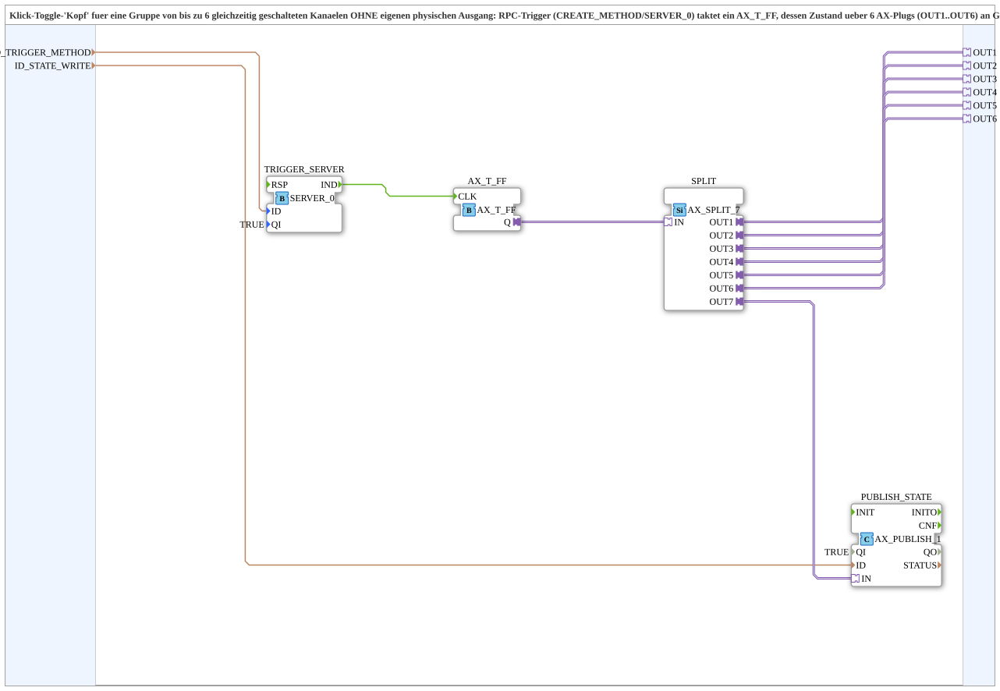

# TOGGLE_RPC_MASTER_QXA_OPC

* * * * * * * * * *

## Einleitung

Der Funktionsblock `TOGGLE_RPC_MASTER_QXA_OPC` ist eine Subapplikation (SubApp) und dient als „Klick-Toggle-Kopf“ für eine Gruppe von bis zu sechs gleichzeitig geschalteten Kanälen. Er besitzt **keinen eigenen physischen Ausgang**, sondern gibt den Toggle-Zustand über sechs nach außen geführte Adapter-Plugs (`OUT1` bis `OUT6`) an sogenannte Geschwister-SubApps weiter – typischerweise eine `AX_TON_MERGE_QXA_OPC`-Instanz pro Kanal. Zusätzlich wird der Zustand über eine OPC-UA-Publish-Adresse lokal veröffentlicht, damit ein Bedienmodul den aktuellen Zustand (z.B. als Hintergrundfarbe) anzeigen kann.

Die SubApp ist speziell für Anwendungen konzipiert, bei denen ein einzelner Softkey mehrere Ausgänge (z.B. eine Scheinwerferbank) synchron toggeln soll, wobei jeder Kanal mit individueller, zeitversetzter Einschaltrampe (über `PT` der nachgeschalteten Bausteine) betrieben werden kann, um kapazitive Einschaltstrom-Spitzen zu vermeiden.

## Schnittstellenstruktur

### **Ereignis-Eingänge**

Keine.

### **Ereignis-Ausgänge**

Keine.

### **Daten-Eingänge**

| Name | Typ | Kommentar |
|------|-----|-----------|
| `ID_TRIGGER_METHOD` | `WSTRING` | Lokale Methodenadresse (ACTION=CREATE_METHOD) für den argumentlosen Toggle-Trigger, wird vom Bedienmodul per `CALL_METHOD` aufgerufen. |
| `ID_STATE_WRITE` | `WSTRING` | Lokale Publish-Adresse (ACTION=WRITE) für den tatsächlichen Toggle-Zustand – wird vom Bedienmodul remote abonniert (z.B. für `GreenWhiteBackground`). |

### **Daten-Ausgänge**

Keine.

### **Adapter**

| Name | Typ | Kommentar |
|------|-----|-----------|
| `OUT1` | `adapter::types::unidirectional::AX` | Toggle-Zustand für Kanal 1 (z.B. an `AX_TON_MERGE_QXA_OPC.MASTER`). |
| `OUT2` | `adapter::types::unidirectional::AX` | Toggle-Zustand für Kanal 2. |
| `OUT3` | `adapter::types::unidirectional::AX` | Toggle-Zustand für Kanal 3. |
| `OUT4` | `adapter::types::unidirectional::AX` | Toggle-Zustand für Kanal 4. |
| `OUT5` | `adapter::types::unidirectional::AX` | Toggle-Zustand für Kanal 5. |
| `OUT6` | `adapter::types::unidirectional::AX` | Toggle-Zustand für Kanal 6. |

## Funktionsweise

Die SubApp realisiert einen Remote-Toggle mit OPC-UA. Intern sind folgende Funktionsbausteine miteinander verdrahtet:

- **`SERVER_0`** (`iec61499::net::SERVER_0`): Ein OPC-UA-Server mit `CREATE_METHOD`-Support. Er bietet die unter `ID_TRIGGER_METHOD` definierte Methodenadresse an.
- **`AX_T_FF`** (`adapter::events::unidirectional::AX_T_FF`): Ein Toggle-Flip-Flop, das bei jedem ankommenden Ereignis seinen Ausgangszustand `Q` umschaltet.
- **`AX_SPLIT_7`** (`adapter::events::unidirectional::AX_SPLIT_7`): Verteilt den Zustand `Q` auf sieben unidirektionale Adapter-Ausgänge.
- **`AX_PUBLISH_1`** (`adapter::net::AX_PUBLISH_1`): Ein OPC-UA-Publisher, der den Zustand auf die unter `ID_STATE_WRITE` vorgegebene Adresse schreibt.

**Ablauf:**  
Wird die Methode per `CALL_METHOD` aufgerufen, erzeugt der Server ein `IND`-Ereignis. Dieses Ereignis taktet das Toggle-Flip-Flop (`CLK`), wodurch sich dessen Ausgang `Q` (binär 0/1) ändert. Gleichzeitig wird das `IND`-Ereignis direkt zurück auf `RSP` gelegt, um die Anfrage sofort zu quittieren und den OPC-UA-Server nicht zu blockieren. Der aktuelle Zustand wird über den Split auf die sieben Ausgänge verteilt: Sechs davon werden auf die externen Plugs `OUT1`…`OUT6` geführt, der siebte (`OUT7`) geht an den Publisher, der den Zustand als `WRITE`-Operation auf der OPC-UA-Adresse veröffentlicht. Dadurch kann ein Bedienmodul den Zustand abonnieren und z.B. die Hintergrundfarbe eines Softkeys ändern.

Die SubApp hat **keine** eigene Ereignis-Eingänge oder -Ausgänge; sie wird ausschließlich über den OPC-UA-Methodenaufruf gesteuert.

## Technische Besonderheiten

- **Direkte RSP-Verdrahtung:** Das Ereignis `IND` wird nicht nur an das Flip-Flop, sondern auch direkt an `RSP` gelegt. Dadurch wird die OPC-UA-Anfrage sofort beantwortet, ohne auf weitere Bausteine zu warten. Frühere Versionen ließen dies aus, was den OPC-UA-Server bis zu 4 Sekunden blockieren konnte (globaler `serviceMutex` in open62541) und jede Statusmeldung im gesamten Projekt verzögerte.
- **1:1-Adapterverbindungen:** Da IEC 61499-Adapterverbindungen strikt 1:1 sind, kann ein einzelner Adapter-Plug nicht mehrere Sockets gleichzeitig versorgen. Deshalb besitzt die SubApp sechs separate `OUT`-Plugs (`AX_SPLIT_7`), sodass bis zu sechs unabhängige Kanäle angeschlossen werden können.
- **Kein eigener physischer Ausgang:** Der Toggle-Zustand wird nur als Software-Signal über die Adapter weitergegeben. Für einen einzelnen Kanal mit eigenem Ausgang ist der Baustein `TOGGLE_RPC_MERGE_QXA_OPC` vorgesehen.
- **Innere Parameter:** `QI` der Server- und Publisher-Bausteine sind fest auf `TRUE` gesetzt, sodass sie sofort nach dem Start aktiv sind.

## Zustandsübersicht

Die SubApp selbst besitzt keine eigene Zustandsmaschine, der wesentliche Zustand ist das interne Toggle-Flip-Flop `AX_T_FF`. Dessen Ausgang `Q` kann zwei Zustände annehmen:

| Zustand | Bedeutung |
|---------|-----------|
| `0` | Kanalgruppe ausgeschaltet (z.B. Licht aus) |
| `1` | Kanalgruppe eingeschaltet (z.B. Licht an) |

Jeder am `OUT`-Plug angeschlossene nachfolgende Baustein (z.B. `AX_TON_MERGE_QXA_OPC`) wertet diesen Wert aus und steuert den physischen Ausgang entsprechend. Der Zustand wird auch über den Publisher kontinuierlich verfügbar gemacht.

## Anwendungsszenarien

- **Scheinwerferbank:** Ein einziger Softkey toggelt eine Gruppe von bis zu sechs Scheinwerfern. Jeder Kanal besitzt seine eigene `AX_TON_MERGE_QXA_OPC`-Instanz, die den Toggle-Zustand entgegennimmt und mit einer individuellen Einschaltverzögerung (`PT`) versieht, um Stromspitzen zu vermeiden.
- **Zentrale Lichtsteuerung:** Ein Bedienmodul sendet per OPC-UA einen Methodenaufruf an die SubApp; gleichzeitig abonniert es den Zustand und visualisiert ihn farblich (z.B. grün/weiß).
- **Redundante Steuerung:** Da mehrere Kanäle parallel geschaltet werden, können Ausfälle einzelner Ausgänge erkannt werden, ohne die gesamte Gruppe zu beeinträchtigen.

## Vergleich mit ähnlichen Bausteinen

| Baustein | Beschreibung | Unterschied |
|----------|--------------|-------------|
| `TOGGLE_RPC_MASTER_QXA_OPC` | **Ohne** eigenen physischen Ausgang, verteilt Zustand an bis zu 6 externe Kanäle. | Besitzt keine eigene Ausgangslogik; erzeugt nur das Software-Toggle-Signal. |
| `TOGGLE_RPC_MERGE_QXA_OPC` | Wie oben, aber **mit** eigenem physischen Ausgang (für einen einzelnen Kanal). | Besitzt den physischen Ausgang integriert; nur für einen Kanal geeignet. |

Der Master-Baustein eignet sich also für Mehrkanal-Szenarien, bei denen die Ausgangslogik auf separaten Bausteinen liegt – beispielsweise wenn eine Sortierung oder Verzögerung pro Kanal gewünscht ist.

## Fazit

`TOGGLE_RPC_MASTER_QXA_OPC` ist ein kompakter und flexibler Baustein zur zentralen Steuerung mehrerer Ausgangskanäle über einen einzigen OPC-UA-Methodenaufruf. Durch die klare Trennung von Toggle-Logik und Ausgangsverarbeitung (per Adapter) lässt sich eine große Anzahl von Kanälen mit minimalem Ressourceneinsatz realisieren. Die saubere Interaktion mit OPC-UA (direkte RSP-Antwort, Publish) gewährleistet ein reaktionsschnelles Verhalten auch in verteilten Systemen. Für Anwendungen mit nur einem Kanal ist jedoch der spezifischere Baustein `TOGGLE_RPC_MERGE_QXA_OPC` empfehlenswert.