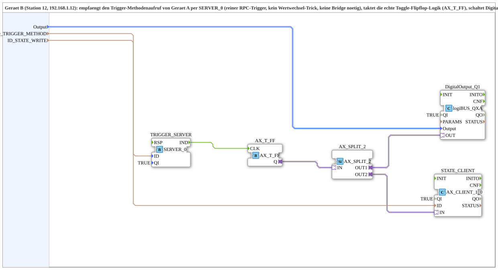

# Toggle_RPC_FROM_Remote_QXA_OPC

* * * * * * * * * *

## Einleitung

Der Baustein `Toggle_RPC_FROM_Remote_QXA_OPC` ist eine Subapplikation, die auf einem Gerät B (z. B. Station 12 mit IP-Adresse 192.168.1.12) eingesetzt wird. Sie empfängt über einen OPC-UA-Server (`SERVER_0`) einen entfernten Trigger-Methodenaufruf von Gerät A. Der Trigger dient als Takt für eine echte Flip-Flop-Logik (`AX_T_FF`), die den Zustand eines Digitalausgangs (`DigitalOutput_Q1`) umschaltet. Der neue Zustand wird anschließend aktiv über einen OPC-UA-Client (`STATE_CLIENT`) zurück an Gerät A geschrieben. Die Kommunikation erfolgt im „SUB-style“: Das gesamte Protokoll ist in einem Composite (Bibliothek `MyLib::sys`) gekapselt und benötigt keine zusätzliche Logik in der Ressource des Geräts.

## Schnittstellenstruktur

### **Ereignis-Eingänge**

Keine.

### **Ereignis-Ausgänge**

Keine.

### **Daten-Eingänge**

- `Output` (Typ: `logiBUS::io::DQ::logiBUS_DO_S`): Identifiziert den digitalen Ausgang (Q1–Q8) des angeschlossenen logiBUS-Moduls. Initialwert: `logiBUS_DO::Invalid`.
- `ID_TRIGGER_METHOD` (Typ: `WSTRING`): Lokale Methodenadresse (ACTION=CREATE_METHOD) für den argumentlosen Trigger-Aufruf, der von Gerät A per `CALL_METHOD` ausgeführt wird.
- `ID_STATE_WRITE` (Typ: `WSTRING`): Remote-Zieladresse (BOOL, ACTION=WRITE) für das Zurückschreiben des Flip-Flop-Zustands an Gerät A.

### **Daten-Ausgänge**

Keine.

### **Adapter**

Keine (die Subapplikation besitzt keine externen Adapter; die interne Kommunikation erfolgt über die oben genannten Daten-Eingänge und die internen Funktionsblöcke).

## Funktionsweise

Die Subapplikation implementiert eine gesteuerte Toggle-Funktion für einen Digitalausgang mit Rückmeldung. Der Ablauf ist wie folgt:

1. **Trigger-Empfang**: Der OPC-UA-Server (`TRIGGER_SERVER`, Typ `iec61499::net::SERVER_0`) wartet auf einen eingehenden Methodenaufruf. Die Methode ist durch den Parameter `ID_TRIGGER_METHOD` definiert.
2. **Taktung des Flip-Flops**: Das eingehende Ereignis (`IND`-Event) des Servers wird direkt auf den Takteingang (`CLK`) des Toggle-Flip-Flops (`AX_T_FF`) geschaltet. Gleichzeitig wird das `IND`-Event sofort als Bestätigung (`RSP`) an den Server zurückgegeben, um eine Blockierung des OPC-UA-Threads zu vermeiden.
3. **Zustandsänderung**: Das Flip-Flop wechselt bei jedem Takt seinen binären Zustand (0 ↔ 1). Der Ausgang `Q` des Flip-Flops wird an einen Splitter (`AX_SPLIT_2`) übergeben, der das Signal auf zwei parallele Pfade aufteilt.
4. **Ausgangssignal**: Über den ersten Ausgang (`OUT1`) wird das Signal an den Funktionsblock `DigitalOutput_Q1` (Typ `logiBUS::io::DQ::logiBUS_QXA`) geleitet, der den entsprechenden physischen Ausgang (identifiziert durch den Eingang `Output`) steuert.
5. **Rückmeldung**: Über den zweiten Ausgang (`OUT2`) wird das Signal an den OPC-UA-Client (`STATE_CLIENT`, Typ `adapter::net::AX_CLIENT_1_0`) gesendet. Dieser Client schreibt den aktuellen Zustand (als BOOL) an die Adresse `ID_STATE_WRITE` auf Gerät A.

Die Daten-Eingänge der Subapplikation werden direkt an die entsprechenden Funktionsblöcke verdrahtet:  

- `Output` → `DigitalOutput_Q1.Output`  
- `ID_TRIGGER_METHOD` → `TRIGGER_SERVER.ID`  
- `ID_STATE_WRITE` → `STATE_CLIENT.ID`

## Technische Besonderheiten

- **RPC-Trigger ohne Wertwechsel-Trick**: Im Gegensatz zu anderen Lösungen wird hier ein echtes Methodenaufruf-Trigger verwendet, was die Notwendigkeit einer Bridge oder eines Wertwechsel-Kunstgriffs eliminiert.
- **Direkte RSP-Verdrahtung**: Das `IND`-Ereignis des Servers wird unmittelbar an `RSP` zurückgeführt. Dadurch wird verhindert, dass der OPC-UA-Server-Thread (open62541) bis zu 4 s blockiert, was ansonsten zu Verzögerungen aller OPC-UA-Statusmeldungen im gesamten Projekt geführt hätte.
- **Kapselung im Composite**: Das Kommunikationsprotokoll liegt vollständig in der Subapplikation (`MyLib::sys`), sodass die Ressource des Geräts keine zusätzliche Protokolllogik enthalten muss.

## Zustandsübersicht

Die Subapplikation selbst besitzt keinen expliziten Zustandsautomaten. Der interne Funktionsblock `AX_T_FF` realisiert ein Toggle-Flip-Flop mit zwei stabilen Zuständen:

- **Zustand 0**: Ausgang `Q` = FALSE → Digitalausgang aus, Rückmeldung FALSE.
- **Zustand 1**: Ausgang `Q` = TRUE → Digitalausgang ein, Rückmeldung TRUE.

Jedes eingehende Trigger-Ereignis bewirkt einen Zustandswechsel (Toggle). Der Zustand bleibt bis zum nächsten Trigger erhalten.

## Anwendungsszenarien

- **Fernsteuerung eines Digitalausgangs**: Gerät A kann über eine OPC-UA-Methode den Ausgang Q1 eines entfernten logiBUS-Moduls (angeschlossen an Gerät B) umschalten. Der aktuelle Zustand wird nach jedem Umschalten an Gerät A zurückgemeldet.
- **Synchronisation von Betriebszuständen**: Die Subapplikation eignet sich für verteilte Systeme, in denen ein zentrales Steuergerät (Gerät A) den Status eines peripheren Geräts (Gerät B) überwacht und ändert.
- **Redundante Zustandsüberwachung**: Durch die aktive Rückmeldung des Flip-Flop-Zustands ist der Zustand des Ausgangs jederzeit im übergeordneten System bekannt, auch wenn die ursprünglichen Trigger verloren gehen.

## Vergleich mit ähnlichen Bausteinen

- **Ohne RPC, mit Wertwechsel-Trick**: Bei älteren Implementierungen wurde ein einfacher Dateneingang als Trigger verwendet, was zu unerwünschten Nebenwirkungen bei der Wertinterpretation führen konnte. Der vorliegende Baustein verwendet dagegen einen expliziten Methodenaufruf.
- **Mit Bridge**: Andere Lösungen benötigen eine Bridge-Komponente, um OPC-UA- mit anderen Protokollen zu verbinden. Hier entfällt dies, da das gesamte Handling innerhalb des Composites gekapselt ist.
- **Mit separatem Toggle-FB**: Der Einsatz des vorgefertigten `AX_T_FF` sorgt für eine klare und wartbare Flip-Flop-Logik im Vergleich zu frei verdrahteten SR-Latches.

## Fazit

`Toggle_RPC_FROM_Remote_QXA_OPC` stellt eine robuste und effiziente Lösung für ferngesteuerte Toggle-Schaltungen mit Rückmeldung dar. Die Kombination aus RPC-Trigger, getakteten Flip-Flop und aktiver Zustandsrückmeldung macht den Baustein ideal für moderne industrielle Anwendungen, bei denen OPC-UA als Kommunikationsstandard verwendet wird. Die direkte RSP-Verdrahtung verbessert zudem die Reaktionszeit des Gesamtsystems erheblich. Durch die Kapselung in einem Composite bleibt die Ressource des Zielgeräts schlank und die Wiederverwendbarkeit hoch.
