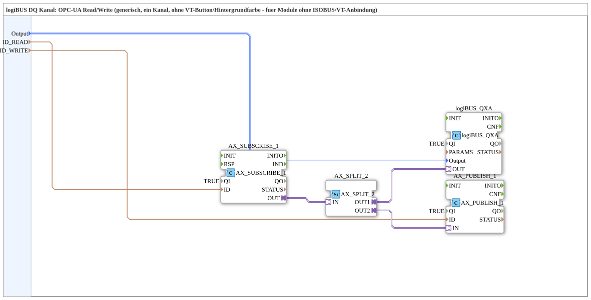

# logiBUS_QXA_OPC

* * * * * * * * * *

## Einleitung

Der Funktionsblock (SubApp) `logiBUS_QXA_OPC` stellt einen generischen OPC-UA Read/Write-Kanal für logiBUS-Digitalausgänge (DQ) bereit. Er dient als Schnittstelle zwischen einer OPC-UA-basierten Steuerung und einem logiBUS-Modul, das keinen ISOBUS/VT-Anschluss unterstützt. Die SubApp kapselt die notwendigen Adapter-Logik für das Abonnieren (Subscribe) und Veröffentlichen (Publish) von OPC-UA-Daten und ermöglicht so das Lesen und Schreiben eines einzelnen DQ-Kanals über OPC-UA.

## Schnittstellenstruktur

Die SubApp besitzt ausschließlich drei Dateneingänge. Es gibt keine direkten Ereignis-Eingänge, Ereignis-Ausgänge, Daten-Ausgänge oder Adapter-Anschlüsse an der Schnittstelle. Die Ereignis- und Datenflüsse werden intern über Adapter-Verbindungen realisiert.

### **Ereignis-Eingänge**

Keine direkten Ereignis-Eingänge vorhanden. Ereignisse werden über die internen Adapter (AX_SUBSCRIBE_1) empfangen.

### **Ereignis-Ausgänge**

Keine direkten Ereignis-Ausgänge vorhanden. Ereignisse werden über die internen Adapter (AX_PUBLISH_1) ausgegeben.

### **Daten-Eingänge**

| Name | Typ | Initialwert | Kommentar |
|------|-----|-------------|-----------|
| `Output` | `logiBUS::io::DQ::logiBUS_DO_S` | `logiBUS_DO::Invalid` | Identifiziert den Ausgang Q1..Q12 |
| `ID_READ` | `WSTRING` | – | OPC-UA Subscribe-Key (schreibbar) – legt die zu abonnierende OPC-UA-Variable fest |
| `ID_WRITE` | `WSTRING` | – | OPC-UA Publish-Key (lesbar) – legt die zu beschreibende OPC-UA-Variable fest |

### **Daten-Ausgänge**

Keine direkten Daten-Ausgänge vorhanden. Die verarbeiteten Daten werden über die internen Adapter und den integrierten FB `logiBUS_QXA` ausgetauscht.

### **Adapter**

An der SubApp-Schnittstelle sind keine Adapter definiert. Intern werden die folgenden Adapter verwendet:

- `AX_SUBSCRIBE_1` (Typ: `adapter::net::AX_SUBSCRIBE_1`) – empfängt OPC-UA-Subscribe-Ereignisse.
- `AX_SPLIT_2` (Typ: `adapter::events::unidirectional::AX_SPLIT_2`) – verteilt eingehende Ereignisse auf zwei Ausgänge.
- `AX_PUBLISH_1` (Typ: `adapter::net::AX_PUBLISH_1`) – sendet OPC-UA-Publish-Ereignisse.

## Funktionsweise

Die SubApp realisiert einen bidirektionalen OPC-UA-Zugriff auf einen einzelnen logiBUS-Digitalausgang:

1. **Dateneingänge**: Der gewünschte Ausgang wird über `Output` (Struktur mit Kanal-ID) ausgewählt. Über `ID_READ` wird der OPC-UA-Knoten (Subscribe-Key) spezifiziert, von dem Werte gelesen werden sollen, und über `ID_WRITE` der OPC-UA-Knoten (Publish-Key), an den Werte geschrieben werden sollen.

2. **Subscribe-Pfad**:  
   - `AX_SUBSCRIBE_1` empfängt OPC-UA-Datenänderungen gemäß `ID_READ`.  
   - Das Ereignis wird über `AX_SPLIT_2` in zwei parallele Ströme aufgeteilt:  
     - **OUT1** → an den internen FB `logiBUS_QXA.OUT` (vermutlich zur Aktualisierung des Ausgangsstatus).  
     - **OUT2** → an `AX_PUBLISH_1.IN` (optional zur Weiterleitung/Rückmeldung).

3. **Publish-Pfad**:  
   - `AX_PUBLISH_1` veröffentlicht Daten gemäß `ID_WRITE` an den OPC-UA-Server. Diese Daten stammen aus dem internen FB `logiBUS_QXA`, der den aktuellen Zustand des logiBUS-Ausgangs bereitstellt.

4. **Interner FB `logiBUS_QXA`**:  
   - Typ `logiBUS::io::DQ::logiBUS_QXA`  
   - Erhält als Parameter `QI=TRUE` (aktiv) und eine leere `PARAMS`.  
   - Verknüpft den ausgewählten Ausgang (`Output`) mit der internen Logik zur Steuerung des realen DQ-Kanals.

Die Ereignis- und Datenflüsse sind so verschaltet, dass sowohl das Lesen (Subscribe) als auch das Schreiben (Publish) von OPC-UA-Werten auf den logiBUS-Kanal abgebildet werden. Die SubApp ist bewusst einfach gehalten und verzichtet auf Visualisierungs-Buttons oder Hintergrundfarben, da sie für Module ohne ISOBUS/VT-Anbindung gedacht ist.

## Technische Besonderheiten

- **OPC-UA-Anbindung**: Die Kommunikation erfolgt vollständig über die Adapter `AX_SUBSCRIBE_1` und `AX_PUBLISH_1`, die für Netzwerk-Kommunikation ausgelegt sind. Dies ermöglicht eine entkoppelte Integration in OPC-UA-Systeme.
- **Generische Kanalauswahl**: Durch die Struktur `logiBUS_DO_S` kann einer von 12 Ausgängen (Q1..Q12) ausgewählt werden. Der Initialwert `Invalid` verhindert eine versehentliche Aktivierung ohne explizite Konfiguration.
- **Ereignis-Splitting**: Der Adapter `AX_SPLIT_2` teilt jedes eingehende Subscribe-Ereignis in zwei separate Ströme auf. Dies ermöglicht eine parallele Verarbeitung (z.B. Aktualisierung des Ausgangs und Weiterleitung an einen Publish-Kanal).
- **Eingebettete FB-Parameter**: Der interne FB `logiBUS_QXA` wird mit festen Parametern (`QI=TRUE`) betrieben; die Dynamik wird über die Dateneingänge der SubApp gesteuert.
- **Keine grafische Anbindung**: Die SubApp ist bewusst ohne VT-Button und Hintergrundfarbe gestaltet, um Platz zu sparen und die Wiederverwendung in headless-Modulen zu erleichtern.

## Zustandsübersicht

Die SubApp selbst besitzt keinen expliziten Zustandsautomaten. Der interne FB `logiBUS_QXA` könnte einen eigenen Zustand besitzen, der jedoch nicht im XML dokumentiert ist. Die SubApp agiert als transparente Verdrahtungsebene zwischen OPC-UA-Adaptern und dem logiBUS-Ausgangs-FB. Der Zustand des Ausgangs wird durch die OPC-UA-Werte und die interne Logik von `logiBUS_QXA` bestimmt.

## Anwendungsszenarien

- **Fernsteuerung von logiBUS-Ausgängen über OPC-UA**: Steuerung eines Digitalausgangs (z.B. Schalten einer Pumpe) über einen OPC-UA-Server, ohne direkte SPS-Anbindung.
- **Integration in Gebäudeautomationssysteme**: Anbindung logiBUS-Komponenten an übergeordnete Leitsysteme, die OPC-UA als Kommunikationsprotokoll nutzen.
- **Einfache Datenbrücke**: Verwendung als Baustein zum Testen von OPC-UA-Verbindungen mit einem einzelnen logiBUS-Kanal.
- **Module ohne VT-Anzeige**: Einsatz in Systemen, bei denen keine Visualisierung am Modul selbst gewünscht ist.

## Vergleich mit ähnlichen Bausteinen

Im Vergleich zu einem direkt mit Ereignis- und Datenanschlüssen versehenen FB bietet `logiBUS_QXA_OPC` eine gekapselte OPC-UA-Anbindung, sodass der Anwender keine detaillierten Adapter-Kenntnisse benötigt. Andere Bausteine könnten zusätzliche Visualisierungsfunktionen oder mehrere Kanäle unterstützen. Dieser Baustein konzentriert sich auf einen einzelnen Kanal und ist bewusst schlank gehalten. Er ähnelt einem „Wrapper“ für den Basis-FB `logiBUS_QXA`, ergänzt um OPC-UA-Netzwerkadapter.

## Fazit

`logiBUS_QXA_OPC` bietet eine kompakte und flexible Lösung zur Anbindung eines logiBUS-Digitalausgangs an ein OPC-UA-System. Durch die interne Verdrahtung von Subscribe- und Publish-Adaptern wird die bidirektionale Kommunikation vereinfacht. Die minimale Schnittstellenstruktur (nur Dateneingänge) erleichtert die Integration in bestehende Steuerungslogik. Der Baustein ist ideal für Anwendungen, bei denen eine direkte OPC-UA-Anbindung ohne zusätzliche Visualisierung benötigt wird.
