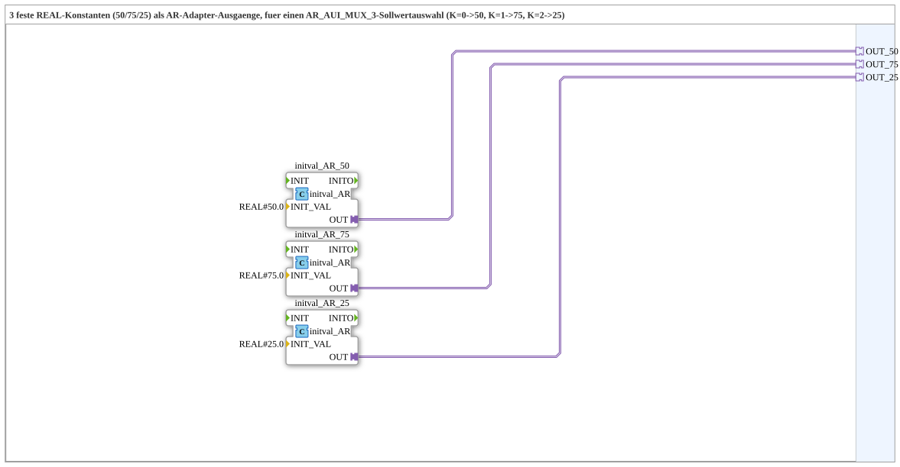

# values_50_75_25

* * * * * * * * * *

## Einleitung

Der Funktionsblock `values_50_75_25` ist eine Subapplikation (SubApp), die drei feste reelle Konstanten als Ausgangswerte über unidirektionale AR‑Adapter bereitstellt. Sie wurde entwickelt, um einem übergeordneten Funktionsblock (z. B. einem `AR_AUI_MUX_3`) die Sollwerte 50, 75 und 25 zur Auswahl bereitzustellen – gesteuert über einen Kanalindex `K` (0 → 50, 1 → 75, 2 → 25).

## Schnittstellenstruktur

Die SubApp besitzt keinerlei Ereignis‑ oder Dateneingänge. Ihre gesamte Funktionalität wird ausschließlich über **drei Adapter‑Ausgänge** realisiert.

### **Ereignis-Eingänge**

Keine vorhanden.

### **Ereignis-Ausgänge**

Keine vorhanden.

### **Daten-Eingänge**

Keine vorhanden.

### **Daten-Ausgänge**

Keine vorhanden.

### **Adapter**

| Name   | Typ                                        | Richtung | Kommentar            |
|--------|--------------------------------------------|----------|----------------------|
| `OUT_50` | `adapter::types::unidirectional::AR`       | Ausgang  | Fester Wert 50.0     |
| `OUT_75` | `adapter::types::unidirectional::AR`       | Ausgang  | Fester Wert 75.0     |
| `OUT_25` | `adapter::types::unidirectional::AR`       | Ausgang  | Fester Wert 25.0     |

## Funktionsweise

Die SubApp verwendet intern drei Instanzen des Bausteins `adapter::types::unidirectional::AR::initval::initval_AR`. Jede Instanz ist über den Parameter `INIT_VAL` mit einem festen `REAL`‑Wert (50, 75 bzw. 25) parametrisiert. Die Ausgänge dieser Instanzen werden direkt auf die entsprechenden Adapter‑Ausgänge `OUT_50`, `OUT_75` und `OUT_25` gelegt. Dadurch liefert die SubApp permanent drei konstante Real‑Werte, ohne dass eine externe Ansteuerung oder Dateneingabe erforderlich ist.

## Technische Besonderheiten

- Verwendung von **unidirektionalen AR‑Adaptern** – diese dienen ausschließlich als Ausgangsschnittstellen.
- Die Werte sind als **REAL**‑Konstanten fest im Baustein verdrahtet und können nur durch Änderung der `INIT_VAL`‑Parameter in den internen FB‑Instanzen angepasst werden.
- Es sind keinerlei Ereignisse oder Steuersignale vorhanden – die Ausgänge sind sofort gültig und statisch.
- Die SubApp ist für den Einsatz in einem Sollwert‑Multiplexer (`AR_AUI_MUX_3`) ausgelegt, der diese Werte über einen Kanalindex auswählt.

## Zustandsübersicht

Da die SubApp weder Ereignis‑ verarbeitende Zustände noch sonstige Logik besitzt, existiert kein impliziter Zustandsautomat. Sie arbeitet rein kombinatorisch und gibt permanent die festen Werte aus.

## Anwendungsszenarien

Die SubApp eignet sich überall dort, wo drei feste Sollwerte – z. B. für eine Prozessregelung, einen Wahlschalter oder eine Umschaltung – benötigt werden. Häufig wird sie zusammen mit einem Multiplexer eingesetzt, um abhängig von einem Steuersignal `K` den geeigneten der drei Werte auszuwählen. Das konkrete Beispiel hier ist die Nutzung mit einem `AR_AUI_MUX_3`, wobei `K=0` den Wert 50, `K=1` den Wert 75 und `K=2` den Wert 25 liefert.

## Vergleich mit ähnlichen Bausteinen

Im Vergleich zu generischen Konstante‑Bausteinen (z. B. einzelnen `CONSTANT`‑FBs) bündelt diese SubApp drei Konstanten in einer einzigen Komponente und stellt sie über standardisierte AR‑Adapter bereit. Dadurch wird die Verdrahtung im übergeordneten Netz vereinfacht. Gegenüber einer wiederverwendbaren parametrisierten SubApp, die Werte per Eingabe setzt, ist `values_50_75_25` bewusst fix konfiguriert und erfordert keine externe Parametrisierung zur Laufzeit.

## Fazit

Die SubApp `values_50_75_25` ist eine einfache und zweckmäßige Lösung, um drei feste Real‑Sollwerte in einem modularen Funktionsblock‑System bereitzustellen. Ihre klare, ereignislose Schnittstelle und die direkte Verwendung von AR‑Adaptern machen sie zu einem robusten Baustein für Multiplexer‑Anwendungen und andere Szenarien mit festen Konstanten.
