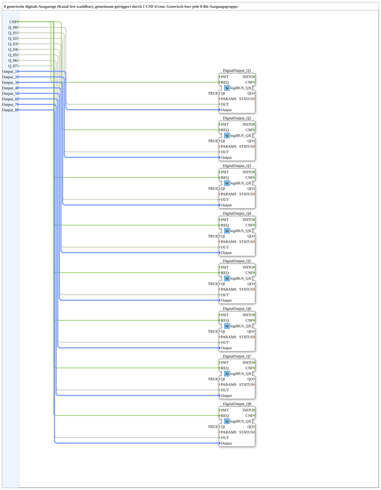

# Bool8_TO_logiBUS_QX8

* * * * * * * * * *
## Einleitung
Der Funktionsblock **Bool8_TO_logiBUS_QX8** ist eine wiederverwendbare Subapplikation, die acht digitale Ausgangssignale (BOOL) über den logiBUS in eine frei parametrierbare 8‑Bit‑Ausgangsgruppe überträgt. Die Ausgangskanäle werden nicht fest verdrahtet, sondern über separate Konfigurationseingänge (`Output_1` … `Output_8`) adressiert. Dadurch kann derselbe Baustein für unterschiedliche Hardware‑Ausgänge eingesetzt werden, ohne die interne Logik zu verändern. Ein gemeinsames Ereignis (`CNF`) triggert alle acht Ausgaben gleichzeitig.

## Schnittstellenstruktur
### **Ereignis-Eingänge**
| Name  | Typ     | Kommentar                         |
|-------|---------|-----------------------------------|
| `CNF` | Event   | Gemeinsamer Trigger für alle Ausgänge |

### **Ereignis-Ausgänge**
Keine (keine Ereignis‑Ausgänge vorhanden).

### **Daten-Eingänge**
| Name       | Typ                           | Kommentar                                      |
|------------|-------------------------------|------------------------------------------------|
| `Q_00`     | BOOL                          | Binärwert für Ausgangskanal 1                   |
| `Q_01`     | BOOL                          | Binärwert für Ausgangskanal 2                   |
| `Q_02`     | BOOL                          | Binärwert für Ausgangskanal 3                   |
| `Q_03`     | BOOL                          | Binärwert für Ausgangskanal 4                   |
| `Q_04`     | BOOL                          | Binärwert für Ausgangskanal 5                   |
| `Q_05`     | BOOL                          | Binärwert für Ausgangskanal 6                   |
| `Q_06`     | BOOL                          | Binärwert für Ausgangskanal 7                   |
| `Q_07`     | BOOL                          | Binärwert für Ausgangskanal 8                   |
| `Output_1` | `logiBUS::io::DQ::logiBUS_DO_S` | Adresse für Ausgangskanal 1 (initial Invalid)    |
| `Output_2` | `logiBUS::io::DQ::logiBUS_DO_S` | Adresse für Ausgangskanal 2 (initial Invalid)    |
| `Output_3` | `logiBUS::io::DQ::logiBUS_DO_S` | Adresse für Ausgangskanal 3 (initial Invalid)    |
| `Output_4` | `logiBUS::io::DQ::logiBUS_DO_S` | Adresse für Ausgangskanal 4 (initial Invalid)    |
| `Output_5` | `logiBUS::io::DQ::logiBUS_DO_S` | Adresse für Ausgangskanal 5 (initial Invalid)    |
| `Output_6` | `logiBUS::io::DQ::logiBUS_DO_S` | Adresse für Ausgangskanal 6 (initial Invalid)    |
| `Output_7` | `logiBUS::io::DQ::logiBUS_DO_S` | Adresse für Ausgangskanal 7 (initial Invalid)    |
| `Output_8` | `logiBUS::io::DQ::logiBUS_DO_S` | Adresse für Ausgangskanal 8 (initial Invalid)    |

### **Daten-Ausgänge**
Keine (keine Daten‑Ausgänge vorhanden).

### **Adapter**
Keine.

## Funktionsweise
Die Subapplikation enthält acht interne Instanzen des Funktionsblocks `logiBUS::io::DQ::logiBUS_QX`. Jede Instanz ist fest mit einem der acht Eingangssignale (`Q_00` … `Q_07`) verbunden und erhält über die zugehörige Adressvariable (`Output_1` … `Output_8`) die Zieladresse des logiBUS‑Ausgangs.

Der gemeinsame Ereigniseingang `CNF` ist mit dem `REQ`‑Eingang aller acht QX‑Bausteine verbunden. Solange `QI` der internen Bausteine auf `TRUE` gesetzt ist (im Netzwerk fest verdrahtet), wird bei jedem ankommenden `CNF`‑Event der aktuelle Zustand der Bool‑Eingänge parallel an die jeweiligen logiBUS‑Ausgänge übertragen.

Die Konfiguration der Ausgangsadressen erfolgt über die Eingänge `Output_1` … `Output_8`. Diese sind vom Typ `logiBUS_DO_S` und müssen vor der ersten Nutzung mit gültigen logiBUS‑Adressen belegt werden (initial stehen sie auf `Invalid`).

## Technische Besonderheiten
- **Generische 8‑Bit‑Ausgangsgruppe:** Durch die Parametrierung der Ausgangsadressen ist der Baustein nicht an eine feste Hardware gebunden und kann für beliebige logiBUS‑Ausgangskanäle wiederverwendet werden.
- **Gemeinsame Triggerung:** Ein einziges `CNF`‑Event synchronisiert die Ausgabe aller acht Kanäle – keine zeitlichen Versätze.
- **Interne Verdrahtung:** Die internen QX‑Bausteine sind mit `QI = TRUE` fest aktiviert; die Steuerung der Ausgabe erfolgt ausschließlich über die Bool‑Eingänge und das Event.
- **Keine Rückmeldung:** Es gibt keine Ausgangs‑ oder Ereignisausgänge, d.h. die Subapplikation ist rein „send‑oriented“.
- **Wiederverwendung:** Durch die losgelöste Adressverwaltung eignet sich der Baustein für modulare Automatisierungskonzepte.

## Zustandsübersicht
Da es sich um eine Subapplikation handelt, besitzt der Baustein keinen eigenen Zustandsautomaten. Er ist **zustandslos** in dem Sinne, dass er nur auf Ereignisse reagiert und sein Verhalten nicht von internen Zuständen abhängt. Der interne QX‑Baustein kann selbst einen Zustandsautomaten haben (z. B. für die Kommunikation mit dem logiBUS), dieser ist jedoch in den QX‑Komponenten gekapselt.

## Anwendungsszenarien
- **Steuerung von 8 Aktoren** über einen logiBUS‑Feldbus, z. B. Ventile, Lampen oder Relais.
- **Modulare I/O‑Erweiterung** in Automatisierungsanlagen, bei denen die physikalischen Ausgänge nicht fest verdrahtet sind.
- **Synchronisierte Ausgabe** mehrerer Binärsignale, z. B. für Anzeige‑ oder Diagnosezwecke.
- **Einsatz in verteilten Systemen**, wo mehrere 8‑Bit‑Gruppen über denselben Baustein parametriert werden können.

## Vergleich mit ähnlichen Bausteinen
Im Gegensatz zu einfachen Einzel‑Ausgangs‑Bausteinen (z. B. einem einzelnen `logiBUS_QX`) bündelt `Bool8_TO_logiBUS_QX8` acht Kanäle in einer logischen Einheit. Dadurch wird die Anzahl der Verbindungen im aufrufenden FB reduziert und die Synchronisation der Ausgaben vereinfacht. Gegenüber einer Lösung mit acht separaten QX‑Bausteinen bietet die Subapplikation den Vorteil einer definierten Schnittstelle und einer einheitlichen Konfiguration.

## Fazit
`Bool8_TO_logiBUS_QX8` stellt eine flexible und kompakte Lösung für die Ansteuerung von acht digitalen Ausgängen über logiBUS dar. Die Trennung von Logik und Adressierung ermöglicht eine breite Wiederverwendung und trägt zur Modularisierung und Wartbarkeit von Automatisierungsprojekten bei. Durch die gemeinsame Triggerung wird eine konsistente Ausgabe aller Kanäle sichergestellt.