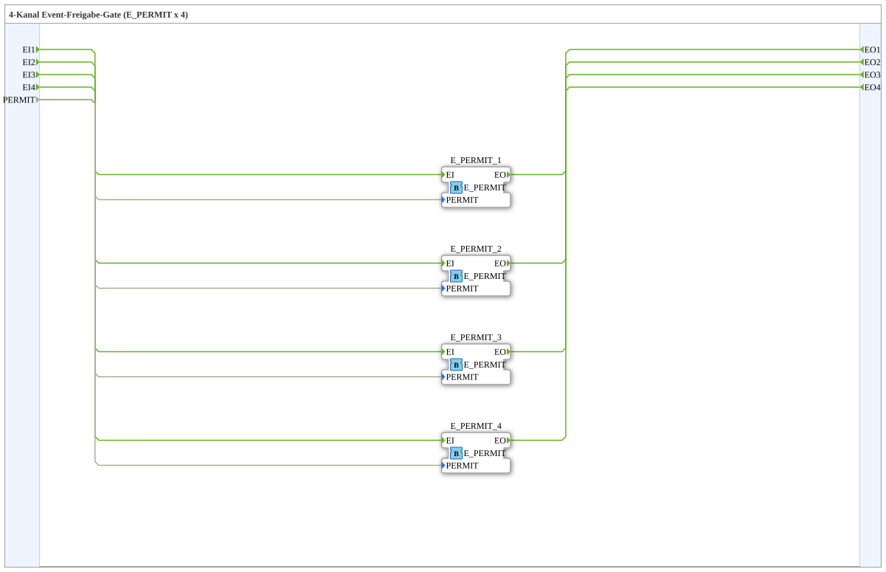

# E_PERMIT_4

* * * * * * * * * *

## Einleitung

Der Baustein **E_PERMIT_4** ist eine Subapplikation (SubApp) und realisiert ein **4‑Kanal‑Event‑Freigabe‑Gate** auf Basis des IEC 61499‑Standardbausteins `E_PERMIT`. Die SubApp bündelt vier voneinander unabhängige Ereignis‑Freigabe‑Kanäle, die über ein gemeinsames Freigabesignal gesteuert werden. Dadurch können vier separate Ereignispfade gleichzeitig mit einer einzigen Bedingung aktiviert oder gesperrt werden. Diese Struktur eignet sich besonders für Anwendungen, bei denen mehrere Event‑Quellen synchron freigegeben oder blockiert werden müssen.

## Schnittstellenstruktur

### **Ereignis-Eingänge**

| Name | Typ     | Kommentar                 |
|------|---------|---------------------------|
| EI1  | Event   | Event input channel 1     |
| EI2  | Event   | Event input channel 2     |
| EI3  | Event   | Event input channel 3     |
| EI4  | Event   | Event input channel 4     |

### **Ereignis-Ausgänge**

| Name | Typ     | Kommentar                  |
|------|---------|----------------------------|
| EO1  | Event   | Event output channel 1     |
| EO2  | Event   | Event output channel 2     |
| EO3  | Event   | Event output channel 3     |
| EO4  | Event   | Event output channel 4     |

### **Daten-Eingänge**

| Name   | Typ    | Kommentar                |
|--------|--------|--------------------------|
| PERMIT | BOOL   | Freigabebedingung        |

### **Daten-Ausgänge**

Keine vorhanden.

### **Adapter**

Keine vorhanden.

## Funktionsweise

Die SubApp enthält vier Instanzen des Standard‑Funktionsbausteins `E_PERMIT` (`iec61499::events::E_PERMIT`), die parallel geschaltet sind. Der Daten‑Eingang `PERMIT` wird auf alle vier Instanzen verteilt. Jeder der vier Ereignis‑Eingänge (`EI1`–`EI4`) ist direkt mit dem Eingang `EI` der jeweiligen `E_PERMIT`‑Instanz verbunden; die jeweiligen Ausgänge `EO` sind mit den entsprechenden Ereignis‑Ausgängen (`EO1`–`EO4`) der SubApp verbunden.

Das Verhalten eines einzelnen `E_PERMIT`‑Bausteins ist definiert als:  
- Wenn `PERMIT = TRUE` und ein Ereignis am Eingang eintrifft, wird dieses Ereignis unmittelbar am Ausgang `EO` weitergegeben.  
- Wenn `PERMIT = FALSE`, wird das eintreffende Ereignis nicht weitergeleitet und verworfen.

Da alle vier Kanäle dasselbe gemeinsame `PERMIT`‑Signal verwenden, sind sie entweder alle gleichzeitig freigeschaltet oder alle gesperrt. Die Verarbeitung der vier Kanäle erfolgt unabhängig voneinander und ohne gegenseitige Beeinflussung.

## Technische Besonderheiten

- **Gemeinsame Freigabe:** Ein einziges Bool‑Signal `PERMIT` steuert alle vier Kanäle – keine Notwendigkeit für separate Freigaben pro Kanal.
- **Parallele Verarbeitung:** Jeder Kanal wird durch eine eigene `E_PERMIT`‑Instanz realisiert, wodurch vollständige Unabhängigkeit der Ereignispfade gewährleistet ist.
- **Standardkonformität:** Es werden ausschließlich IEC 61499‑Standardbausteine verwendet, was eine hohe Interoperabilität und Wiederverwendbarkeit ermöglicht.
- **Kein interner Zustand:** Die SubApp besitzt keine eigenen Zustandsvariablen oder Timer; sie ist rein ereignisgesteuert und reaktionsschnell.

## Zustandsübersicht

Die SubApp selbst besitzt keinen expliziten internen Zustand. Da sie jedoch aus vier `E_PERMIT`‑Bausteinen besteht, kann man pro Kanal die beiden logischen Zustände betrachten:

- **Freigegeben:** Solange `PERMIT = TRUE`, werden ankommende Ereignisse unverzögert an den Ausgang weitergegeben.
- **Gesperrt:** Bei `PERMIT = FALSE` werden eingehende Ereignisse blockiert und nicht weitergegeben.

Der Übergang zwischen diesen Zuständen erfolgt sofort bei einer Änderung des `PERMIT`‑Signals und wirkt gleichzeitig auf alle vier Kanäle.

## Anwendungsszenarien

- **Sicherheitsorientierte Steuerungen:** Freigabe von Ereignispfaden nur bei erfüllter Sicherheitsbedingung (z. B. Not‑Halt nicht aktiv).
- **Parallele Aktorsteuerung:** Vier unabhängige Maschinen oder Prozesse werden über ein gemeinsames Freigabesignal gestartet oder gestoppt.
- **Event‑Multiplexing:** Mehrere Ereignisquellen (z. B. Sensoren) sollen nur dann weiterverarbeitet werden, wenn eine übergeordnete Bedingung wahr ist.
- **Test‑ und Simulationsumgebungen:** Ein zentrales Enable‑Signal kann genutzt werden, um komplette Ereignispfade für Testzwecke zu deaktivieren.

## Vergleich mit ähnlichen Bausteinen

- **`E_PERMIT` (Standard):** Der einfache 1‑Kanal‑Baustein – diese SubApp erweitert ihn auf vier Kanäle mit gemeinsamer Freigabe, wodurch die Verdrahtung in Mehrkanal‑Applikationen deutlich reduziert wird.
- **`E_SWITCH` (Event‑Schalter):** Ermöglicht das Umschalten zwischen zwei Ereignispfaden (basiert auf einem Bool‑Signal), während `E_PERMIT_4` nur zwischen Durchlassen und Blockieren unterscheidet.
- **`E_SPLIT` / `E_MERGE`:** Diese dienen der Verteilung bzw. Zusammenführung von Ereignissen unabhängig von einer Freigabebedingung – sie ergänzen `E_PERMIT_4` eher, als dass sie es ersetzen.
- **Eigene SubApp‑Lösungen:** Viele Anwender bauen sich ähnliche Mehrfach‑Freigaben selbst; `E_PERMIT_4` bietet eine vorgefertigte, klar dokumentierte und standardkonforme Alternative.

## Fazit

Der Baustein **E_PERMIT_4** stellt eine kompakte und effiziente Lösung zur gleichzeitigen Freigabe von vier unabhängigen Ereignispfaden dar. Durch die Verwendung einer einzigen Freigabebedingung wird die Steuerlogik vereinfacht und die Übersichtlichkeit in komplexen Automatisierungsprojekten erhöht. Die SubApp ist ideal für Anwendungen, bei denen mehrere Ereignisströme synchron aktiviert oder deaktiviert werden müssen, und profitiert von der hohen Zuverlässigkeit der IEC 61499‑Standardbausteine.