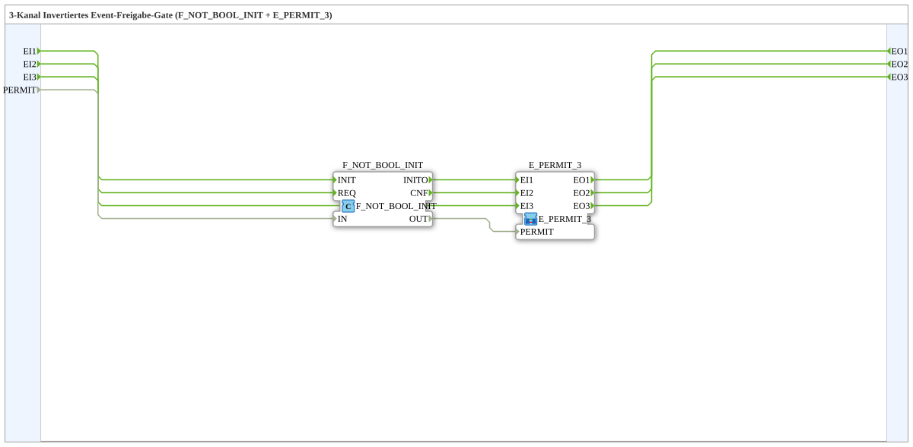

# E_PERMIT_INVERT_3

* * * * * * * * * *
## Einleitung

Der Funktionsblock **E_PERMIT_INVERT_3** ist eine Subapplikation (SubApp) für die 4diac-IDE. Er stellt ein 3-Kanal-Ereignis-Freigabe-Gate mit invertierter Freigabelogik dar. Die SubApp kombiniert die Funktionsbausteine `F_NOT_BOOL_INIT` (boolesche Negation) und `E_PERMIT_3` (3-Kanal-Event-Freigabe) zu einer kompakten, wiederverwendbaren Einheit.

Über den Eingang `PERMIT` wird gesteuert, ob die eingehenden Ereignisse an den jeweiligen Ausgängen durchgeschaltet oder blockiert werden. Die Besonderheit liegt in der Invertierung: Ist `PERMIT = FALSE`, sind die Ereignisse freigegeben; ist `PERMIT = TRUE`, werden sie gesperrt.

## Schnittstellenstruktur

### **Ereignis-Eingänge**

| Name | Kommentar |
|------|-----------|
| `EI1` | Event input channel 1 |
| `EI2` | Event input channel 2 |
| `EI3` | Event input channel 3 |

### **Ereignis-Ausgänge**

| Name | Kommentar |
|------|-----------|
| `EO1` | Event output channel 1 |
| `EO2` | Event output channel 2 |
| `EO3` | Event output channel 3 |

### **Daten-Eingänge**

| Name | Datentyp | Kommentar |
|------|----------|-----------|
| `PERMIT` | `BOOL` | Invertierte Freigabebedingung |

### **Daten-Ausgänge**

Keine vorhanden.

### **Adapter**

Keine vorhanden.

## Funktionsweise

Die SubApp besteht intern aus zwei Funktionsbausteinen:

- `F_NOT_BOOL_INIT` – negiert den booleschen Eingang `PERMIT`.
- `E_PERMIT_3` – ein 3-Kanal-Event-Freigabebaustein, der die eingehenden Ereignisse nur dann an die Ausgänge weiterleitet, wenn sein Freigabeeingang `PERMIT` den Wert `TRUE` hat.

Der Datenfluss ist wie folgt:

1. Der boolesche Wert von `PERMIT` wird an den Eingang `IN` des Bausteins `F_NOT_BOOL_INIT` übergeben.
2. `F_NOT_BOOL_INIT` invertiert diesen Wert und liefert das Ergebnis an seinem Ausgang `OUT`.
3. Das invertierte Signal wird an den Freigabeeingang `PERMIT` von `E_PERMIT_3` angeschlossen.
4. Die Ereignisse an `EI1`, `EI2` und `EI3` werden intern mit den entsprechenden Eingängen von `E_PERMIT_3` verbunden.
5. Abhängig vom negierten Freigabesignal werden die Ereignisse an `EO1`, `EO2` und `EO3` weitergeleitet oder blockiert.

Die folgende Wahrheitstabelle verdeutlicht das Verhalten für einen der drei Kanäle (beispielhaft für Kanal 1):

| `PERMIT` (extern) | Negierter Wert (intern) | Ereignis `EI1` | Ausgang `EO1` |
|-------------------|-------------------------|----------------|---------------|
| `FALSE`           | `TRUE`                  | eintreffend    | wird durchgeschaltet |
| `TRUE`            | `FALSE`                 | eintreffend    | wird blockiert |

## Technische Besonderheiten

- Die SubApp kapselt die Kombination aus Negation und Ereignisfreigabe in einem einzigen wiederverwendbaren Typ.
- Es werden keine eigenen Algorithmen oder internen Zustände definiert; die Logik wird vollständig durch die beiden Standardbausteine realisiert.
- Der Baustein `F_NOT_BOOL_INIT` ist eine initialisierbare Negation. In dieser Konfiguration wird kein Initialwert gesetzt; das Verhalten entspricht einer einfachen Negation des Eingangssignals.
- Die SubApp besitzt drei voneinander unabhängige Kanäle, sodass gleichzeitig mehrere Ereignispfade mit derselben Freigabebedingung gesteuert werden können.
- Da es sich um eine SubApplikation handelt, ist die innere Struktur in der 4diac-IDE sichtbar und kann bei Bedarf erweitert oder angepasst werden.

## Zustandsübersicht

Die SubApp selbst besitzt keinen expliziten endlichen Zustandsautomaten. Das Verhalten wird durch die Freigabelogik bestimmt. Es lassen sich jedoch zwei logische Zustände für jeden Kanal unterscheiden:

| Zustand | Bedingung (extern) | Verhalten |
|---------|--------------------|-----------|
| **Freigegeben** | `PERMIT = FALSE` | Eingehende Ereignisse werden an den entsprechenden Ausgang weitergeleitet. |
| **Gesperrt** | `PERMIT = TRUE` | Eingehende Ereignisse werden verworfen und nicht an den Ausgang durchgereicht. |

Diese Zustände gelten für alle drei Kanäle gleichermaßen.

## Anwendungsszenarien

- **Sicherheitslogik**: Ein Ereignis soll nur dann verarbeitet werden, wenn ein Sicherheitssignal *inaktiv* ist. Beispiel: `PERMIT` ist `TRUE`, wenn eine Schutzhaube geöffnet ist; die Ereignisse sollen dann gesperrt werden.
- **Betriebsartenumschaltung**: Wenn ein Signal wie „Handbetrieb“ aktiv ist (`TRUE`), sollen automatische Verarbeitungs-Events blockiert werden. Bei „Automatik“ (`FALSE`) werden die Events durchgelassen.
- **Mehrkanalige Freigabe**: Gleichzeitige Steuerung von drei unabhängigen Ereignispfaden mit einer einzigen, invertierten Freigabebedingung.
- **NOT-AUS-Verknüpfung**: Bei aktivem NOT-AUS (`PERMIT = TRUE`) werden alle prozessrelevanten Events unterdrückt; erst bei zurückgesetztem NOT-AUS (`PERMIT = FALSE`) werden die Events wieder zugelassen.

## Vergleich mit ähnlichen Bausteinen

- **`E_PERMIT_3`**: Besitzt eine positive Freigabe. Ereignisse werden bei `PERMIT = TRUE` durchgelassen und bei `FALSE` blockiert. `E_PERMIT_INVERT_3` kehrt diese Logik um.
- **`E_PERMIT`**: Bietet die gleiche Funktion für nur einen Kanal. `E_PERMIT_INVERT_3` erweitert das Konzept auf drei Kanäle und integriert die Negation direkt.
- **Einzelne Negation + `E_PERMIT_3`**: Dieselbe Funktion könnte durch Vorschalten eines `F_NOT_BOOL_INIT` vor einem `E_PERMIT_3` erreicht werden. Die SubApp kapselt diese Verschaltung und erleichtert dadurch die Anwendung und Wartung.

## Fazit

`E_PERMIT_INVERT_3` ist ein praktischer, wiederverwendbarer Baustein, der eine invertierte Ereignisfreigabe über drei Kanäle realisiert. Durch die Kombination von Negation und Multi-Permit-Logik in einer SubApp wird die Steuerungslogik übersichtlicher und der Verdrahtungsaufwand reduziert. Er eignet sich besonders für Sicherheits- und Betriebsartenkonzepte, bei denen Ereignisse nur im inaktiven Zustand eines Freigabesignals verarbeitet werden dürfen.