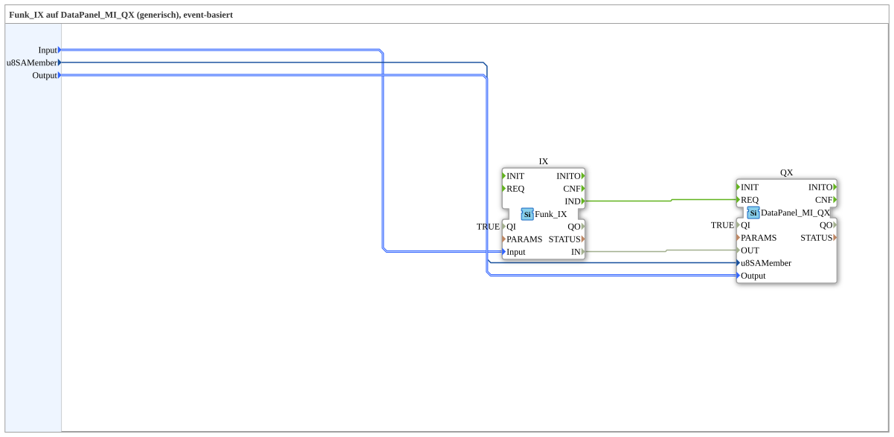

# Funk_IX_TO_DataPanel_MI_QX

* * * * * * * * * *
## Einleitung
Der Funktionsblock **Funk_IX_TO_DataPanel_MI_QX** stellt eine wiederverwendbare Subapplikation dar, die einen drahtlosen Eingang (Funk_IX) mit einem Ausgabemodul des DataPanels (DataPanel_MI_QX) verbindet. Er dient dazu, ein über Funk empfangenes Signal (z. B. von einem Taster) in einen definierten Ausgangszustand am DataPanel umzusetzen. Die Subapplikation ist ereignisbasiert und ermöglicht eine generische Zuordnung von Eingangssignalen zu Ausgängen.

## Schnittstellenstruktur
Die Subapplikation besitzt ausschließlich Dateneingänge und keine Ausgänge oder Ereignisschnittstellen nach außen.

### **Ereignis-Eingänge**
Keine.

### **Ereignis-Ausgänge**
Keine.

### **Daten-Eingänge**
| Name        | Typ                          | Kommentar                                     | Initialwert          |
|-------------|------------------------------|-----------------------------------------------|----------------------|
| `Input`     | `Funk::io::DI::Funk_DI_S`    | Identifiziert den digitalen Eingang (z. B. `DigitalInput_Key_01`) | `Funk_DI::Invalid` |
| `u8SAMember`| `USINT`                      | Knoten-Subadresse (SA) im Bereich 224..239   | `MI::MI_00`          |
| `Output`    | `DataPanel::io::MI::DQ::DataPanel_MI_DO_S` | Identifiziert den Ausgang (z. B. `DigitalOutput_1A..8B` oder `Input_Power_Port_5..8`) | `Invalid`         |

### **Daten-Ausgänge**
Keine.

### **Adapter**
Keine.

## Funktionsweise
Die Subapplikation enthält zwei interne Funktionsblöcke:
- **Funk_IX**: Empfängt ein drahtloses Eingangssignal und liefert über seinen Ereignisausgang `IND` eine positive Flanke, wenn ein gültiges Signal eingetroffen ist.
- **DataPanel_MI_QX**: Verarbeitet den übergebenen Datenwert und steuert den entsprechenden Ausgang des DataPanels.

Der interne Ablauf:
1. Der eingehende Datenwert am externen Eingang `Input` wird an den Eingang `IX.Input` des Funk_IX-Blocks geleitet.
2. Sobald der Funk_IX ein Ereignis generiert (Ereignisausgang `IND`), wird dieses Ereignis an den Ereigniseingang `REQ` des DataPanel_MI_QX weitergegeben.
3. Gleichzeitig wird der Wert vom Ausgang `IX.IN` (der den empfangenen Zustand repräsentiert) an den Dateneingang `OUT` des DataPanel_MI_QX übergeben.
4. Der DataPanel_MI_QX verwendet die Werte `u8SAMember` und `Output`, um den Zielausgang zu identifizieren und den übermittelten Zustand zu setzen.

Die Parameter `QI` sind intern auf `TRUE` gesetzt, sodass die Blöcke permanent aktiviert sind. Die Zuordnung zwischen Eingang und Ausgang erfolgt durch die externen Parameter, sodass derselbe Baustein für verschiedene Funkkanäle und Ausgänge konfiguriert werden kann.

## Technische Besonderheiten
- **Ereignisbasiert**: Die Übertragung des Signals erfolgt über ein Ereignis vom Funk_IX zum DataPanel-Modul, was eine effiziente Verarbeitung nur bei tatsächlichen Ereignissen ermöglicht.
- **Generische Konfiguration**: Durch die Parameter `Input`, `u8SAMember` und `Output` wird der Baustein universell einsetzbar, ohne die interne Logik ändern zu müssen.
- **Keine Ausgänge**: Die Subapplikation gibt keine Daten nach außen weiter; alle Ergebnisse werden direkt am DataPanel wirksam.
- **Interne Initialisierung**: Beide Funktionsblöcke sind mit `QI = TRUE` initialisiert, wodurch sie sofort betriebsbereit sind.
- Die Subapplikation ist für den Einsatz mit der Hardwarefamilie DataPanel und Funk-IO konzipiert.

## Zustandsübersicht
Die Subapplikation besitzt keinen expliziten Zustandsautomaten. Ihr Verhalten ist rein ereignisgesteuert:  
- Im Ruhezustand wartet der Funk_IX auf ein ankommendes Funksignal.  
- Sobald ein Signal empfangen wird, erzeugt er ein Ereignis, das den DataPanel_MI_QX anstößt.  
- Nach der Verarbeitung kehrt der Baustein in den Wartezustand zurück.  

Es gibt also keine dauerhaften Zustände, sondern nur die aktive Verarbeitung eines Ereignisses pro Zyklus.

## Anwendungsszenarien
- **Drahtlose Steuerung von Ausgängen**: Ein Funk-Taster sendet ein Signal, das über diesen Baustein einen bestimmten Ausgang am DataPanel (z. B. eine Leuchte oder einen Antrieb) aktiviert.
- **Einbindung in größere Automatisierungssysteme**: Die Subapplikation kann in übergeordnete Steuerungslogiken eingebettet werden, um Funkempfänger mit Ausgabemodulen zu verknüpfen.
- **Flexible Konfiguration**: Durch die Parametrierung kann derselbe Baustein für verschiedene Funkkanäle (unterschiedliche `Input`-Werte) und verschiedene Ausgänge (`Output`) eingesetzt werden, ohne Änderungen am internen Netzwerk vorzunehmen.

## Vergleich mit ähnlichen Bausteinen
Im Gegensatz zu fest verdrahteten Koppelbausteinen bietet dieser Baustein eine höhere Flexibilität durch die generischen Parameter. Er ähnelt einem Adapter, der eine ereignisbasierte Verbindung zwischen einem Funk-Input-Modul und einem Output-Modul herstellt. Im Vergleich zu einem reinen Datenbaustein ohne Ereignissteuerung ist hier die Reaktion unmittelbar an das Eintreffen eines Ereignisses gebunden, was unerwünschte Ausgaben ohne neues Funksignal vermeidet. Ein direkter Vergleich zu ähnlichen Subapplikationen ist nicht vorhanden, da diese spezifisch für die Kombination der IO-Module entwickelt wurde.

## Fazit
**Funk_IX_TO_DataPanel_MI_QX** ist ein kompakter, ereignisbasierter Baustein, der die Integration von Funkempfängern und DataPanel-Modulen erheblich vereinfacht. Durch seine generische Parametrierung ist er wiederverwendbar und an verschiedene Anforderungen anpassbar. Die interne Architektur ist transparent und ermöglicht eine robuste Übertragung von Eingangssignalen zu definierten Ausgängen. Für Anwendungen, die eine schnelle und flexible drahtlose Steuerung erfordern, stellt dieser Baustein eine effektive Lösung dar.