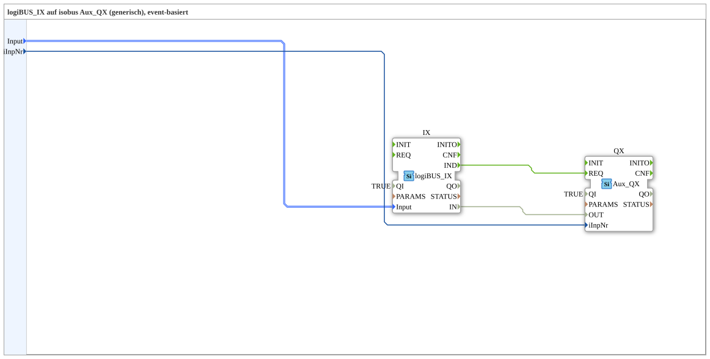

# IX_TO_Aux_QX

* * * * * * * * * *

## Einleitung

Die SubApp `IX_TO_Aux_QX` dient als generische, ereignisbasierte Brücke zwischen einem logiBUS-Eingang (Typ `logiBUS_DI_S`) und einem ISOBUS-Auxiliary-Output (`Aux_QX`). Sie kapselt die notwendige Verbindungslogik, um einen einzelnen logiBUS-Digital-Eingang (I1..I8) in einen ISOBUS-Aux-Output umzuwandeln. Die übergebene Eingangsnummer `iInpNr` bestimmt dabei die Reihenfolge im Auxiliary-Output-Pool. Die SubApp wurde mit dem Standard IEC 61499-2 erstellt und ist als wiederverwendbare Komponente konzipiert.

## Schnittstellenstruktur

### **Ereignis-Eingänge**

Keine Ereignis-Eingänge an der SubApp-Schnittstelle vorhanden.

### **Ereignis-Ausgänge**

Keine Ereignis-Ausgänge an der SubApp-Schnittstelle vorhanden.

### **Daten-Eingänge**

| Name     | Typ                           | Kommentar                                                                 |
| -------- | ----------------------------- | ------------------------------------------------------------------------- |
| `Input`  | `logiBUS::io::DI::logiBUS_DI_S` | Identifiziert den logiBUS-Eingang (I1..I8). Default: `Invalid`           |
| `iInpNr` | `USINT`                       | Nummer des Auxiliary-Arrays – entspricht der Reihenfolge im Pool (0 = erster Aux-Input) |

### **Daten-Ausgänge**

Keine Daten-Ausgänge an der SubApp-Schnittstelle vorhanden.

### **Adapter**

Keine Adapter an der SubApp-Schnittstelle vorhanden.

## Funktionsweise

Die SubApp instanziiert intern zwei Funktionsblöcke: `IX` (Typ `logiBUS::io::DI::logiBUS_IX`) und `QX` (Typ `isobus::UT::io::Auxiliary::OUT::Aux_QX`). Die Verbindung erfolgt auf Ereignis- und Datenebene:

- **Ereigniskette:** Das Ereignis `IND` des `IX`-Blocks wird direkt mit dem Eingang `REQ` von `QX` verbunden. Dadurch wird bei jedem neuen Eingangssignal des logiBUS-Moduls ein Ausgabeereignis im `QX` ausgelöst.
- **Datenpfad:** Der Datenwert `IN` von `IX` (der den aktuellen Zustand des logiBUS-Eingangs liefert) wird an den Daten-Eingang `OUT` von `QX` weitergegeben. Zusätzlich wird der SubApp-Parameter `iInpNr` direkt an `QX.iInpNr` angeschlossen, sodass die Zuordnung des Auxiliary-Outputs festgelegt wird.
- **Steuerparameter:** Beide internen Blöcke sind mit `QI = TRUE` initialisiert und arbeiten damit im aktivierten Modus.

Somit verarbeitet die SubApp ein eingehendes logiBUS-Signal (z. B. von einem digitalen Eingang) und setzt es in einen ISOBUS-Auxiliary-Output um. Die Übertragung erfolgt streng ereignisgetrieben, was eine synchrone Reaktion ohne zusätzliche Polling-Logik ermöglicht.

## Technische Besonderheiten

- **Ereignisbasiert:** Die gesamte Verarbeitung ist ereignisorientiert (durch `IND` bzw. `REQ`) und eignet sich für Echtzeitanwendungen.
- **Generische Konfiguration:** Über `iInpNr` wird der Ziel-Aux-Output dynamisch bestimmt, ohne dass die SubApp selbst geändert werden muss.
- **Typverwendung:** Die Schnittstelle nutzt den im Compiler importierten Typ `logiBUS::io::DI::logiBUS_DI_S`, der eine strukturierte Beschreibung eines logiBUS-Digital-Eingangs repräsentiert.
- **Initialwert:** Der Daten-Eingang `Input` ist mit `Invalid` initialisiert, was auf einen undefinierten Anfangszustand hinweist und eine bewusste Erstkonfiguration vor dem Start erzwingt.
- **Wiederverwendbarkeit:** Die SubApp ist aus einem größeren Projekt (Übung 003c) extrahiert und kann in verschiedenen Anwendungen eingesetzt werden, die eine logiBUS-zu-ISOBUS-Kopplung benötigen.

## Zustandsübersicht

Die SubApp selbst besitzt keinen eigenen Zustandsautomaten. Der aktuelle Zustand wird vollständig durch die internen Funktionsblöcke bestimmt:

- `IX` (logiBUS-Input) nimmt je nach Eingangssignal die Zustände `IDLE`, `RUN`, oder Fehlerzustände an.
- `QX` (ISOBUS-Aux-Output) verwaltet den Zustand des Ausgangs (z. B. `INACTIVE`, `ACTIVE`).

Die SubApp verbindet lediglich die Ereignis- und Datenflüsse. Für eine detaillierte Zustandsbeschreibung wird auf die Dokumentation der jeweiligen Funktionsblöcke verwiesen.

## Anwendungsszenarien

Typische Einsatzfälle liegen in der Landwirtschaft und mobilen Maschinen, wo logiBUS-Sensoren oder Schalter mit ISOBUS-Terminals oder Steuergeräten verbunden werden sollen:

- **Fernbedienung:** Ein logiBUS-Taster (z. B. für eine Hydraulikfunktion) steuert über den ISOBUS einen Auxiliary-Output (z. B. ein Magnetventil).
- **Ein-/Aus-Signale:** Digital-Eingänge von Maschinen werden als Steuerbefehle in eine ISOBUS-Steuerung eingespeist.
- **Test- und Simulationsumgebungen:** Die SubApp kann verwendet werden, um logiBUS-Signale in einer ISOBUS-Umgebung zu simulieren oder zu verifizieren.

## Vergleich mit ähnlichen Bausteinen

Es gibt möglicherweise spezialisiertere Bausteine, die mehrere logiBUS-Eingänge bündeln oder zusätzliche Logik (z. B. Filter, Entprellung) enthalten. `IX_TO_Aux_QX` zeichnet sich jedoch durch seine Einfachheit und Flexibilität aus: Es erfüllt genau eine Aufgabe – die direkte Durchschaltung eines einzelnen Eingangs – und lässt sich durch die `iInpNr`-Parametrierung an verschiedene Poolpositionen anpassen. Gegenüber spezifisch programmierten Lösungen bietet es eine klare IEC 61499-konforme Struktur und ist dadurch leicht in größere Automatisierungssysteme integrierbar.

## Fazit

Die SubApp `IX_TO_Aux_QX` stellt eine saubere, ereignisgesteuerte Kopplung zwischen einem logiBUS-Eingang und einem ISOBUS-Auxiliary-Output dar. Durch die geringe Schnittstelle (nur zwei Dateneingänge) ist sie leicht zu parametrieren und in verschiedensten Kontexten einsetzbar. Die interne Verwendung bewährter Funktionsblöcke gewährleistet eine robuste und standardkonforme Lösung. Sie eignet sich insbesondere für modulare Steuerungsarchitekturen, in denen logiBUS-Signale in ISOBUS-Systeme überführt werden müssen, ohne den Gesamtcode zu verkomplizieren.