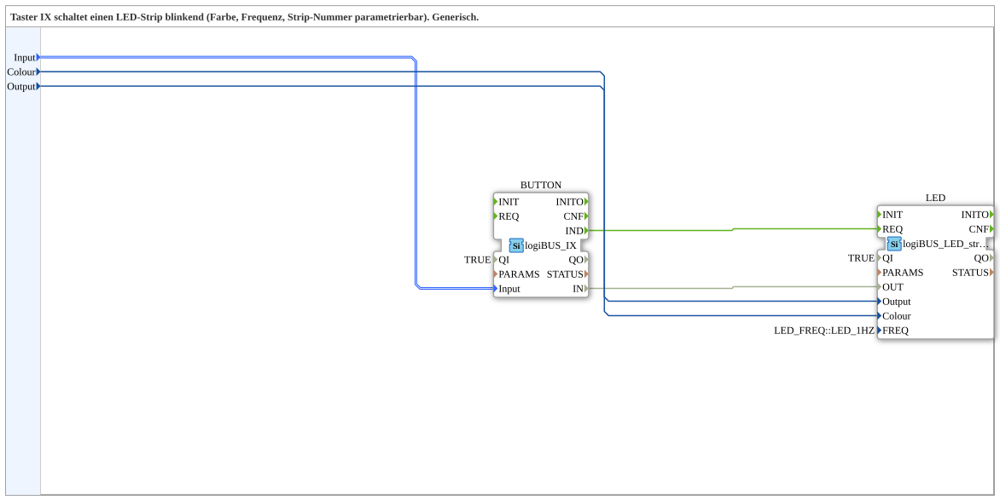

# IX_TO_logiBUS_LED_strip_QX

* * * * * * * * * *

## Einleitung

Die Subapp **IX_TO_logiBUS_LED_strip_QX** verbindet einen Taster-Eingang vom Typ `logiBUS_IX` mit einem LED-Streifen-Baustein vom Typ `logiBUS_LED_strip_QX`. Sie wird eingesetzt, um einen LED-Streifen über einen Taster blinkend zu schalten. Dabei können die Farbe, der verwendete Taster-Eingang und die Nummer des LED-Streifens über die Dateneingänge der Subapp vorgegeben werden.

Die Subapp ist als generische, wiederverwendbare Einheit ausgelegt. Die eigentliche Steuerlogik ist intern verdrahtet; nach außen hin sind ausschließlich die Parametriereingänge sichtbar.

## Schnittstellenstruktur

Die Subapp besitzt keine Ereignis-Schnittstellen und keine Datenausgänge. Sie arbeitet rein datengetrieben und kapselt die interne Ereignisverarbeitung vollständig.

### **Ereignis-Eingänge**

- Keine

### **Ereignis-Ausgänge**

- Keine

### **Daten-Eingänge**

| Name | Typ | Initialwert | Beschreibung |
|------|-----|-------------|--------------|
| `Input` | `logiBUS::io::DI::logiBUS_DI_S` | `Invalid` | Identifiziert den verwendeten Eingang `Input_I1` bis `Input_I8` |
| `Colour` | `UINT` | `LED_COLOURS::LED_GREEN` | Bestimmt die Farbe des LED-Streifens |
| `Output` | `USINT` | – | Bestimmt die Nummer des anzusteuernden LED-Streifens |

### **Daten-Ausgänge**

- Keine

### **Adapter**

- Keine

## Funktionsweise

Die Subapp setzt sich aus zwei internen Funktionsbausteinen zusammen:

- `BUTTON` vom Typ `logiBUS_IX`
- `LED` vom Typ `logiBUS_LED_strip_QX`

Der externe Eingang `Input` wird an den Dateneingang `BUTTON.Input` weitergeführt. Dadurch wird festgelegt, welcher physische Eingang des Taster-Moduls überwacht wird. Der interne Baustein `BUTTON` ist mit `QI = TRUE` aktiviert und wartet auf eine Änderung des Eingangssignals.

Wird der Taster betätigt oder losgelassen, erzeugt `BUTTON` das Ereignis `IND`. Dieses Ereignis ist direkt mit dem Ereigniseingang `REQ` des LED-Bausteins verbunden. Zeitgleich wird der aktuelle Eingangszustand von `BUTTON.IN` an den Dateneingang `LED.OUT` übergeben.

Der LED-Baustein wird durch das Ereignis `REQ` verarbeitet. Er verwendet:

- `Output` zur Auswahl des LED-Streifens
- `Colour` zur Bestimmung der Farbe
- den übergebenen Wert an `OUT` als Schaltsignal

Der Parameter `FREQ` des LED-Bausteins ist intern auf `LED_FREQ::LED_1HZ` gesetzt. Dadurch blinkt der ausgewählte LED-Streifen mit 1 Hz, wenn der Tasterzustand aktiv ist. Ist der Tasterzustand inaktiv, wird der LED-Streifen ausgeschaltet.

## Technische Besonderheiten

- Die Subapp besitzt keine eigenen Ereignis-Ein- oder -Ausgänge.
- Sie besitzt keine Datenausgänge und keine Adapter.
- Alle Verbindungen zwischen `BUTTON` und `LED` sind intern verdrahtet.
- Die Eingänge `Input`, `Colour` und `Output` werden direkt auf die internen Funktionsbausteine durchgeschleift.
- Die Blinkfrequenz ist nicht als externer Eingang verfügbar, sondern als Parameter des internen LED-Bausteins hinterlegt. Aktuell ist `LED_1HZ` eingestellt.
- Die Farbe wird über die Konstante `LED_COLOURS::LED_GREEN` vorbelegt, kann aber zur Laufzeit über den Eingang `Colour` geändert werden.
- Die interne Verdrahtung verwendet die 4diac-typischen logiBUS-Datentypen und gewährleistet so eine typsichere Verbindung.

## Zustandsübersicht

Die Subapp selbst besitzt keine eigene Zustandsmaschine. Die Zustände ergeben sich aus dem Verhalten der internen Funktionsbausteine:

| Zustand | Beschreibung |
|---------|--------------|
| Warten | `BUTTON` überwacht den konfigurierten Eingang. Es wurde kein Tasterereignis erkannt. |
| Ereignis | Bei einem Tasterwechsel erzeugt `BUTTON` das Ereignis `IND` und löst damit `LED.REQ` aus. |
| LED inaktiv | Der Tasterzustand ist `FALSE`. Der LED-Streifen erhält kein aktives Schaltsignal und bleibt aus. |
| LED blinkt | Der Tasterzustand ist `TRUE`. Der LED-Streifen wird mit der konfigurierten Farbe und Frequenz angesteuert. |

## Anwendungsszenarien

- Ein Taster an einem `logiBUS_IX`-Eingang schaltet einen Status-LED-Streifen an einer Maschine.
- Über den Eingang `Colour` kann die Signalfarbe der Anzeige geändert werden, etwa von Grün auf Rot.
- Über den Eingang `Output` kann zwischen verschiedenen LED-Streifen umgeschaltet werden.
- Die Subapp kann in übergeordneten Steuerungsprojekten mehrfach instanziiert werden, wenn mehrere Taster-LED-Streifen-Kombinationen benötigt werden.

## Vergleich mit ähnlichen Bausteinen

Im Vergleich zu einer direkten Verbindung eines `logiBUS_IX` mit einem `logiBUS_LED_strip_QX` bietet die Subapp eine gekapselte und wiederverwendbare Struktur. Die Verdrahtung muss nicht in jeder Anwendung neu erstellt werden.

Gegenüber einem einfachen LED-Ausgangsbaustein ohne Blinkfunktion ermöglicht der interne LED-Streifen-Baustein eine fest eingestellte Blinkfrequenz. Zusätzlich können Farbe und Streifennummer flexibel parametriert werden.

Ein wesentlicher Unterschied zu vollständigen Funktionsbausteinen mit eigenen Ereignissen besteht darin, dass die Subapp keine Rückmeldung nach außen gibt. Sie ist daher vor allem für einfache, autarke Taster-Leuchtanzeigen geeignet.

## Fazit

Die Subapp `IX_TO_logiBUS_LED_strip_QX` ist eine kompakte und wiederverwendbare Lösung für die Ansteuerung eines blinkenden LED-Streifens über einen Taster. Sie kombiniert die logiBUS-Eingabe und den LED-Streifen-Baustein in einer übersichtlichen Einheit. Durch die Parametrierung von Eingang, Farbe und Streifennummer lässt sie sich flexibel in unterschiedlichen Steuerungsprojekten einsetzen.
