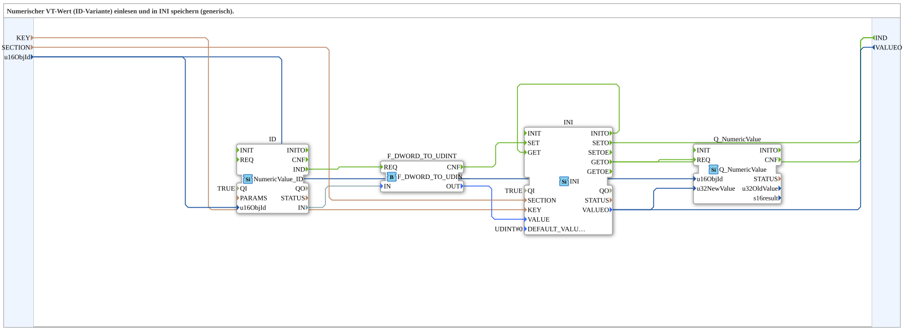

# NumericValue_ID_TO_INI

* * * * * * * * * *
## Einleitung
Der Funktionsblock `NumericValue_ID_TO_INI` ist eine wiederverwendbare Subapplikation, die einen numerischen Wert von einem ISOBUS-Gerät (ID‑Variante) einliest und persistent in einer INI‑Datei speichert. Der gespeicherte Wert wird beim Initialisieren wieder geladen und an das Gerät zurückgegeben, sodass der Zustand über einen Neustart hinweg erhalten bleibt. Die Subapp ist generisch aufgebaut und kann für verschiedene Objekt‑IDs und beliebige Speicherorte (Section/Key) verwendet werden.

## Schnittstellenstruktur
### **Ereignis-Eingänge**
Es sind keine externen Ereignis‑Eingänge vorhanden. Die Verarbeitung wird ausschließlich über interne Ereignisse der enthaltenen Funktionsbausteine angestoßen.

### **Ereignis-Ausgänge**
- **IND** – Wird ausgelöst, wenn ein neuer Wert erfolgreich in der INI‑Datei gespeichert oder aus ihr geladen wurde. Dieses Ereignis signalisiert der Umgebung, dass der aktuelle Wert (VALUEO) gültig ist und verwendet werden kann.

### **Daten-Eingänge**
- **KEY** (STRING) – Schlüsselname innerhalb der INI‑Sektion, unter dem der Wert abgelegt wird.
- **SECTION** (STRING) – Name der INI‑Sektion, in der der Wert gespeichert wird.
- **u16ObjId** (UINT) – Objekt‑ID des numerischen Werts auf dem ISOBUS‑Gerät. Standardmäßig auf `ID_NULL` gesetzt.

### **Daten-Ausgänge**
- **VALUEO** (UDINT) – Der aktuell gespeicherte, konvertierte Wert als 32‑Bit‑Unsigned‑Integer (UDINT). Dieser wird sowohl beim Speichern als auch beim Laden aktualisiert und nach außen bereitgestellt.

### **Adapter**
Es sind keine Adapter definiert. Die Kommunikation erfolgt über die oben genannten Ein‑ und Ausgänge sowie über die interne Verbindung zum ISOBUS‑Gerät (über die in der Subapp eingebetteten Funktionsbausteine).

## Funktionsweise
Die Subapplikation besteht aus vier Funktionsbausteinen:
- **NumericValue_ID** (`isobus::UT::io::NumericValue::NumericValue_ID`): Liest den aktuellen Wert von der angegebenen Objekt‑ID ein und gibt ihn als `DWORD` aus (Ereignis `IND`).
- **F_DWORD_TO_UDINT** (`iec61131::conversion::F_DWORD_TO_UDINT`): Konvertiert den empfangenen `DWORD`‑Wert in einen `UDINT`‑Wert.
- **INI** (`eclipse4diac::storage::INI`): Verwaltet den Zugriff auf die INI‑Datei. Er unterstützt das Speichern (`SET`) und Laden (`GET`) von Werten mit frei wählbarem Section/Key.
- **Q_NumericValue** (`isobus::UT::Q::Q_NumericValue`): Schreibt einen neuen Wert an das ISOBUS‑Gerät zurück.

**Ablauf beim Speichern eines neu eingelesenen Wertes:**  
1. Der Baustein `NumericValue_ID` sendet bei einem neuen Wert das Ereignis `IND`.  
2. Dieses löst die Konvertierung in `F_DWORD_TO_UDINT` aus (`REQ`). Der konvertierte `UDINT` wird am Ausgang `OUT` bereitgestellt.  
3. Nach Abschluss der Konvertierung (`CNF`) wird der Wert über das Ereignis `SET` an den `INI`‑Baustein übergeben. Der Wert wird zusammen mit den aktuellen `KEY` und `SECTION` gespeichert.  
4. Nach erfolgreichem Speichern sendet `INI` das Ereignis `SETO`, das als `IND` an den Ausgang der Subapp weitergegeben wird.

**Ablauf beim Laden bei Initialisierung:**  
1. Beim Start der Subapplikation initialisiert der `INI`‑Baustein (`INITO`).  
2. Dieses Ereignis löst intern ein `GET` aus, um den gespeicherten Wert aus der INI‑Datei zu lesen.  
3. Das `GETO`‑Ereignis des `INI`‑Bausteins wird an `Q_NumericValue.REQ` gesendet, wodurch der geladene Wert (`VALUEO`) an das ISOBUS‑Gerät zurückgeschrieben wird.  
4. Gleichzeitig wird das `GETO`‑Ereignis auch als `IND` an den Ausgang der Subapp geleitet, sodass auch die Umgebung den geladenen Wert erhält.

Somit stellt die Subapp sicher, dass der Wert sowohl bei Änderungen als auch beim Systemstart konsistent ist.

## Technische Besonderheiten
- **Persistente Speicherung:** Die Verwendung des `INI`‑Bausteins ermöglicht das dauerhafte Ablegen des Werts, sodass dieser nach einem Neustart oder Spannungsausfall wieder verfügbar ist.
- **Generische Konfiguration:** Durch die Eingänge `KEY` und `SECTION` kann der Speicherort dynamisch festgelegt werden, ohne die Subapp intern zu verändern.
- **Konvertierung:** Die Konvertierung von `DWORD` zu `UDINT` stellt sicher, dass der Wert in ein für das ISOBUS‑Protokoll übliches Format überführt wird.
- **Automatisches Rückschreiben:** Nach dem Laden wird der Wert sofort an das ISOBUS‑Gerät gesendet, sodass die Hardware den zuletzt gespeicherten Zustand übernimmt.
- **Initialwert:** Für den Fall, dass noch kein Wert gespeichert ist, wird über den Parameter `DEFAULT_VALUE` des `INI`‑Bausteins der Wert `0` als Fallback verwendet.

## Zustandsübersicht
Die Subapplikation kann in folgende Hauptzustände unterteilt werden:
- **Initialisierungsphase:** Der `INI`‑Baustein wird gestartet und versucht, den gespeicherten Wert zu laden (`INITO` → `GET`).
- **Warten auf neuen Wert:** Der Baustein `NumericValue_ID` wartet auf ein Ereignis von der Hardware.
- **Verarbeitung eines neuen Wertes:** Sobald ein Wert empfangen wird, erfolgt die Konvertierung und das Speichern in der INI‑Datei.
- **Rückschreiben nach Laden:** Nach dem Laden wird der Wert an das Gerät gesendet (über `Q_NumericValue`).
- **Bereit:** Die Subapp ist inaktiv und wartet auf das nächste Ereignis, solange keine Änderung ansteht.

Der Wechsel zwischen den Zuständen erfolgt ereignisgesteuert über die internen Verbindungen der FB‑Instanzen.

## Anwendungsszenarien
- **ISOBUS‑Konfiguration:** Speicherung von Konfigurationswerten (z. B. Einstellungen, Kalibrierdaten) eines landwirtschaftlichen Geräts, die über eine Objekt‑ID gelesen und geschrieben werden.
- **Diagnose und Wartung:** Persistente Speicherung von Zählerständen oder Diagnosewerten, die nach einem Neustart wiederhergestellt werden müssen.
- **Maschinensteuerung:** Speichern von Sollwerten oder Parametern, die zur Laufzeit verändert werden und über einen Neustart hinweg erhalten bleiben sollen.
- **Generische Datenübernahme:** Einbinden in größere Applikationen, bei denen verschiedene numerische Parameter mit minimalem Aufwand persistent abgelegt werden sollen – durch einfaches Setzen von `KEY`, `SECTION` und `u16ObjId`.

## Vergleich mit ähnlichen Bausteinen
Im Gegensatz zu einfachen `NumericValue`‑Bausteinen, die nur lesen oder schreiben, kombiniert diese Subapp die Funktionen *Einlesen*, *Persistieren* und *Rückschreiben*. Andere Implementierungen könnten nur einen Teil dieser Aufgaben abdecken:  
- **NumericValue_ID ohne Speicherung:** Liest nur den Wert und gibt ihn aus, verliert aber den Zustand bei Neustart.  
- **INI‑Baustein allein:** Erlaubt nur den Zugriff auf die INI‑Datei, ohne direkte Verbindung zum ISOBUS‑Gerät.  
- **Manuelle Verkettung:** Die gleiche Funktionalität ließe sich auch durch separate FB‑Instanzen realisieren, wäre aber weniger kompakt und schwerer wiederverwendbar.

Diese Subapp bündelt die notwendigen Schritte in einer kompakten, wiederverwendbaren Einheit und reduziert so den Entwicklungsaufwand.

## Fazit
Der Funktionsblock `NumericValue_ID_TO_INI` bietet eine robuste Lösung zur persistenten Speicherung von numerischen Werten aus ISOBUS‑Geräten. Durch die Kombination aus Hardwarezugriff, Konvertierung, INI‑Speicherung und automatischem Rückschreiben beim Start erfüllt er eine häufige Anforderung in industriellen und landwirtschaftlichen Anwendungen. Die generische Schnittstelle mit `KEY`, `SECTION` und `u16ObjId` erlaubt eine flexible Wiederverwendung ohne Änderungen an der internen Struktur. Die Dokumentation der Ereignis- und Datenflüsse zeigt eine klare und deterministische Verarbeitung, die in verteilten Steuerungssystemen einfach integriert werden kann. Daher ist dieser Baustein eine sinnvolle Ergänzung für jede Applikation, die eine dauerhafte Speicherung von Geräteparametern benötigt.