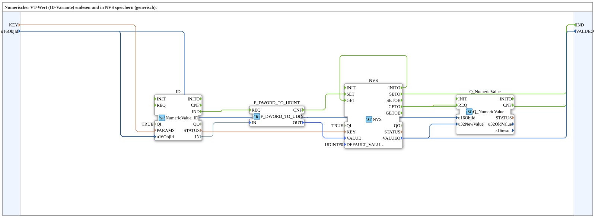

# NumericValue_ID_TO_NVS

* * * * * * * * * *

## Einleitung

Der Baustein `NumericValue_ID_TO_NVS` ist eine Subapplikation (SubApp) zur generischen Speicherung eines numerischen Werts, der über die ID‑Variante des ISOBUS‑Numeric‑Value‑Protokolls eingelesen wird, in den nichtflüchtigen Speicher (NVS) eines ESP32. Er kombiniert die Funktionen des Einlesens, Konvertierens, Speicherns und Wiederausgebens. Die Applikation ist modular aufgebaut und kann in verschiedenen Kontexten wiederverwendet werden, in denen ein numerischer Wert über einen Schlüssel persistent gespeichert und bei Bedarf geladen werden soll.

## Schnittstellenstruktur

### **Ereignis-Eingänge**

Keine.

### **Ereignis-Ausgänge**

| Ereignis | Typ   | Kurzbeschreibung                                    |
|----------|-------|-----------------------------------------------------|
| `IND`    | Event | Zeigt an, dass ein Wert aus dem NVS geladen oder gespeichert wurde. |

### **Daten-Eingänge**

| Name     | Typ     | Initialwert  | Beschreibung                                            |
|----------|---------|--------------|---------------------------------------------------------|
| `KEY`    | STRING  | –            | Schlüsselname unter dem der Wert im NVS gespeichert wird. |
| `u16ObjId`| UINT   | `ID_NULL`    | Objekt‑ID des numerischen Werts am ISOBUS‑Terminal.       |

### **Daten-Ausgänge**

| Name     | Typ     | Beschreibung                                      |
|----------|---------|---------------------------------------------------|
| `VALUEO` | UDINT   | Der aktuell gelesene bzw. gespeicherte numerische Wert. |

### **Adapter**

Keine.

## Funktionsweise

Der Baustein arbeitet in zwei Hauptphasen:

1. **Initialisierung**  
   Nach dem Start wird automatisch der im NVS gespeicherte Wert unter dem angegebenen `KEY` geladen. Dazu wird das intern verbundene `NVS`‑FB mit dem Ereignis `GET` angestoßen. Das Ergebnis (`VALUEO`) wird über den Ausgang `VALUEO` der SubApp bereitgestellt und gleichzeitig an einen internen `Q_NumericValue`‑FB übergeben, der den Wert an das ISOBUS‑Terminal übermitteln kann.

2. **Wertaktualisierung über ISOBUS**  
   Wenn ein neuer numerischer Wert über die ID‑Variante am Terminal anliegt, löst das `NumericValue_ID`‑FB das Ereignis `IND` aus. Dieses Ereignis wird über die interne Kette  
   `ID.IND → F_DWORD_TO_UDINT.REQ → F_DWORD_TO_UDINT.CNF → NVS.SET`  
   abgearbeitet. Der vom Terminal gelesene DWORD‑Wert wird in einen `UDINT` konvertiert und als neuer Wert mit dem zugehörigen `KEY` im NVS gespeichert. Nach erfolgreichem Speichern wird das Ereignis `SETO` ausgelöst, das zum Ausgang `IND` der SubApp führt.

Parallel dazu wird bei jeder Speicher‑ oder Leseoperation auch der interne `Q_NumericValue`‑FB mit dem aktuellen Wert und der Objekt‑ID versorgt, sodass der Wert auch am Terminal angezeigt bzw. aktualisiert wird.

Die Datenflüsse sind in der SubApp über direkte Verbindungen realisiert, wobei die externen Anschlüsse der SubApp (`KEY`, `u16ObjId`, `VALUEO`) direkt mit den internen Bausteinen verdrahtet sind.

## Technische Besonderheiten

- **Persistenz:** Der Wert wird über den `logiBUS::storage::esp32_nvs::NVS`‑FB dauerhaft im Flash‑Speicher des ESP32 abgelegt.
- **Generische ID‑Auswahl:** Die Objekt‑ID (`u16ObjId`) ist konfigurierbar, sodass verschiedene numerische Werte des ISOBUS‑Terminals verwendet werden können.
- **Typkonvertierung:** Der vom ISOBUS gelieferte `DWORD`‑Wert wird durch `F_DWORD_TO_UDINT` in einen `UDINT` umgewandelt, passend zur internen Darstellung.
- **Automatisches Laden:** Beim Start wird der gespeicherte Wert ohne externe Anforderung geladen und über `VALUEO` bereitgestellt.
- **Interne ISOBUS‑Aktualisierung:** Der `Q_NumericValue`‑FB dient dazu, den Wert am Terminal zu setzen bzw. zu aktualisieren, ohne dass ein separater Ausgang erforderlich ist.

## Zustandsübersicht

Die SubApp kennt keine expliziten Zustände, da sie ereignisgesteuert arbeitet. Die relevanten Abläufe lassen sich wie folgt beschreiben:

- **Initialisierungszustand:** Nach dem Start wird der Wert aus dem NVS geladen (`INITO → GET`). Nach Abschluss werden `GETO` sowie das externe Ereignis `IND` ausgelöst.
- **Speicherzustand:** Bei einem ankommenden Wert vom Terminal wird die Kette `ID.IND → Konvertierung → NVS.SET` durchlaufen. Nach erfolgreichem Speichern erscheint `SETO` und wiederum `IND`.
- **Lesenzustand:** Ein explizites Laden (durch externe Ereignisse) ist nicht vorgesehen; das Lesen erfolgt nur bei Initialisierung. Allerdings kann der Wert über `VALUEO` jederzeit abgelesen werden.

Die Ereignisse `IND` signalisieren also immer den Abschluss einer Speicher‑ oder Leseoperation.

## Anwendungsszenarien

- **Konfigurationsspeicherung:** Geräteparameter, die über das ISOBUS‑Terminal eingestellt und beim nächsten Start wiederhergestellt werden sollen.
- **Datenprotokollierung:** Speicherung von Messwerten oder Zählerständen, die dauerhaft erhalten bleiben müssen.
- **Firmware‑Update-Einstellungen:** Persistente Speicherung von Benutzereinstellungen in landwirtschaftlichen Maschinen.
- **Wiederverwendbare SubApp:** Einbindung in größere Steuerungsanwendungen, die einen numerischen ISOBUS‑Wert dauerhaft speichern müssen.

## Vergleich mit ähnlichen Bausteinen

Im Gegensatz zu reinen Kommunkations‑Bausteinen (z.B. `NumericValue_ID` allein) oder reinen Speicher‑Bausteinen (z.B. `NVS` ohne ISOBUS‑Anbindung) kombiniert `NumericValue_ID_TO_NVS` beide Funktionen in einer einzigen SubApp. Dadurch entfällt die manuelle Verdrahtung zwischen ISOBUS‑Reader, Konverter und NVS. Ähnliche Bausteine könnten ohne ID‑Variante (z.B. mit Index) oder ohne Konvertierung (direkter `DWORD`‑Typ) arbeiten, bieten jedoch weniger Flexibilität. Diese SubApp ist durch die parametrierbare Objekt‑ID und den konfigurierbaren Schlüssel besonders universell einsetzbar.

## Fazit

`NumericValue_ID_TO_NVS` stellt eine robuste und wiederverwendbare Lösung dar, um numerische ISOBUS‑Werte direkt und dauerhaft im NVS eines ESP32 zu speichern. Durch die klare Trennung von Einlesen, Konvertieren und Speichern sowie die automatische Initialisierung ist sie einfach in übergeordnete Steuerungen integrierbar. Die interne Aktualisierung des ISOBUS‑Terminals über `Q_NumericValue` macht den Baustein darüber hinaus zu einem vollständigen Bindeglied zwischen Terminal und persistentem Speicher.
